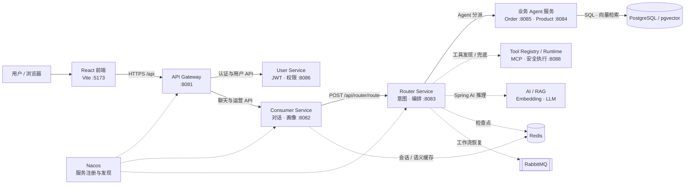

# SmartAssistant

SmartAssistant 是一个基于 Spring Boot、Spring AI 和 React 的多智能体对话系统。系统通过 Gateway 统一接入请求，由 Consumer 管理对话上下文、用户画像与语义路由缓存，Router 负责意图识别、任务分发和 Agent 协调，再调用订单、商品等领域服务；常规 Agent 无法处理时，由 Tool Registry 与 Tool Runtime 提供工具发现和通用兜底能力。

## 主要能力

- 用户登录、权限控制与会话隔离
- 多轮对话、历史会话管理和人工关闭会话
- 多 Agent 路由与任务编排
- 订单、商品与推荐能力，以及基于 Tool Registry / Runtime 的通用兜底
- RAG 文档解析、向量检索、重排序与评测门禁
- Tool Registry 与 MCP 兼容的工具发现
- Prometheus、Grafana、Loki 和 Jaeger 可观测性配置

## 运行时架构



主请求路径是 `React → Gateway → Consumer → Router → 业务 Agent → 数据存储`：

1. 前端统一通过 Gateway 访问认证、对话和运营接口。
2. Consumer 维护会话上下文、用户画像和语义缓存，并把路由请求交给 Router。
3. Router 完成意图识别与 Agent 编排，将任务分派到订单、商品服务或工具兜底链路。
4. PostgreSQL/pgvector 保存业务与向量数据；Redis 和 RabbitMQ 分别承载缓存、检查点与工作流恢复。
5. Nacos 提供服务注册发现，监控配置覆盖 Prometheus、Grafana、Loki 与链路追踪。

更完整的源码证据、节点搜索和交互查看能力见：

- [交互式 Archify 架构图](docs/architecture/smartassistant-runtime.architecture.html)
- [可复现的架构规范](docs/architecture/smartassistant-runtime.architecture.json)

## 项目结构

| 路径 | 说明 |
| --- | --- |
| `smart-assistant-gateway/` | API 网关，默认端口 8081 |
| `smart-assistant-router/` | 意图识别、任务分发、Agent 协调与最终兜底 |
| `smart-assistant-consumer/` | 对话、用户画像、语义路由缓存、反馈与运营接口 |
| `smart-assistant-user/` | 用户、认证与权限 |
| `smart-assistant-order/` | 订单查询与订单工具 |
| `smart-assistant-product/` | 商品检索、商品知识库与推荐 |
| `smart-assistant-tool-runtime/` | 可嵌入的通用工具实现，不包含服务端传输 |
| `smart-assistant-tool-registry/` | 工具注册、发现、MCP 与生命周期管理 |
| `smart-assistant-routing-contract/` | Router/Consumer 共享的路由通信契约 |
| `smart-assistant-embedding-service/` | Embedding 服务 |
| `smart-assistant-common/` | 公共模型、RAG、评测与基础组件 |
| `frontend/` | React/Vite 前端；开发环境通过 Vite 代理访问 Gateway |
| `docs/` | 架构、设计、运维和评测文档 |
| `deploy/` | 生产部署配置 |
| `monitoring/` | 可观测性配置 |

## 环境要求

- JDK 21
- Docker 与 Docker Compose
- Node.js 20 或更高版本
- Git

项目已包含 Maven Wrapper，不需要额外安装 Maven。

## 本地开发

1. 创建本地环境变量文件：

   ```powershell
   Copy-Item .env.example .env
   ```

   Linux/macOS 可使用：

   ```bash
   cp .env.example .env
   ```

2. 按照 `.env.example` 填写数据库、Redis、JWT 和模型服务配置。不要提交真实密钥。

3. 启动本地基础设施：

   ```bash
   docker compose -f docker-compose.dev.yml up -d
   ```

4. 编译并运行后端测试：

   Windows：

   ```powershell
   .\mvnw.cmd test
   ```

   Linux/macOS：

   ```bash
   ./mvnw test
   ```

5. 启动前端：

   ```bash
   cd frontend
   npm ci
   npm run dev
   ```

前端开发服务器的代理目标在 `frontend/vite.config.ts` 中配置。

## 部署

生产部署的唯一入口是 `deploy/docker-compose.yml`。部署前必须通过环境变量注入真实密钥，禁止把 `.env`、数据库转储、运行日志或用户会话数据提交到仓库。

参考：

- [生产部署说明](deploy/README.md)
- [Docker 镜像清单](docs/DOCKER.md)
- [生产就绪检查清单](docs/production-readiness-checklist.md)

## 测试与质量门禁

GitHub Actions 会执行：

- 全模块编译
- Maven Enforcer 与 JaCoCo 质量检查
- Router E2E 测试
- 黄金评测集门禁
- Tool Manifest 校验
- 依赖漏洞与密钥泄漏扫描

评测数据保存在 `docs/eval/` 和模块测试资源中。一次性联调数据、生成报告及运行时用户数据不进入版本控制。

## 文档

- [交互式运行时架构图](docs/architecture/smartassistant-runtime.architecture.html)
- [运行时架构规范](docs/architecture/smartassistant-runtime.architecture.json)
- [系统设计](docs/system_design.md)
- [架构演进路线](docs/architecture-roadmap.md)
- [RAG 生产化设计](docs/rag-production/ARCHITECTURE.md)
- [RAG 实现记录](docs/rag-production/IMPLEMENTATION.md)
- [Tool Registry 方案](docs/tool-registry-plan.md)
- [前端说明](frontend/README.md)

## 安全约定

- 所有密钥仅通过环境变量或未跟踪的本地 `.env` 提供。
- `data/users/` 和 `data/corrections/` 属于运行时数据，不得提交。
- 本地生成的模型权重、构建产物、日志和数据库文件不得提交。
- 如历史提交中出现过真实凭据，应立即轮换；删除当前文件不会清除 Git 历史。
