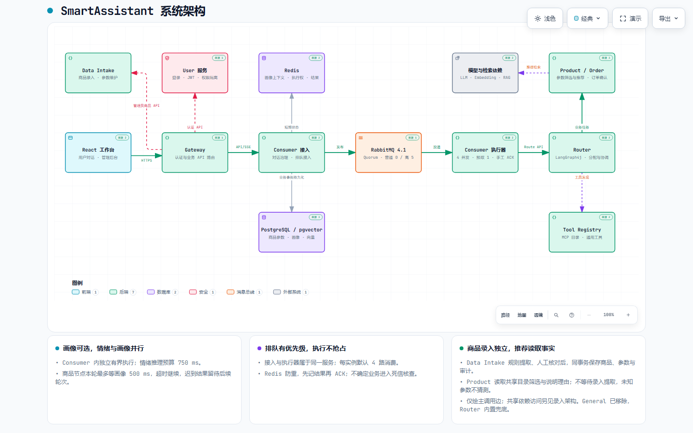

# SmartAssistant

SmartAssistant 是一个基于 Spring Boot、Spring AI 和 React 的多智能体对话系统。系统通过 Gateway 统一接入请求，由 Consumer 管理对话、情绪预处理、用户画像和语义答案缓存，并通过 RabbitMQ 调度业务请求。Router 负责意图识别、任务分发和 Agent 协调，调用订单、商品等领域服务；分配失败时由 Router 内置 Agent 配合 Tool Registry / Runtime 完成兜底。

## 主要能力

用户通过登录页访问工作台，普通用户与管理员使用不同页面，并遵守各自的权限与数据隔离约束。此前的演示账号入口已移除。

- 用户登录、权限控制与会话隔离
- 多轮对话、历史会话管理和人工关闭会话
- 聊天框语音输入：Qwen ASR 转文字，核对后手动发送（需开启服务端配置，见 [接入说明](docs/voice-input.md)）
- 配套语音回复：语音提问完成后自动播报，文字回复可手动朗读，支持暂停/继续/停止（见 [语音回复说明](docs/voice-output.md)）
- 多 Agent 路由与任务编排
- 订单、商品与推荐能力，以及基于 Tool Registry / Runtime 的通用兜底
- RAG 文档解析、向量检索、重排序与评测门禁
- Tool Registry 与 MCP 兼容的工具发现
- Prometheus、Grafana、Loki 和 Jaeger 可观测性配置

## 运行时架构

<p align="center">
  <a href="https://yu-hk.github.io/SmartAssistant/architecture/smartassistant-runtime.architecture.html" title="在线打开交互式架构图">
    
  </a>
</p>

**[在线打开交互式架构图](https://yu-hk.github.io/SmartAssistant/architecture/smartassistant-runtime.architecture.html)** · **[查看全部架构与流程图](https://yu-hk.github.io/SmartAssistant/)**。上图仅为静态预览，图中的按钮不可点击；点击图片可打开在线交互版。仓库中的 [HTML 源文件](docs/architecture/smartassistant-runtime.architecture.html)可下载后离线打开。

启用 MQ 时的主请求路径是 `React → Gateway → Consumer 接入 → RabbitMQ → Consumer 执行器 → Router → 业务 Agent`。图中的 Consumer 接入和执行器属于同一服务，Product / Order 则是两个独立领域服务；模型与检索节点是逻辑依赖组，不是新增的统一微服务。

1. 前端统一通过 Gateway 访问认证、对话和运营接口。
2. Consumer 在独立有界执行器中并行情绪分析与画像准备。情绪推理默认预算 750 ms，画像异步更新不阻塞请求线程。
3. 服务端根据本轮情绪建议确定 MQ 优先级。RabbitMQ 4.1 Quorum 队列区分普通 0 / 高 5；每个 Consumer 实例默认 4 路消费、预取 1、手工 ACK，不抢占已运行任务。Redis 记录执行权与结果，不确定业务进入死信核查，不自动重做订单操作。
4. Router 只承担规划、协调与内置兜底。商品节点在当前 Router 实例内对同一轮画像最多额外等待 500 ms，超时或读取失败无画像继续；后续商品节点复用选定结果。
5. Product 从共享商品目录读取结构化参数，执行候选筛选、证据核实与推荐理由生成；金额和预算状态由程序校验，默认结论不含差额。Order 在补齐参数、用户二次确认后进入确定性工作流。画像和情绪不能替代业务证据或写操作确认。
6. PostgreSQL/pgvector 保存业务、画像版本与向量数据；Redis 保存短期上下文、缓存、执行权和检查点。RabbitMQ 还承担画像提交与工作流恢复等独立队列。
7. Nacos 提供服务注册发现，监控配置覆盖 Prometheus、Grafana、Loki 与链路追踪。高层图省略共享依赖的其他访问边与监控连线，完整配置见 `deploy/docker-compose.yml`。

管理员商品录入由独立的 `data-intake-service` 承载：简介/规格规则提取 → 预览与人工核对 → 同事务保存商品、参数及审计。Gateway 保留 `/api/admin/products/**` 路径并校验管理员身份；录入不经 Consumer、聊天 MQ/Router 或大模型。Product 推荐时读取已存事实，未知参数不猜测。FAQ 导入与维护仍在 Consumer，后续单独拆分。详见 [在线录入服务架构图](https://yu-hk.github.io/SmartAssistant/architecture/data-intake-service.architecture.html)、[商品录入与推荐读取架构](docs/architecture/product-intake.md)、[本次发布与回滚](docs/data-intake-service-rollout.md)及[2026-09-28 生产验证](docs/data-intake-production-verification-20260928.md)；[2026-09-14 的部署验收](docs/product-intake-deployment-verification.md)仅对应拆分前实现。

商品 RAG 的知识库检索按 Product Agent 配置的知识库名称与运行时注册表取交集，不再遍历其他业务库；原问题与一条检索改写并行进入精确、关键词和商品 BM25 路径。商品 BM25 从结构化目录加载名称/管理员维护的别名、已确认的人群与用途标签、规格与有来源的参数，建立分字段索引；明确型号、用途和参数词先由规则多标签选域，归属不明时 Jev 只建议匹配字段（置信度至少 0.90）。未点名商品时完整索引软兜底；明确点名时只保留对应商品，避免串入其他商品证据。Jev 不提供商品事实，也不改变预算、库存、重量、分场景续航和主动降噪的确定性核验；明确商品的重量提问只在结构化数值有来源和核验时间时直答，否则说明尚未核实。目录索引定期刷新，命中后仍按编码读取实时事实；路径内重复命中只计一次。稀疏（关键词、BM25）和稠密（知识库）权重在 RRF 融合时实际生效，精确匹配及图谱保持固定权重。Multi-Query 仍默认关闭，证据不足时沿用有界补检。详见[检索准备与融合流程图](https://yu-hk.github.io/SmartAssistant/architecture/product-rag-pre-retrieval.workflow.html)、[固定字段检索流程图](https://yu-hk.github.io/SmartAssistant/architecture/product-field-routing.workflow.html)及[预检索策略与 Multi-Query 评估](docs/rag-production/PRE_RETRIEVAL.md)。

商品特征中保留设备净重、分场景续航、主动降噪等可核对参数。适用人群和用途另作管理员声明的目录标签，须记录依据并确认；历史商品不自动推断或回填。Product 可检索、展示已确认标签，但不能将其表述为性能保证。详见[商品录入与推荐读取架构](docs/architecture/product-intake.md)。

此扩展的生产迁移、服务与前端发布、合成 QA 商品写入及清理记录见[2026-09-29 生产验证](docs/product-suitability-production-verification-20260929.md)。

下单资料缺失时，Order 仅提出下单域必需字段；用户可手填，或主动从本人已确认的历史订单中选择收货信息。历史资料有差异、或本次填写与单笔历史订单不一致时必须核对，不能静默覆盖。补全资料不等于授权下单，写操作仍需最终审批。详见 [在线下单收货信息补全与确认流程图](https://yu-hk.github.io/SmartAssistant/architecture/order-checkout-history.workflow.html)。

管理员后台的“画像管理”提供跨用户的画像元数据、分析开关状态、清理任务与回执、代清理审计；不返回画像原文。管理员代用户清理前需选择原因并输入目标用户名确认，Consumer 独立验证访问令牌、撤销状态和数据库当前管理员角色，再锁定目标普通用户账号核对用户名；暂停分析、创建清理任务和写入审计在同一事务中完成，后续异步清理逐目标写回执。普通用户侧栏不再展示“画像与隐私”入口，原有本人身份校验的接口暂时保留以兼容旧客户端。数据库迁移见 `docs/database/migrations/20260928_add_profile_admin_cleanup_audit.sql`。详见[在线画像管理架构图](https://yu-hk.github.io/SmartAssistant/architecture/profile-admin-management.architecture.html)、[管理员代清理流程](https://yu-hk.github.io/SmartAssistant/architecture/profile-admin-management.workflow.html)、[首次生产验收](docs/profile-admin-production-verification-20260928.md)及[用户入口移除验收](docs/profile-customer-entry-removal-verification-20260928.md)。

会话深链按当前 `/chat/:sessionId` 验证，不能复用首次打开的旧 ID。列表暂未出现新会话时再查询会话详情；只有详情明确返回 403/404 才提示失效并回首页，网络或服务错误保留链接供重试。重新选择会话或新建会话会清除旧提示。流程见 [在线会话链接校验与恢复](https://yu-hk.github.io/SmartAssistant/architecture/session-link-validation.workflow.html)。

同一账号下的会话彼此独立：切换或新建会话不自动关闭其他活动会话；发送、处理中校验与恢复只针对目标会话。用户评分写入成功后，前端再请求关闭被评分的会话以释放服务端占用；若关闭失败，保留评分和真实会话状态并提示重试，不把它显示为已结束。前端入口页使用禁止缓存的响应头，避免旧版页面引用失效资源。详见 [在线独立会话与评分关闭流程](https://yu-hk.github.io/SmartAssistant/architecture/independent-session-rating.workflow.html)。

语义答案缓存只覆盖短时效商品咨询和文档绑定的业务咨询，其他场景不进入缓存；完整边界见 [语义答案缓存策略](docs/semantic-cache-policy.md)。

设计与边界：[情绪并行预处理](docs/architecture/sentiment-preprocessing.md) · [MQ 优先级调度](docs/architecture/chat-priority-mq.md) · [可选画像与等待上限](docs/architecture/optional-user-profile.md)。

当前技术/模块事实与编码边界见 [项目上下文](ai-project-context.md)；依赖或服务声明变更由 CI 自动核对。
运维见 [发布与回滚检查单](docs/deployment-rollback-runbook.md)，整改范围见 [报告核对记录](docs/assessment-follow-up-20260917.md)。

## 项目结构

| 路径 | 说明 |
| --- | --- |
| `smart-assistant-gateway/` | API 网关，默认端口 8081 |
| `smart-assistant-router/` | 意图识别、任务分发、Agent 协调与最终兜底 |
| `smart-assistant-consumer/` | 对话、情绪预处理、用户画像、MQ 调度、反馈与运营接口 |
| `smart-assistant-data-intake/` | 管理员商品录入、确定性参数提取、目录写入与参数维护 |
| `smart-assistant-user/` | 用户、认证与权限 |
| `smart-assistant-order/` | 订单查询与订单工具 |
| `smart-assistant-product/` | 商品检索、商品知识库与推荐 |
| `smart-assistant-tool-runtime/` | 可嵌入的通用工具实现，不包含服务端传输 |
| `smart-assistant-tool-registry/` | 工具注册、发现、MCP 与生命周期管理 |
| `smart-assistant-routing-contract/` | Router/Consumer 共享的路由通信契约 |
| `smart-assistant-embedding-service/` | Embedding 服务 |
| `smart-assistant-common/` | 公共模型、RAG、评测与基础组件 |
| `frontend/` | React/Vite 前端；开发环境通过 Vite 代理访问 Gateway |
| `docs/` | 架构、设计、运维和评测文档 |
| `deploy/` | 生产部署配置 |
| `monitoring/` | 可观测性配置 |

## 环境要求

- JDK 21
- Docker 与 Docker Compose
- Node.js 20 或更高版本
- Git

项目已包含 Maven Wrapper，不需要额外安装 Maven。

## 本地开发

1. 创建本地环境变量文件：

   ```powershell
   Copy-Item .env.example .env
   ```

   Linux/macOS 可使用：

   ```bash
   cp .env.example .env
   ```

2. 按照 `.env.example` 填写数据库、Redis、JWT 和模型服务配置。不要提交真实密钥。

3. 启动本地基础设施：

   ```bash
   docker compose -f docker-compose.dev.yml up -d
   ```

4. 编译并运行后端测试：

   Windows：

   ```powershell
   .\mvnw.cmd test
   ```

   Linux/macOS：

   ```bash
   ./mvnw test
   ```

5. 启动前端：

   ```bash
   cd frontend
   npm ci
   npm run dev
   ```

前端开发服务器的代理目标在 `frontend/vite.config.ts` 中配置。

## 部署

生产部署的唯一入口是 `deploy/docker-compose.yml`。部署前必须通过环境变量注入真实密钥，禁止把 `.env`、数据库转储、运行日志或用户会话数据提交到仓库。

新功能按以下顺序交付：本地测试通过 → 发布到线上服务器并用真实页面及接口验收 → 验收无误后推送并合并远程分支。涉及业务流程环节变化时，同时更新架构图和 README。其他远程功能分支须逐支核对变更、验证功能、确认已合并且不再使用后，才关闭该分支；不能仅因分支较旧批量删除。生产验收失败时停止合并并按[发布回滚检查单](docs/deployment-rollback-runbook.md)处理。

参考：

- [生产部署说明](deploy/README.md)
- [Docker 镜像清单](docs/DOCKER.md)
- [生产就绪检查清单](docs/production-readiness-checklist.md)

## 测试与质量门禁

GitHub Actions 会执行：

- 全模块编译
- Maven Enforcer 与 JaCoCo 质量检查
- Router E2E 测试
- 黄金评测集门禁
- Tool Manifest 校验
- 依赖漏洞与密钥泄漏扫描

评测数据保存在 `docs/eval/` 和模块测试资源中。一次性联调数据、生成报告及运行时用户数据不进入版本控制。

商品只读查询通过统一目录身份识别 1～4 款商品，再分别核验事实：名称/别名规范化、同会话指代、经人工核对的系列/变体关系、逐商品字段和数量、总预算与单款条件。模型规划后，商品域确认能处理的只读指代固定生成携带历史的商品读取节点，避免落到通用回答节点。不确定型号保留为候选并请用户核实；Jev 只提供目录候选建议，不能生成 SKU 或代替用户确认。支持简单价格/重量/降噪条件；复杂残余条件和缺少续航场景会明确提示，不能当作已满足。管理员身份元数据维护 API 带版本控制与审计，尚未提供新的后台表单，也不自动回填历史商品。详见[商品实体识别说明](docs/product-entity-resolution.md)、[本次验证记录](docs/product-entity-verification-20260930.md)及[交互流程图](https://yu-hk.github.io/SmartAssistant/architecture/product-entity-resolution.workflow.html)；[多商品初版说明](docs/multi-product-query.md)保留为历史基线。

新增 [64 场景商品覆盖契约](docs/product-entity-coverage-20260930.md)，把正确直答、合理核实/证据不足、错误 SKU 和闭合链未认领分开统计，CI 上传逐例报告；这不是线上真实覆盖率。SSH 恢复后已发布数量边界、错误单位与续航口语修复，并补充 Router 单商品澄清保护，避免通用模型追加无效数量的折算价。流程图保持 Archify 经典风格；生产协议与 Chrome/Edge 验收证据见上述报告。

## 文档

四维评估新增可重复运行的 Ragas 0.4.3 适配器：从线上商品只读调用采集实际答案及按序字段证据，使用预先冻结的合成参考答案重复评判上下文召回率、上下文精度、忠实度、答案相关性；完整保留失败与波动，输出检索/生成改进的影子建议。此阶段不读取真实用户会话、不自动重检索或改变线上权重，目录字段证据也不冒充完整向量检索轨迹。详见 [四维评测与反馈说明](docs/ragas-feedback.md)。

2026-10-01 线上隔离评测扩展至 8 个冻结合成商品问题、三轮共 96 项真实评分：召回率与精度约为 1，但未知资料、数量合计、多商品相关性仍存在评判口径问题。新增证据感知影子分类与零模型调用复放，完整保留原分数；不据此自动重检索或调权。Chrome/Edge 同账号只读回归通过，详见[本轮线上结果与修正](docs/ragas-online-shadow-verification-20261001.md)。

后续增加与模型评分分离的[独立回答核验](docs/ragas-answer-audit.md)：冻结目录价格、未知重量和逐商品字段/数量，使用 Decimal 核对金额及证据绑定，识别错价、错合计、编造重量、漏商品等合成反例。它只支持当前目录回复模板，未解析表述不能判通过；不计算新的 Ragas 分数或自动触发重检索。线上隔离重新采集与原评分复核、Chrome/Edge 回归均已验证，详见[本轮记录](docs/ragas-answer-audit-verification-20261001.md)。

商品字段覆盖独立于相似度：逐商品标记已知、资料未知、证据缺失、身份未确定，不能用一个高分候选代表全部需求。可完整解析的目录事实不再进入模糊重排；未知字段保留显式未知，超过证据预算或身份不明时不扩大到其他型号。RAG 管线记录各路候选、各阶段顺序和最终上下文指纹，并沿实际请求 ID 接入阶段追踪；新增轨迹不保存问题原文、历史或证据正文。离线评分校验答案/证据指纹，区分字段遗漏、生成问题、计算上下文和未知答案评分偏差。融合与语义重排的混合参数默认仍为 0，须同金标对照验证后再启用；本轮没有开启 Ragas 驱动的自动重检索。详见[覆盖与追踪实施说明](docs/retrieval-coverage.md)。

同金标对照工具将策略选择限定在开发集，再用冻结留出集复核；真实公共种子 BM25/BGE、Product RRF/重排探针已在生产隔离容器执行三轮。20 题、8 种策略的本轮结果没有支持替换基线，线上参数保持不变；ID 排序指标不能冒充 Ragas 四维评分或全流程验收。详见[校准方法](docs/retrieval-calibration.md)与[本轮验证记录](docs/retrieval-calibration-verification-20261001.md)。

进一步的[原生知识库子链路验证](docs/native-retrieval-calibration.md)覆盖实际选域、公开 ACL、内部召回和文档/聚合片段粒度：52 个合成问题、4 策略、三轮一致，但分号拆分再做多路 RRF 在两道开发题丢失资料，已通过逐路轨迹定位到合并竞争。开发/留出各只有 8 个独立问题族，且仅 memory-KB 知识子链路，不包含 PG/目录/Router/生成；本轮没有启用拆分、在线自动重检索或修改生产权重。

后续新增[实体约束与证据保留对照](docs/anchored-retrieval-calibration.md)：原问题参与、明确名称绑定子句、候选席位有界保留，仅在隔离探针启用。全新 64 题、65 文档、5 策略、三轮一致；40 道留出正例的 ID 召回从简单拆分的 0.975 回到 1.000，但原问题基线同样为 1.000，因此仍不替换线上策略。Chrome/Edge 同账号只读页面回归通过；席位不等于事实支撑，不声称已接入在线闭环或获得新的 Ragas 四维分数。

2026-10-01 已上线[有界自动重检索](docs/automatic-retrieval.md)：知识类只读请求发现词项证据缺口时，同权限同选域最多增加一次知识库召回，等待上限 1500 ms；只接受明确名称一致、补足缺词且保留首轮原文与引用的候选，超时、忙碌或无安全增益保留原结果。生产轨迹已确认真实执行，Chrome/Edge 六次咨询及刷新、跨浏览器恢复通过。64 道冻结对照无新增非金标证据，两个六事实控制从 5/6 补到 6/6；四维 Ragas 仍用于隔离校准，不是每个线上请求的触发器，答案相关性并非全部改善。随后已单独修复[资料不足被误判为执行阻塞](docs/knowledge-refusal-guard.md)：固定旧/新二进制对照复现并验证，限定生产 Product 发布，Chrome/Edge 新增八次发送、刷新及跨浏览器恢复通过（六次实时、两次缓存），真实权限阻塞和写操作确认仍保持。历史失败记录保留；上述未开启说明均为此前阶段记录。

- [架构图与流程图总览](https://yu-hk.github.io/SmartAssistant/)
- [交互式运行时架构图](https://yu-hk.github.io/SmartAssistant/architecture/smartassistant-runtime.architecture.html)
- [下单收货信息补全与确认流程图](https://yu-hk.github.io/SmartAssistant/architecture/order-checkout-history.workflow.html)
- [商品 RAG 检索准备与融合流程图](https://yu-hk.github.io/SmartAssistant/architecture/product-rag-pre-retrieval.workflow.html)
- [商品固定字段检索流程图](https://yu-hk.github.io/SmartAssistant/architecture/product-field-routing.workflow.html)
- [多商品查询与证据汇总流程图](https://yu-hk.github.io/SmartAssistant/architecture/multi-product-query.workflow.html)
- [商品实体识别与字段绑定流程图](https://yu-hk.github.io/SmartAssistant/architecture/product-entity-resolution.workflow.html)
- [四维评测与检索反馈流程图](https://yu-hk.github.io/SmartAssistant/architecture/ragas-feedback.workflow.html)
- [有界自动重检索流程图](https://yu-hk.github.io/SmartAssistant/architecture/automatic-retrieval.workflow.html)
- [回复来源与统计回放流程图](https://yu-hk.github.io/SmartAssistant/architecture/session-telemetry.workflow.html)

会话洞察将回复来源与用量分开：仅明确的 `fromCache` 布尔值显示“缓存复用”或“实时处理”，缺少来源显示“未记录”，不根据零 Token 推断缓存。SSE 与历史读取都保留来源；新审计通过已有 `route_method` 写入 `STREAM_CACHE` / `STREAM_LIVE` 或 `ROUTER_CACHE` / `ROUTER_LIVE`，旧审计保持未知，不批量回填。累计统计只叠加本会话各轮已知快照，不重复计入缓存原答案生成用量；缓存校验仍可能产生调用，不等于整条链路免费。详见[来源与统计说明](docs/session-telemetry.md)。
- [节点消息队列方案图（设计参考）](https://yu-hk.github.io/SmartAssistant/architecture/agent-node-message-queue.workflow.html)
- [ToolGateway 任务依赖图（设计参考）](https://yu-hk.github.io/SmartAssistant/architecture/tool-gateway-task-dependencies.workflow.html)
- [运行时架构规范](docs/architecture/smartassistant-runtime.architecture.json)
- [架构图生成与验证记录](docs/architecture/runtime-diagram-verification.md)
- [商品录入与推荐读取架构](docs/architecture/product-intake.md)
- [独立录入服务架构图](https://yu-hk.github.io/SmartAssistant/architecture/data-intake-service.architecture.html)
- [系统设计](docs/system_design.md)
- [架构演进路线](docs/architecture-roadmap.md)
- [RAG 生产化设计](docs/rag-production/ARCHITECTURE.md)
- [RAG 实现记录](docs/rag-production/IMPLEMENTATION.md)
- [Tool Registry 方案](docs/tool-registry-plan.md)
- [前端说明](frontend/README.md)

## 安全约定

- 所有密钥仅通过环境变量或未跟踪的本地 `.env` 提供。
- `data/users/` 和 `data/corrections/` 属于运行时数据，不得提交。
- 本地生成的模型权重、构建产物、日志和数据库文件不得提交。
- 如历史提交中出现过真实凭据，应立即轮换；删除当前文件不会清除 Git 历史。
