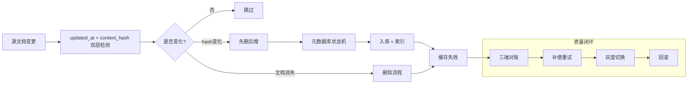

# RAG 知识库动态更新——文章观点 vs 项目现状

> 原文：《RAG 知识库如何实现动态与持续更新？》（沪漂阿龙在努力，2026-06-29）
> 对照项目：SmartAssistant（Spring AI 2.0.0 + Milvus/PgVector）
> 分析日期：2026-07-02

---

## 文章核心框架



---

## 逐条对照

### 1. 变更检测：updated_at + content_hash

| 文章要求 | 项目现状 | 差距 |
|---------|---------|------|
| `updated_at` 粗筛：只拉取时间变化的文档 | ❌ 无 updated_at 粗筛机制，每次全量 reindex | **P0 缺口** |
| 正文规范化后计算 SHA-256（去时间戳/页脚/广告） | ⚠️ HtmlDocumentParser 有简单的时间戳清理，但无系统化 `normalize_text()` | **P1 缺口** |
| content_hash 用于跳过未变化文档 | ❌ contentHash 虽然已生成（所有解析器），但**从未被消费**用于变更判断 | **P0 缺口** |

**项目代码出处：**
- `ParsedDocument.contentHash` — 已生成，类型 `String`
- `HtmlDocumentParser.buildElement()` — 只做了 `sha256(content)` 没有 `normalize_text`
- `KnowledgeIngestionService.parseAndIngest()` — 每次全量 reindex，不检查 hash

**建议改进：**
```java
// KnowledgeIngestionService 增加变更检测
String newHash = contentHash(normalize(normalizedText));
String oldHash = registry.getContentHash(docId);
if (newHash.equals(oldHash)) {
    log.debug("[Ingestion] 文档未变更，跳过: docId={}", docId);
    return IngestionResult.skipped(docId);
}
```

---

### 2. 先删后增：修改时旧 chunk 下线

| 文章要求 | 项目现状 | 差距 |
|---------|---------|------|
| 修改文档时先删除旧 chunk 再重新切分 | ⚠️ InMemory 的 `reindex()` 有 `removeSuperseded()`（同 baseDocId 低版本清理） | **部分覆盖** |
| 不做"只更新一个 chunk"的局部修改 | ✅ PgVector 全量 ON CONFLICT DO UPDATE | ✅ |
| 删除时保证检索层不可见 | ❌ 无 `is_deleted` / `latest` 标记，物理删除为主 | **P1 缺口** |
| 版本过滤（latest=true 查询） | ❌ 无 latest 标记，全靠版本号比较 | **P1 缺口** |

**关键问题：** `PgVectorKnowledgeBase.addDocument()` 和 `MilvusKnowledgeBase.addDocument()` 不会在修改前先删除旧版本。如果同一 baseDocId 有 v1 和 v2，两者都会被检索到。

```java
// 现状：PgVector 只是覆盖（ON CONFLICT）
// 问题：同 baseDocId 但不同 chunk_index 的文档可能共存
"INSERT INTO knowledge_docs ... ON CONFLICT (id) DO UPDATE ..."

// 期望：修改前先删除旧版本
vectorStore.delete(filter={"doc_id": baseDocId, "latest": true});
```

---

### 3. 元数据库状态机（chunk 级 index_status）

| 文章要求 | 项目现状 | 差距 |
|---------|---------|------|
| chunk 注册表（doc_id, chunk_id, version_id, content_hash, index_status） | ❌ 无独立注册表。元数据内嵌在 `knowledge_docs` 表或 Milvus Collection 中 | **P1 缺口** |
| index_status: pending → embedding_done → vector_ready → fulltext_ready → ready / partial_failed | ❌ 无状态追踪。`KnowledgeIngestionService` 要么全成功要么全失败 | **P1 缺口** |
| 补偿任务扫描 partial_failed 修复部分成功 | ❌ 无对账补偿任务 | **P2 缺口** |

**现有近似机制：** `IngestionResult` 只能返回成功/失败，没有 intermediate status。

---

### 4. 乱序保护与幂等

| 文章要求 | 项目现状 | 差距 |
|---------|---------|------|
| revision/event 乱序保护（低版本不覆盖高版本） | ❌ 无 revision 比较机制 | **P2 缺口** |
| 分布式锁（文档级别并发控制） | ❌ 无文档级锁 | **P2 缺口** |
| 幂等（doc_id + version_id 唯一约束） | ✅ PgVector ON CONFLICT 幂等覆盖 | ✅ |

---

### 5. 三端对账（reconciliation）

| 文章要求 | 项目现状 | 差距 |
|---------|---------|------|
| 元数据库作为 source of truth | ❌ 无独立注册表，无法做对账基准 | **P2 缺口** |
| 定期扫描修复向量库与元数据库差异 | ❌ 不存在 | **P2 缺口** |
| 缓存失效（更新后失效引用缓存） | ❌ 无 RAG 缓存失效机制 | **P1 缺口** |

---

### 6. 全量重建 + 灰度切换

| 文章要求 | 项目现状 | 差距 |
|---------|---------|------|
| 新索引 alias 切流 | ❌ 原地覆盖 reindex | **暂不需要** |
| 离线评估后灰度 | ❌ 无灰度切换 | **暂不需要** |
| 保留旧索引回滚 | ❌ 无回滚机制 | **暂不需要** |

**说明：** 项目当前主要用于客服/订单场景，数据量级和变更频率较低，灰度切换需求暂不迫切。

---

### 7. ACL 权限同步

| 文章要求 | 项目现状 | 差距 |
|---------|---------|------|
| tenant_id 检索前过滤 | ✅ 三个 KB 实现均在检索前执行租户过滤 | ✅ |
| 权限变化也算变更 | ❌ 无权限变更的自动同步 | **P2 缺口** |

---

## 覆盖度总览

| 覆盖度 | 数量 | 条目 |
|-------|------|------|
| ✅ **已覆盖/超越** | 4 | 幂等(ON CONFLICT)、确定性chunk_id、ACL检索前过滤、版本评分 |
| ⚠️ **部分覆盖** | 2 | contentHash已生成但未消费(需闭环)、先删后增(InMemory有但PgVector/Milvus无) |
| ❌ **关键缺口** | 6 | 变更检测(updated_at+hash)、缓存失效、状态机(index_status)、乱序保护、分布式锁、对账补偿 |
| 🟦 **暂不需要** | 3 | 灰度切换、离线评估、回滚（数据量和变更频率低） |

---

## 分阶段改进建议

### P0 改进（预估 1 天）

1. **变更检测闭环** — `KnowledgeIngestionService` 增加 `normalize_text()` + contentHash 比较
   - 在 common 模块增加 `HashUtil.normalizeAndHash(String text)` 工具方法
   - `DelayedParsedDocument` 或 `KnowledgeIngestionService` 维护一个轻量级 contentHash registry（Redis 或内存 Map）
   - 对每篇文档计算 hash 后比较，相同则跳过

### P1 改进（预估 1.5 天）

2. **先删后增（全 KB 实现）** — `PgVectorKnowledgeBase.addDocument()` / `MilvusKnowledgeBase.addDocument()` 在写入前先删除同 baseDocId 的旧 chunk
   - 利用 `KnowledgeDocument.getBaseDocId()` 构建 filter 删除
   - 增加 `is_deleted` 标记（软删除）而非物理删除

3. **缓存失效机制** — 文档更新后失效相关的 RAG 查询缓存
   - `KnowledgeBase` 增加 `invalidateCache(baseDocId)` 方法
   - 在 `KnowledgeIngestionService` 成功入库后调用

### P2 改进（预估 2 天）

4. **chunk 注册表** — 新增 `rag_chunk_registry` 表（PgVector）或类似 SF 的 Milvus collection
   - 字段：doc_id, chunk_id, version_id, content_hash, index_status, tenant_id, is_deleted
   - index_status: pending → ready / partial_failed

5. **三端对账任务** — 定时任务扫描 partial_failed 的 chunk，修复向量库/全文索引差异
   - 使用 Spring `@Scheduled` 定期执行
   - 以 chunk 注册表为 source of truth

---

## 总结

这篇文章聚焦 RAG 知识库的**运维可靠性**（运维视角），而非路由/检索策略（算法视角）。SmartAssistant 在版本控制和 ACL 上的设计已经超越了 Demo 级别（`KnowledgeDocument.getBaseDocId()`、`isSupersededBy()`、评分公式中的 `versionBoost`），但在**变更检测**和**异常恢复**方面存在明显的生产级缺口。

核心改进路径：**P0 变更检测 → P1 先删后增 + 缓存失效 → P2 注册表 + 对账**。P0 改动量最小（~50 行），ROI 最高（避免每次全量重建），建议优先实施。
