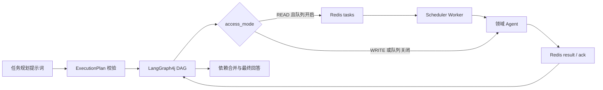

# LangGraph4j 节点消息队列方案

## 结论

任务分配与节点执行可以接入消息队列，但队列只负责可靠传输和执行调度，LangGraph4j 继续负责 DAG、依赖、检查点、人工审批和结果合并。默认只将可安全重试的 `READ` 节点送入 Redis 可靠队列；`WRITE` 节点保持同步调用，避免副作用越过当前图事务。

## 执行链路



## 消息契约与可靠性

- 队列消息携带完整 `AgentExecutionRequest`，保留节点 ID、前驱结构化输出、工作流版本、校验和、幂等键、截止时间和 trace ID。
- Worker 写回类型化 `AgentExecutionResponse`，保留结构化数据、标题标签和领域质量评估，避免降级为纯文本。
- Redis List 使用原子领取、processing 列表、ACK、超时回收、一次传输重试和死信队列，交付语义为 at-least-once。
- 传输重试只处理瞬时失败；语义纠错、重新规划和节点依赖仍由 LangGraph4j 负责。
- 写节点依靠幂等键和人工确认留在同步链路；未来若要异步化，必须先实现持久化审批状态机和事务型 Outbox。

## 配置

```yaml
router:
  scheduler:
    enabled: false
    read-only-only: true
    worker-count: 4
    poll-timeout: 1
    wait-timeout-ms: 65000
    hot-pool-enabled: false
```

首次上线保持 `enabled: false`，确认 Redis 连接、队列积压、P95 延迟、超时回收和死信告警正常后，再按实例灰度开启。若队列关闭或 Scheduler 不可用，节点自动使用原同步调用链路。

## 验收场景

场景：`帮我查询热门耳机，然后创建订单`。

1. 规划器输出 `products(READ)` 和依赖它的 `order(WRITE)`。
2. `products` 经 Redis Worker 执行，并把真实 SKU、质量结果和 trace 信息返回图状态。
3. `order` 读取 `products` 的结构化输出，但保持同步执行并进入人工确认。
4. 验收标准：依赖数据不丢失、READ 可重试、WRITE 不入队、工作流版本和 trace ID 全链路一致。
