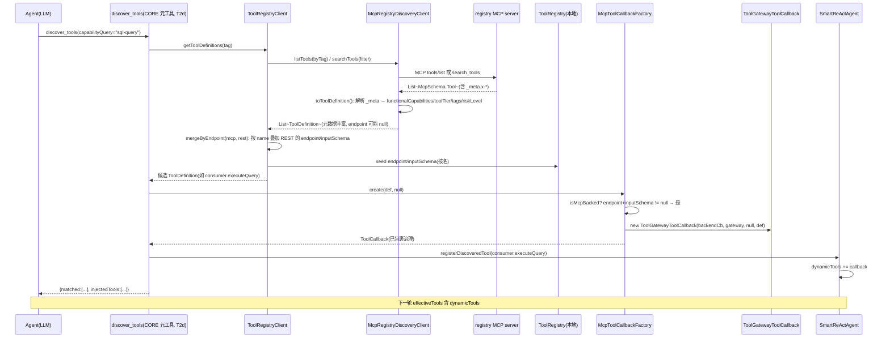
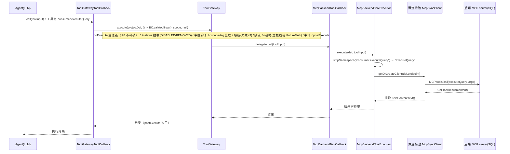
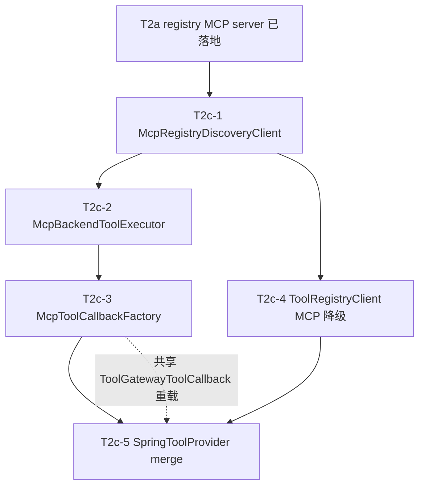

# T2c 设计：Common MCP 适配层（发现客户端 + 执行转发）

> 作者：高见远（software-architect）｜协作：齐活林（team-lead）
> 状态：设计稿（只读，不含实现代码、不修改源码、不 commit）｜日期：2026-07-13
> 依赖事实：T2a（commit `b18192a`）、T2b（commit `02637c9` + `148aa07`）、T2' 设计 `docs/design-tool-discovery-t2-mcp.md`、T1 已落地。
> 本设计**仅设计** T2c 的 5 个文件（3 新增 + 2 修改 + 1 轻微扩展），**不触碰 T2a/T2b 已落地的 registry 模块代码**。

---

## 0. 范围、依据与硬约束

### 0.1 本设计范围（来自 T2' §5.2，不可缩水也不可越界）

全部位于 `smart-assistant-common` 模块：

| 文件 | 动作 | 说明 |
|------|------|------|
| `.../gateway/tool/mcp/McpRegistryDiscoveryClient.java` | **新** | MCP client 封装，连 **registry** MCP server，调 `tools/list` / `search_tools`，把 `_meta` 扩展字段解析回 `ToolDefinition` |
| `.../gateway/tool/mcp/McpBackendToolExecutor.java` | **新** | 经 `ToolGateway` 包裹后转发到**后端** MCP server `tools/call`（源连接池 + 懒加载 + 重连） |
| `.../gateway/tool/mcp/McpToolCallbackFactory.java` | **新** | 由 `ToolDefinition` 生成 `ToolCallback`：center→本地 `@Tool` Bean；MCP-backed→`McpBackendToolExecutor`；统一 `ToolGatewayToolCallback` 包裹 |
| `.../tool/client/ToolRegistryClient.java` | **改** | 增加 MCP 客户端降级衔接（MCP 优先、REST 作 fallback，保留三级降级） |
| `.../tool/provider/SpringToolProvider.java` | **改** | merge 阶段识别 MCP-backed 工具（`endpoint` + `inputSchema` 非空）改用 `McpToolCallbackFactory` 生成回调 |

> 注：`ToolGatewayToolCallback`（common 内，非 registry）需**轻微新增一个 def 感知重载**（见 §2 / §5），以便 MCP-backed 工具以中心目录的完整 `ToolDefinition`（含 DISABLED/REMOVED 状态、rateLimit）驱动 P0 治理，而非退化成 CORE 默认定义。这是复用而非重写，且位于 common 模块，不违反"不碰 T2a/T2b/registry"约束。

### 0.2 已读真实代码、确认的关键 API（设计不可凭记忆，已全部核对）

| 类 / 文件 | 确认的真实签名 / 事实 |
|-----------|----------------------|
| `ToolGateway` (`common/.../gateway/tool/ToolGateway.java`) | 两个 `execute` 重载：`execute(String toolName, ToolExecutor, String scope, String idemKey)`（按名从本地 `ToolRegistry` 解析 def，找不到则按 CORE/ACTIVE 兜底）与 `execute(ToolDefinition def, ToolExecutor, String scope, String idemKey)`（直接用传入 def 跑治理链）。`doExecute` 治理链：status 拦截(DISABLED/REMOVED 拒绝)→preExecute 钩子→幂等→scope/tag 鉴权→熔断(失败≥3)→限流→超时(`FutureTask` + 虚拟线程 + `def.getTimeout()`)→审计→postExecute 钩子。`ToolExecutor` 是 `@FunctionalInterface String execute() throws Exception`。 |
| `ToolGatewayToolCallback` (`common/.../gateway/tool/ToolGatewayToolCallback.java`) | 构造 `ToolGatewayToolCallback(ToolCallback delegate, ToolGateway gateway, String scope)`；`call(toolInput)` = `gateway.execute(delegate.getToolDefinition().name(), () -> delegate.call(toolInput), scope, null)`（走**字符串重载**，会再查本地 `ToolRegistry`）。实现 Spring AI `ToolCallback`（`getToolDefinition()` 返回 Spring AI `ToolDefinition`）。 |
| `ToolRegistryClient` (`common/.../tool/client/ToolRegistryClient.java`) | 构造 `ToolRegistryClient(ToolRegistryProperties, ObjectMapper, ToolGateway, ToolRegistry)`。公开：`getToolDefinitions(tag)`（三级降级：缓存→远程→空）、`getToolDescriptions`、`register`、`getToolCallbacks(tag, Object... beans)`、`registerWithFallback`。内部：`fetchFromRegistry(tag)` 走 REST `GET {url}/api/tools?tags={tag}&status=ACTIVE`，解析 `ApiResponse.data` 为 `List<ToolDefinition>`；`assembleCallbacks(beans)` 用 `MethodToolCallbackProvider` 组装本地 `@Tool`；`resolveRegisteredNames(tag)`。 |
| `SpringToolProvider` (`common/.../tool/provider/SpringToolProvider.java`) | 实现 `ToolProvider`（`getToolCallbacks(String tag)`）。流程：扫 `ApplicationContext` 含 `@Tool` 方法的 Bean → `MethodToolCallbackProvider` 组装 → `resolveRegisteredNames(tag)`（调 `registryClient.getToolDefinitions`）→ 三层 merge（CORE 常驻；SHARED/EXTENSION 需 allowlist）→ 每项 `new ToolGatewayToolCallback(tc, gateway, null)` → 按名排序。 |
| `ToolDefinition` (`common/.../gateway/tool/ToolDefinition.java`) | 字段已含 `name/description/riskLevel(ToolRiskLevel)/timeout/Duration/needsApproval/maxRetries/rateLimit/scopes/tags/version/status(ToolStatus)/namespace/endpoint/capabilities(String[])/outputSchema/inputSchema(String, T2' 新增)/toolTier(ToolTier)/functionalCapabilities(List<String>, T1 新增)`。`isReadOnly()` = `riskLevel==READ`。有 Builder（`toBuilder=true`）。 |
| `ToolRegistryProperties` (`common/.../tool/client/ToolRegistryProperties.java`) | `@ConfigurationProperties(prefix="tool-registry")`：`url`、`cacheTtlSeconds`(30)、`connectTimeoutMs`(2000)、`readTimeoutMs`(5000)。**无 MCP 相关字段**。 |
| `ToolRegistry` (`common/.../gateway/tool/ToolRegistry.java`) | `get(name)`、`register(def)`、`getAll()`、`isRegistered(name)` —— 本地内存 Map。 |
| common `pom.xml` | **当前无任何 MCP 依赖**（仅 `spring-ai-model` / `spring-ai-client-chat` / `spring-ai-ollama` 等）。MCP client SDK 必须新增。 |
| registry `pom.xml` (T2b) | 含 `spring-ai-starter-mcp-server-webmvc`、`spring-ai-starter-mcp-client-webflux`（本地仓库仅此 client starter）、`mcp-json-jackson3:2.0.0`、并把 `jackson-annotations/core/databind` 锁 `2.18.4`；`spring.ai.mcp.client.enabled=false` + `spring.main.web-application-type=servlet` 守门。 |
| registry `McpToolSourceIngestor` (T2b) | 用 `McpClient.sync(HttpClientSseClientTransport.builder(endpoint).build()).requestTimeout(Duration).build()` **手动**建 `McpSyncClient`，调 `client.listTools().tools()`。`HttpClientSseClientTransport` 来自 JDK `HttpClient`（非 WebFlux）。 |
| registry `McpToolRegistryAdapter` (T2a) | **关键事实**：`toMcpTool()` 仅把 `functionalCapabilities/toolTier/tags/riskLevel` 写入 MCP `Tool.meta()`（`_meta`），**并双写 `functionalCapabilities`/`toolTier`**；`annotations` 只有 `title/readOnlyHint/destructiveHint/idempotentHint/openWorldHint`。**`endpoint` 未写入 meta**。 |
| registry `McpServerConfig` + `application.yml` (T2a) | MCP server `protocol: sse`，`sse-endpoint: /sse`，`sse-message-endpoint: /mcp/message`，端口 8088。`search_tools` 是唯一可调用 tool，其余为"可发现但拒绝执行"。 |
| registry `application.yml` `tool-registry.mcp-sources` | 源配置：`sourceId/enabled=false/transport=sse/endpoint(如 http://consumer:8081/mcp)/namespace/...`。 |

### 0.3 硬约束（本设计遵守）

1. **仅设计，不写实现、不改源码、不 commit。**
2. **P0 治理链 100% 不可破**：所有 MCP-backed 工具的 `tools/call` 必须经由 `ToolGateway`（经 `ToolGatewayToolCallback` 包裹）；registry MCP server 不实现传递式 `tools/call`（沿用 T2a 边界）。
3. **复用既有原语**：`ToolRegistryClient` 三级降级、`ToolGroupManager` 元工具模式、`ToolManifestValidator`、`ToolGateway`/`ToolGatewayToolCallback` 治理。
4. **不碰 T2a/T2b/registry 已落地代码**；不重新设计 32 令牌词表（复用 `ToolFunctionalCapability`）。
5. **T2c 是基础设施层**：不依赖 T4（`capabilityScope` 预载，那是 T2d 的事），但可被 T2d 复用。
6. **降级策略**：MCP 不可用时回到现有 HTTP REST / 缓存（CORE-only 三级降级不破）。

---

## 1. 实现方案 + 框架选型

### 1.1 依赖（common `pom.xml` 需新增）

**核心结论**：common 当前无 MCP client SDK，必须新增。提供两种方案，推荐方案 A（轻量、对公共库更干净），方案 B 为与 T2b 完全一致的零风险路径。

**方案 A（推荐，轻量 SDK，不引 reactive 栈）**：直接依赖 MCP Java SDK 核心包（含 `McpClient`/`McpSyncClient`/`HttpClientSseClientTransport`/`McpSchema`），与 registry 已用的 `mcp-json-jackson3:2.0.0` 同一版本 `2.0.0`：

```xml
<!-- T2c：MCP client SDK（手动构造 McpSyncClient，不依赖 Spring 自动装配） -->
<dependency>
    <groupId>io.modelcontextprotocol.sdk</groupId>
    <artifactId>mcp</artifactId>
    <version>2.0.0</version>
</dependency>
<dependency>
    <groupId>io.modelcontextprotocol.sdk</groupId>
    <artifactId>mcp-json-jackson3</artifactId>
    <version>2.0.0</version>
</dependency>
```

> 理由：common 被所有 Agent 模块依赖，方案 A 仅引入 MCP SDK 类，**不向消费方传播 WebFlux/Netty reactive 栈**。手动 `McpClient.sync(transport)` 构造 client（与 T2b 一致），无需 Spring client 自动装配。

**方案 B（与 T2b 完全一致，零风险）**：镜像 registry 的引入方式：

```xml
<dependency>
    <groupId>org.springframework.ai</groupId>
    <artifactId>spring-ai-starter-mcp-client-webflux</artifactId>
</dependency>
<dependency>
    <groupId>io.modelcontextprotocol.sdk</groupId>
    <artifactId>mcp-json-jackson3</artifactId>
    <version>2.0.0</version>
</dependency>
```

> 代价：向所有消费 common 的模块传递引入 WebFlux 依赖；需在各 Agent `application.yml` 设 `spring.ai.mcp.client.enabled=false` + `spring.main.web-application-type=servlet`（同 registry 守门）以避免 reactive 自动装配。优点：与 T2b 字节级一致，编译/运行已验证。
> **此为待主理人拍板项（见 §8.1）**。无论 A/B，版本统一钉 `2.0.0`（与 `mcp-json-jackson3` 对齐，由父 `spring-ai-bom` 2.0.0 管理 client starter 版本；纯 `mcp` SDK 需显式 2.0.0）。

**Jackson 钉法（防御性）**：若遇到 `NoClassDefFoundError: com.fasterxml.jackson.annotation.JsonSerializeAs`（registry T2b 已踩过），在 common `pom.xml` 的 `<dependencyManagement>` 中锁 `jackson-annotations/core/databind` 为 `2.18.4`（同 registry）。建议方案 B 时直接复制 registry 的钉法；方案 A 下多数情况不需要，但保留为回退。

### 1.2 传输方式

- **SSE / `HttpClientSseClientTransport`（JDK `HttpClient`，非 WebFlux）**：与 T2b 拉取后端、与 registry MCP server（WebMvc/SSE）**完全一致**。
- 客户端**手动构造**（`McpClient.sync(transport).requestTimeout(...).build()`），不使用 Spring AI client 自动装配（避免 `spring.ai.mcp.client.enabled` 触发默认 bean 连接）。
- registry MCP server 连接基址默认 = `tool-registry.url`（如 `http://localhost:8088`），SDK 自动追加 `/sse`；需与 registry `spring.ai.mcp.server.sse-endpoint: /sse` 对齐（见 §7 配置项）。

### 1.3 关键代码事实驱动的 3 个设计决策

1. **`endpoint` 不在 MCP 元数据里**（T2a `buildMeta` 未写）：纯 MCP 发现得到的 `ToolDefinition.endpoint` 为 null，**无法直接转发后端**。T2c 解决方式（不越界改 T2a）：`ToolRegistryClient` 的 MCP 优先通道以「MCP 发现的元数据」为基，**按 name 叠加 REST 返回的 `endpoint`/`inputSchema`**，得到执行可用的完整 def；执行时 `McpBackendToolExecutor` 仍可经本地 `ToolRegistry.get(name)` 兜底取 endpoint。两条路径都保证 endpoint 可用。
2. **扩展字段写在 `_meta` 而非 `annotations`**（T2a 实现与 T2' §1.2 表不一致）：`McpRegistryDiscoveryClient.toToolDefinition` 的解析**权威来源是 `tool.meta()`**（`x-functional-capabilities`/`x-tool-tier`/`x-tags`/`x-risk-level` + 双写 `functionalCapabilities`/`toolTier`）；同时容错读取 `tool.annotations().readOnlyHint()` 推导 `READ`。
3. **MCP-backed 工具的完整 `ToolDefinition` 不在本地 `ToolRegistry`**：`ToolGatewayToolCallback` 现有 `call()` 走字符串重载会再查本地 `ToolRegistry`、查不到则退化成 CORE 默认定义（丢失 DISABLED 状态/rateLimit）。因此新增 **def 感知重载**，把中心目录的完整 `ToolDefinition` 直接传给 `ToolGateway.execute(ToolDefinition, ...)`，确保 P0 治理用真实定义。

---

## 2. 文件清单及相对路径（新增 / 修改）

> 包前缀统一：`com/example/smartassistant/common`（下文用 `...` 代替）。

### 2.1 新增文件

**`.../gateway/tool/mcp/McpRegistryDiscoveryClient.java`** —— MCP 发现客户端（连 registry MCP server）
- 字段：`McpSyncClient registryClient`（手动构造，连 `props.getMcpEndpoint()` + `/sse`）、`ObjectMapper`、`McpDiscoveryProperties props`、`boolean enabled`。
- 关键方法：
  - `List<ToolDefinition> listTools(Set<String> tags)`：连 registry MCP server `listTools()` → 逐个 `toToolDefinition` → 按 `tags` 客户端过滤（因 `search_tools` 无 tag 参数，见 §7）；失败抛受检异常供上层降级。
  - `List<ToolDefinition> searchTools(McpSearchFilter filter)`：调 `registryClient.callTool("search_tools", args)` → 解析返回的 JSON 数组（`McpSchema.Tool` 列表）→ 逐个 `toToolDefinition`。
  - `private ToolDefinition toToolDefinition(McpSchema.Tool tool)`：**解析 `tool.meta()`**（`x-functional-capabilities`/`x-tool-tier`/`x-tags`/`x-risk-level` + 双写 `functionalCapabilities`/`toolTier`），`description`/`inputSchema`（Map→JSON String）来自 `tool` 自身；`riskLevel` 优先 `x-risk-level`，缺失时由 `annotations().readOnlyHint()` 推导。
  - `private McpSearchFilter` 内部记录 `functionalCapabilities/keyword/matchMode/tier/status/limit`，序列化为 `search_tools` 入参 Map。
  - `@PreDestroy close()`：关闭 `registryClient`。
- 可测性：`McpSyncClient` 创建封装为可注入 `McpRegistryClientFactory`（生产用真实 `HttpClientSseClientTransport`，测试可 stub），**不依赖真实 registry**（镜像 T2b 的 `McpBackendClientFactory` 模式）。

**`.../gateway/tool/mcp/McpBackendToolExecutor.java`** —— 后端 MCP 执行转发（源连接池）
- 字段：`Map<String, McpSyncClient> pool`（endpoint→client，按源连接池 + 懒加载）、`McpDiscoveryProperties props`、`ObjectMapper`。
- 关键方法：
  - `String execute(ToolDefinition def, String toolInput)`：① `backendName = stripNamespace(def.getName())`；② `client = getOrCreateClient(def.getEndpoint())`；③ `args = parseJson(toolInput)`（空白→空 Map）→ `CallToolRequest.builder().name(backendName).arguments(args).build()`；④ `CallToolResult r = client.callTool(req)`；⑤ `extractText(r)` 拼接 `TextContent.text()` 返回。
  - `private McpSyncClient getOrCreateClient(String endpoint)`：懒加载 + 失败重连（捕获连接异常→`close()` 旧 client→重建）；请求超时取 `props.getMcpBackendRequestTimeoutMs()`。
  - `private static String stripNamespace(String fullName)`：去首个 `.` 之前前缀（`consumer.executeQuery`→`executeQuery`）；无 `.` 原样返回。
  - `@PreDestroy closeAll()`：遍历关闭所有 `McpSyncClient`（**连接池生命周期必须显式关闭**）。
- 治理衔接：本类**不**做限流/超时/熔断，全部复用 `ToolGateway`（见 §4b 时序）；仅做连接级超时与重连。

**`.../gateway/tool/mcp/McpToolCallbackFactory.java`** —— 回调工厂（统一包裹 `ToolGatewayToolCallback`）
- 字段：`ToolRegistry toolRegistry`、`ToolGateway gateway`、`McpBackendToolExecutor backendExecutor`。
- 关键方法：
  - `ToolCallback create(ToolDefinition def, @Nullable ToolCallback localCallback)`：
    - **MCP-backed 分支**（`isMcpBacked(def)` 为真）：构造 `McpBackendToolCallback(def, backendExecutor)` → `new ToolGatewayToolCallback(backendCb, gateway, null, def)`（**def 感知重载**）。
    - **center / 本地分支**：`cb = (localCallback != null) ? localCallback : buildLocalFromDef(def)`（兜底用反射/空实现，正常由 `SpringToolProvider` 传入本地 `@Tool` 回调）→ `new ToolGatewayToolCallback(cb, gateway, null, def)`。
  - `static boolean isMcpBacked(ToolDefinition def)`：`def.getEndpoint() != null && def.getInputSchema() != null`（与 T2b 写入对齐：MCP-backed 工具必有 endpoint + inputSchema；中心 `@Tool` 工具二者为 null）。
- 内部类 `McpBackendToolCallback implements org.springframework.ai.tool.ToolCallback`：
  - `getToolDefinition()`：返回由 `def` 重建的 Spring AI `ToolDefinition`（`name=def.getName()`，`inputSchema=parse(def.getInputSchema())`，`description=def.getDescription()`）。
  - `call(String toolInput)`：`return backendExecutor.execute(def, toolInput)`。

### 2.2 修改文件

**`.../tool/client/ToolRegistryClient.java`**（修改：`fetchFromRegistry` 增加 MCP 优先通道）
- 新增字段：`McpRegistryDiscoveryClient discoveryClient`（可空注入）、`boolean mcpDiscoveryEnabled`（来自 `props`）。
- 修改 `getToolDefinitions(tag)`：缓存命中逻辑不变；远程分支改为：`fetchFromRegistry(tag)`。
- 新增 `private List<ToolDefinition> fetchFromRegistry(String tag)`：
  ```
  if (mcpDiscoveryEnabled && discoveryClient != null) {
      try {
          List<ToolDefinition> mcpDefs = discoveryClient.listTools(byTag(tag));        // 元数据丰富（capabilities/tier/tags）
          List<ToolDefinition> restDefs = fetchFromRegistryRest(tag);                  // 完整 def（含 endpoint/inputSchema）
          return mergeByEndpoint(mcpDefs, restDefs);                                   // 按 name：基=mcp，叠加 endpoint/inputSchema 自 rest
      } catch (Exception e) {
          log.warn("MCP 发现失败，降级 REST: {}", e.getMessage());
      }
  }
  return fetchFromRegistryRest(tag);   // 原实现改名保留
  ```
- 新增 `private List<ToolDefinition> fetchFromRegistryRest(String tag)`：**原 `fetchFromRegistry` 体**，从 REST `GET {url}/api/tools?tags={tag}&status=ACTIVE` 解析。
- 新增 `private List<ToolDefinition> mergeByEndpoint(List<Tcp> mcp, List<Tcp> rest)`：以 mcp 列表为基，按 name 查找 rest 中同名 def，**覆盖 `endpoint` 与 `inputSchema`**（rest 为权威执行信息），其余字段保留 mcp 的扩展元数据；rest 有而 mcp 无的也补入。
- **三级降级保持不变**：`getToolDefinitions` 外层仍是「缓存→远程(含 MCP优先/REST fallback)→过期缓存→空/CORE-only」。

**`.../tool/provider/SpringToolProvider.java`**（修改：merge 增加 MCP-backed 分支）
- 新增字段：`McpToolCallbackFactory callbackFactory`。
- 修改 `getToolCallbacks(tag)`：
  - 现有本地 `@Tool` Bean 合并逻辑（CORE 常驻 + SHARED/EXTENSION allowlist + `ToolGatewayToolCallback` 包裹）**保持不变**，产出 `localMerged`。
  - 新增：从 `registryClient.getToolDefinitions(tag)` 取**完整 def 列表**（已含 endpoint/inputSchema），对其中的 MCP-backed def（`factory.isMcpBacked(def)` 且不在本地已表示）调用 `callbackFactory.create(def, null)`，产出 `mcpBackedCallbacks`。
  - 返回 `localMerged ∪ mcpBackedCallbacks`，按名排序。
  - 说明：MCP-backed 工具无本地 `@Tool` Bean，故需此分支；预置工具集即可包含（如 `consumer.executeQuery`），亦可由 T2d `discover_tools` 按需注入 `dynamicTools`（后者不经 `SpringToolProvider`）。

**`.../gateway/tool/ToolGatewayToolCallback.java`**（轻微修改：新增 def 感知重载，**向后兼容**）
- 新增构造：`ToolGatewayToolCallback(ToolCallback delegate, ToolGateway gateway, String scope, ToolDefinition projectDef)`。
- 新增字段：`private final ToolDefinition projectDef;`（旧构造传 null）。
- 修改 `call(String toolInput)`：
  ```
  if (projectDef != null) {
      return gateway.execute(projectDef, () -> delegate.call(toolInput), scope, null); // 用真实 def 跑治理链
  }
  return gateway.execute(delegate.getToolDefinition().name(), () -> delegate.call(toolInput), scope, null); // 原字符串重载
  ```
- 仅此一处新增重载，旧调用方（center 工具）行为不变。

### 2.3 配置类（建议扩展，非新建独立块）

**`.../tool/client/ToolRegistryProperties.java`**（修改：追加 MCP 发现字段）
- 追加：`boolean mcpDiscoveryEnabled = false`、`String mcpEndpoint`（默认 = `url`）、`int mcpRequestTimeoutMs = 5000`、`int mcpBackendRequestTimeoutMs = 5000`、`int mcpBackendMaxIdleSeconds = 300`。
- 或在 §8 待明确中决定的独立 `@ConfigurationProperties(prefix="mcp-discovery")` 类（推荐前者，单配置块）。

### 2.4 测试文件（新增，见 §9）

- `.../src/test/java/.../gateway/tool/mcp/McpRegistryDiscoveryClientTest.java`
- `.../src/test/java/.../gateway/tool/mcp/McpBackendToolExecutorTest.java`
- `.../src/test/java/.../gateway/tool/mcp/McpToolCallbackFactoryTest.java`
- `.../src/test/java/.../tool/client/ToolRegistryClientMcpFallbackTest.java`
- `.../src/test/java/.../tool/provider/SpringToolProviderMcpBackedTest.java`

---

## 3. 数据结构和接口（类图）

```mermaid
classDiagram
    %% ===== 数据模型（T1 + T2' 已落地）=====
    class ToolDefinition {
        +String name
        +String description
        +ToolRiskLevel riskLevel
        +ToolStatus status
        +ToolTier toolTier
        +String[] capabilities
        +List~String~ functionalCapabilities
        +String[] tags
        +String endpoint
        +String inputSchema
        +isReadOnly() boolean
    }
    class ToolFunctionalCapability {
        <<enum>> 32 令牌词表
        +fromValue(String) ToolFunctionalCapability
        +isValid(String) boolean
    }
    ToolDefinition --> ToolFunctionalCapability : functionalCapabilities 引用令牌

    %% ===== 新增：Common MCP 适配层 =====
    class McpRegistryDiscoveryClient {
        -McpSyncClient registryClient
        -ObjectMapper objectMapper
        -McpDiscoveryProperties props
        +listTools(Set~String~ tags) List~ToolDefinition~
        +searchTools(McpSearchFilter) List~ToolDefinition~
        -toToolDefinition(McpSchema.Tool) ToolDefinition
        -parseMeta(Map) 扩展字段
        +close() @PreDestroy
    }
    class McpBackendToolExecutor {
        -Map~String, McpSyncClient~ pool
        -McpDiscoveryProperties props
        +execute(ToolDefinition def, String toolInput) String
        -getOrCreateClient(String endpoint) McpSyncClient
        -stripNamespace(String) String
        +closeAll() @PreDestroy
    }
    class McpToolCallbackFactory {
        -ToolRegistry toolRegistry
        -ToolGateway gateway
        -McpBackendToolExecutor backendExecutor
        +create(ToolDefinition def, ToolCallback local) ToolCallback
        +isMcpBacked(ToolDefinition) boolean
    }
    class McpBackendToolCallback {
        <<inner, impl ToolCallback>>
        -ToolDefinition def
        -McpBackendToolExecutor executor
        +getToolDefinition() org.springframework.ai.tool.definition.ToolDefinition
        +call(String) String
    }

    %% ===== 修改 =====
    class ToolRegistryClient {
        -McpRegistryDiscoveryClient discoveryClient
        -boolean mcpDiscoveryEnabled
        +getToolDefinitions(tag) 三级降级 + MCP 优先
        -fetchFromRegistryRest(tag) List~ToolDefinition~
        -mergeByEndpoint(mcp, rest) List~ToolDefinition~
    }
    class SpringToolProvider {
        -McpToolCallbackFactory callbackFactory
        +getToolCallbacks(tag) 含 MCP-backed 分支
    }
    class ToolGatewayToolCallback {
        -ToolDefinition projectDef  %% 新增重载携带
        +ToolGatewayToolCallback(delegate, gateway, scope, projectDef)  %% 新增重载
        +call(String) String
    }

    %% ===== P0 治理（不可破坏）=====
    class ToolGateway {
        +execute(ToolDefinition def, ToolExecutor, scope, idemKey) String
        -doExecute(...) 状态/审批/限流/超时/审计
    }
    class ToolRegistry {
        +get(String) ToolDefinition
        +register(ToolDefinition)
    }
    class ToolProvider {
        <<interface>>
        +getToolCallbacks(String tag) List~ToolCallback~
    }

    %% ===== 外部 SDK =====
    class McpSyncClient {
        <<SDK io.modelcontextprotocol.client>>
        +listTools() ListToolsResult
        +callTool(CallToolRequest) CallToolResult
        +close()
    }
    class HttpClientSseClientTransport {
        <<SDK>> builder(url)
    }

    %% ===== 关系 =====
    ToolGatewayToolCallback --> ToolGateway : 路由 call()（def 感知重载）
    ToolGatewayToolCallback --> ToolDefinition : projectDef 驱动治理
    McpBackendToolCallback ..|> org.springframework.ai.tool.ToolCallback
    McpToolCallbackFactory --> McpBackendToolExecutor : MCP-backed 分支
    McpToolCallbackFactory --> McpBackendToolCallback : 构造
    McpToolCallbackFactory --> ToolRegistry : 兜底解析 endpoint
    McpToolCallbackFactory ..> ToolGatewayToolCallback : 统一包裹
    McpBackendToolExecutor --> McpSyncClient : 源连接池转发 tools/call
    McpBackendToolExecutor --> ToolDefinition : 取 endpoint + 去前缀
    McpRegistryDiscoveryClient --> McpSyncClient : 连 registry MCP server
    McpRegistryDiscoveryClient --> ToolDefinition : 解析回(_meta)
    ToolRegistryClient --> McpRegistryDiscoveryClient : MCP 优先通道
    ToolRegistryClient --> ToolDefinition : REST fallback 提供 endpoint
    SpringToolProvider ..|> ToolProvider
    SpringToolProvider --> McpToolCallbackFactory : MCP-backed 生成回调
    SpringToolProvider --> ToolRegistryClient : 取中心完整 defs
    ToolRegistryClient --> ToolRegistry : 本地缓存/降级
    McpSyncClient ..> HttpClientSseClientTransport : 构造自
```



> 类图另存于 `docs/t2c-class-diagram.mermaid`。

---

## 4. 程序调用流程（时序图）

### 4a. discover_tools 经 MCP 发现并注入 dynamicTools（复用 T2' §2.2，标注 T2c 组件）



### 4b. MCP-backed 工具经 ToolGateway 执行转发后端（复用 T2' §3.4，重点标出治理包裹点）



> 时序图另存于 `docs/t2c-sequence-diagram.mermaid`。

---

## 5. 任务列表（有序、含依赖、按实现顺序）

> 拆 5 个子任务；建议实现顺序与依赖如下。每个子任务附测试点（详见 §9）。

| ID | 任务 | 依赖 | 优先级 | 对应文件 |
|----|------|------|--------|----------|
| **T2c-1** | **McpRegistryDiscoveryClient**：MCP client 封装，连 registry MCP server，`tools/list`/`search_tools` 解析 `_meta` 扩展字段回 `ToolDefinition`；可注入 `McpRegistryClientFactory` 便于单测 | T2a（MCP 契约已落地） | P0 | `McpRegistryDiscoveryClient.java` + `McpRegistryDiscoveryClientTest.java` |
| **T2c-2** | **McpBackendToolExecutor + 源连接池**：`execute(def, toolInput)` 去前缀→`McpSyncClient.callTool`→提取文本；懒加载/重连/`@PreDestroy` 关闭；超时取配置 | T2c-1（共享 `McpSyncClient`/`HttpClientSseClientTransport` 用法） | P0 | `McpBackendToolExecutor.java` + `McpBackendToolExecutorTest.java` |
| **T2c-3** | **McpToolCallbackFactory + ToolGatewayToolCallback def 感知重载**：`create(def, local)` 分流 center/MCP-backed；内部 `McpBackendToolCallback`；统一 `ToolGatewayToolCallback` 包裹（新重载传 projectDef） | T2c-2、`ToolGateway`/`ToolGatewayToolCallback`（common 已存在） | P0 | `McpToolCallbackFactory.java`、`ToolGatewayToolCallback.java`（改）、`McpToolCallbackFactoryTest.java` |
| **T2c-4** | **ToolRegistryClient MCP 降级衔接**：注入 `McpRegistryDiscoveryClient`，`fetchFromRegistry` 改 MCP 优先 + REST fallback + `mergeByEndpoint`；三级降级不变 | T2c-1、`ToolRegistryClient`（已存在） | P0 | `ToolRegistryClient.java`（改）、`ToolRegistryClientMcpFallbackTest.java` |
| **T2c-5** | **SpringToolProvider merge 识别 MCP-backed**：`getToolCallbacks` 增加 MCP-backed 分支，经 `McpToolCallbackFactory` 生成回调；center 路径不变 | T2c-3、T2c-4、`SpringToolProvider`（已存在） | P1 | `SpringToolProvider.java`（改）、`SpringToolProviderMcpBackedTest.java` |

**依赖图（mermaid）**



---

## 6. 依赖包列表

common `pom.xml` 需加（版本钉法见 §1.1）：

```
# 方案 A（推荐，轻量，无 reactive 栈）：
io.modelcontextprotocol.sdk:mcp:2.0.0
io.modelcontextprotocol.sdk:mcp-json-jackson3:2.0.0

# 方案 B（与 T2b 一致，零风险）：
org.springframework.ai:spring-ai-starter-mcp-client-webflux   # 版本由父 spring-ai-bom 2.0.0 管理
io.modelcontextprotocol.sdk:mcp-json-jackson3:2.0.0

# Jackson 防御性钉法（方案 B 必带；方案 A 遇 NoClassDefFoundError 时加）：
com.fasterxml.jackson.core:jackson-annotations:2.18.4
com.fasterxml.jackson.core:jackson-core:2.18.4
com.fasterxml.jackson.core:jackson-databind:2.18.4
```

- `mcp`/`mcp-json-jackson3` 版本统一 `2.0.0`，与 registry 已验证的 `mcp-json-jackson3:2.0.0` 对齐。
- client starter 版本由父 `spring-ai-bom`（`2.0.0`）管理，**不显式写版本**（避免全局升级，同 registry 注释）。
- 运行守门：`spring.ai.mcp.client.enabled=false`（消费方 `application.yml`，同 T2b）+ 若用方案 B 还需 `spring.main.web-application-type=servlet`。

---

## 7. 共享知识（跨文件约定）

1. **namespace 前缀去掉规则**：完整工具名 = `<namespace>.<backendToolName>`（如 `consumer.executeQuery`，由 T2b 写入）。`McpBackendToolExecutor.stripNamespace` 去**首个** `.` 之前部分 → `executeQuery`。namespace 为单段（T2b `source.namespace`），故只去首点；无 `.` 原样返回。
2. **inputSchema 原样转发**：`McpBackendToolExecutor` **不**用 `ToolDefinition.inputSchema` 校验入参，仅把 LLM 给的 `toolInput`（JSON 字符串）解析为 `Map<String,Object>` 透传给后端 `callTool`；后端自行校验。`inputSchema` 对执行是**信息性**的（供发现/LLM 用）。
3. **`_meta` 扩展字段解析回写映射表**（权威来源 = `tool.meta()`）：

   | MCP `Tool._meta` 键 | → `ToolDefinition` 字段 | 说明 |
   |---------------------|--------------------------|------|
   | `x-functional-capabilities` | `functionalCapabilities` | 优先；缺失看 `functionalCapabilities` |
   | `functionalCapabilities`（双写） | `functionalCapabilities` | 兜底 |
   | `x-tool-tier` / `toolTier` | `toolTier` | 值=`CORE`/`SHARED`/`EXTENSION`；缺失默认 `SHARED` |
   | `x-tags` | `tags` | `String[]` |
   | `x-risk-level` | `riskLevel` | 值=`READ`/`LOW`/`MEDIUM`/`HIGH`；缺失由 `annotations.readOnlyHint()` 推导（true→READ） |
   | （无） | `endpoint` | **`_meta` 不含 endpoint** → 由 `ToolRegistryClient.mergeByEndpoint` 从 REST 叠加 |
   | （无） | `inputSchema` | 由 `tool.inputSchema()`（Map→JSON String）得；与 endpoint 同理可由 REST 兜底 |

4. **连接池生命周期**：`McpBackendToolExecutor.pool` 为 `endpoint→McpSyncClient` 长连接，懒加载；`@PreDestroy closeAll()` 必须关闭所有 client（避免 SSE 连接泄漏）。`McpRegistryDiscoveryClient` 同样 `@PreDestroy close()`。`McpSyncClient` 由 `McpClient.sync(transport).requestTimeout(...).build()` 构造，单次调用失败→`close()` 旧连接→重建（SDK SSE transport 自带重连）。
5. **配置项读取位置**：**新增字段挂在现有 `tool-registry` 配置块**（扩展 `ToolRegistryProperties`），不新开块（见 §8.2 待明确）。新增键：`mcp-discovery-enabled`(默认 false)、`mcp-endpoint`(默认 = `url`)、`mcp-request-timeout-ms`(5000)、`mcp-backend-request-timeout-ms`(5000)、`mcp-backend-max-idle-seconds`(300)。registry 连接基址须与 registry `spring.ai.mcp.server.sse-endpoint: /sse` 对齐（SDK 自动补 `/sse`）。
6. **MCP-backed 判定规则**（统一，跨 `McpToolCallbackFactory`/`SpringToolProvider`）：`def.getEndpoint() != null && def.getInputSchema() != null` → MCP-backed。与 T2b 写入对齐（中心 `@Tool` 工具二者为 null）。
7. **三级降级保留**：`ToolRegistryClient.getToolDefinitions` 外层「缓存→远程→过期缓存→空/CORE-only」**完全不变**；MCP 仅作为"远程"步骤内的优先 fetch 源，MCP 失败自动回退 REST，REST 也失败则继续外层降级。CORE 工具永远可用，不依赖中心/MCP。
8. **特性开关**：`mcp-discovery-enabled=false` 时 `ToolRegistryClient` 完全走原 REST 路径（T2c 改动零影响，可一键回退到 T2' 前行为）；开启后才走 MCP 优先通道。

---

## 8. 待明确事项（需主理人 / 用户拍板，或代码无法单独确认）

1. **【依赖选型】common 引入轻量 `mcp` SDK（方案 A）还是镜像 T2b 的 `spring-ai-starter-mcp-client-webflux`（方案 B）？** 方案 A 不向消费方传播 reactive 栈（对公共库更干净），但需确认本地仓库可解析 `io.modelcontextprotocol.sdk:mcp:2.0.0`；方案 B 与 T2b 字节级一致、零风险，但给所有 Agent 模块带 WebFlux 依赖（靠 `enabled=false`+`servlet` 守门）。**建议方案 A，方案 B 作回退**。
2. **【配置块】MCP 发现配置是扩展 `tool-registry` 块（扩展 `ToolRegistryProperties`）还是新建 `mcp-discovery` 块（新 `@ConfigurationProperties`）？** 建议扩展 `ToolRegistryProperties`（单配置块、与 `url` 同源），但需确认不与 registry 侧 `mcp-sources` 语义混淆（二者不同：registry 侧是"后端源接入配置"，common 侧是"消费方发现/转发配置"）。
3. **【endpoint 缺口】T2a `buildMeta` 未把 `endpoint` 写入 MCP `_meta`，纯 MCP 发现无 endpoint。** T2c 以"REST 叠加 endpoint"解决（§1.3/§7.3），**不越界改 T2a**。若主理人希望纯 MCP 路径也能自给 endpoint，则需 T2a 在 `buildMeta` 追加 `endpoint` 键（属 registry 改动，超出 T2c 范围）——请确认是否接受 T2c 的 REST 叠加方案。
4. **【心跳/重连】`McpBackendToolExecutor` 是否需要 `@EnableScheduling` 定时心跳保活？** 建议**首版不引入定时心跳**，仅做"调用时懒加载 + 失败重连"（SDK SSE transport 自带重连）；若后端要求心跳保活再补 `@Scheduled` 健康检查（待明确，列入 T2e 观测项）。
5. **【def 感知重载】`ToolGatewayToolCallback` 新增一个携带 `ToolDefinition` 的重载（向后兼容）是否可接受？** 位于 common（非 registry），属 T2c 范围内小幅扩展，是让 MCP-backed 工具以真实定义跑 P0 治理的唯一干净方式。请确认。
6. **【默认通道】`ToolRegistryClient.getToolDefinitions`（预置工具集）默认走 `listTools`（全量+客户端 tag 过滤）还是 `searchTools`（能力过滤）？** 建议 `listTools` + 客户端 tag 过滤（因 `search_tools` 无 tag 参数，见 §7.5）；`search_tools` 主要供 T2d `discover_tools` 能力检索用。
7. **【消费方守门】各 Agent 模块 `application.yml` 是否统一加 `spring.ai.mcp.client.enabled=false`？** 若选方案 B 则必须；若选方案 A 且不使用 Spring 自动装配的 client bean，则非必须但仍建议显式关闭以防误装配。需在各 Agent 模块落地（T2c 之外，建议记入 T2e）。

---

## 9. 测试策略（每子任务核心测试点）

**T2c-1 `McpRegistryDiscoveryClientTest`**
- `toToolDefinition` 解析映射：构造一个带 `_meta`（`x-functional-capabilities=["sql-query"]`、`x-tool-tier=SHARED`、`x-tags=["consumer"]`、`x-risk-level=READ` + 双写）的 `McpSchema.Tool`，断言得到的 `ToolDefinition` 的 `functionalCapabilities`/`toolTier`/`tags`/`riskLevel` 正确；`name`/`description`/`inputSchema` 原样。
- `annotations.readOnlyHint=true` 但 `_meta` 无 `x-risk-level` 时，`riskLevel` 推导为 `READ`。
- `listTools` 经注入的 `McpRegistryClientFactory` stub 返回固定 `Tool` 列表，断言按 `tags` 客户端过滤正确。
- `searchTools` 调 `callTool("search_tools", ...)` 解析返回的 JSON 数组为 `List<ToolDefinition>`。
- 失败降级：stub 抛异常时，`listTools` 抛异常（由 `ToolRegistryClient` 捕获降级，本类不吞）。

**T2c-2 `McpBackendToolExecutorTest`**
- `stripNamespace("consumer.executeQuery")=="executeQuery"`；无前缀原样。
- `execute(def, toolInput)`：注入 `McpSyncClient` stub（返回 `CallToolResult` 含 `TextContent`），断言 `callTool` 用正确 `backendName` + 解析后的 `arguments` Map 被调用，返回拼接文本。
- 连接失败：`getOrCreateClient` 捕获异常→重建 client（断言重建发生、不抛穿）。
- `@PreDestroy closeAll`：断言所有 client 的 `close()` 被调用（连接池生命周期）。

**T2c-3 `McpToolCallbackFactoryTest` + `ToolGatewayToolCallback` 重载**
- `isMcpBacked`：`endpoint+inputSchema` 非空→true；中心工具（二者 null）→false。
- `create` MCP-backed 分支：返回 `ToolCallback`，`call` 触发 `McpBackendToolExecutor.execute`；且被 `ToolGateway` 包裹（用 `ToolGateway` mock 断言 `execute(ToolDefinition, ...)` 被调用——**验证 100% 经 ToolGateway**）。
- `create` center 分支：传入本地 `ToolCallback`，返回包裹后回调；`call` 走本地 delegate。
- **治理包裹验证**：mock `ToolGateway`，断言 MCP-backed 回调 `call` 时 `ToolGateway.execute` 收到的是**真实 `ToolDefinition`（projectDef）** 而非字符串重载（P0 不可破的关键断言）。

**T2c-4 `ToolRegistryClientMcpFallbackTest`**
- MCP 优先：注入 `discoveryClient` stub（返回元数据丰富 def，endpoint=null）+ REST stub（返回含 endpoint 的 def），`getToolDefinitions` 结果中 `endpoint`/`inputSchema` 来自 REST 叠加、`functionalCapabilities` 来自 MCP。
- 降级：MCP stub 抛异常时，`getToolDefinitions` 自动回退 REST 且仅 REST 结果（端点可用时不破）。
- 开关：`mcpDiscoveryEnabled=false` 时完全走原 REST，行为与 T2c 前一致（回归）。
- 三级降级：REST 也失败→返回过期缓存/空，CORE-only 不破。

**T2c-5 `SpringToolProviderMcpBackedTest`**
- MCP-backed 识别：`getToolDefinitions` 返回含 `consumer.executeQuery`（endpoint+inputSchema 非空）时，`getToolCallbacks(tag)` 产出对应 `ToolCallback` 且经 `McpToolCallbackFactory` 生成（断言 `McpBackendToolExecutor` 被接线）。
- 不重复：本地已存在的 `@Tool` Bean 不因 MCP-backed 分支重复。
- center 路径不变：仅本地 `@Tool` 时行为与 T2c 前一致（CORE 常驻 + allowlist）。

---

## 10. 与 T2a / T2b / T2d 的衔接 & 风险

### 10.1 衔接
- **T2a**：T2c 消费 T2a 的 MCP 契约（`tools/list`/`search_tools`、registry SSE 端点、`_meta` 写法）。T2c 解析严格对齐 T2a `buildMeta` 实际实现（读 `_meta`，非设计稿 §1.2 的 `annotations`）。
- **T2b**：T2c 消费 T2b 写入中心目录的 MCP-backed `ToolDefinition`（`endpoint`/`inputSchema`/`namespace.` 前缀/`SHARED`/`READ`/`sql-query`）。连接池复用 T2b 的 `HttpClientSseClientTransport` + `McpClient.sync` 手动构造模式。
- **T2d**：`DiscoverToolsTool`（T2d）调用 `McpRegistryDiscoveryClient` + `McpToolCallbackFactory` 注入 `dynamicTools`；T2c 是 T2d 的基础设施（T2d 依赖 T2c）。T2c 不依赖 T4（`capabilityScope` 预载）。

### 10.2 风险与 T2' §7 对应
| 风险 | T2c 内缓解 |
|------|-----------|
| MCP 传输可靠性（SSE 中断） | 源连接池懒加载+失败重连；MCP 查询失败降级 REST（保留三级降级） |
| registry MCP server 挂→发现断 | `ToolRegistryClient` 回退 REST + CORE-only；`discover_tools` 返回"仅预载可用"（T2d） |
| 外部 MCP 工具绕过治理 | 强制 MCP-backed `tools/call` 100% 经 `ToolGatewayToolCallback`(def 感知重载)；契约测试断言（§9 T2c-3） |
| 多 MCP server 连接管理 | 源连接池按 endpoint 隔离；`@PreDestroy` 关闭；失败隔离（单源挂不影响其他） |
| `_meta` 自定义字段兼容性 | 解析容错：缺 `x-*` 看双写键/看 `annotations`；标准客户端忽略未知键 |
| 后端 MCP server 挂 | 复用 `ToolGateway` 限流/超时/熔断 → `ToolExecutionException` → 现有错误恢复 |

---

## 11. Anything UNCLEAR（汇总待确认）

见 §8 七项，其中 **P0 阻塞级**为：
- §8.1 依赖选型（决定 common `pom.xml` 具体写法）；
- §8.3 endpoint 缺口的处理方式（T2c 已给"REST 叠加"方案，需主理人确认接受，避免越界改 T2a）；
- §8.5 `ToolGatewayToolCallback` def 感知重载是否可接受（P0 治理正确性的前提）。

其余（§8.2/4/6/7）为非阻塞，可按设计默认推进并在实现期微调。
