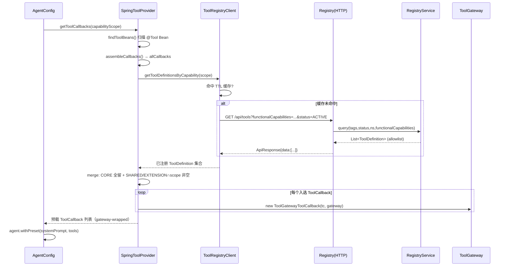
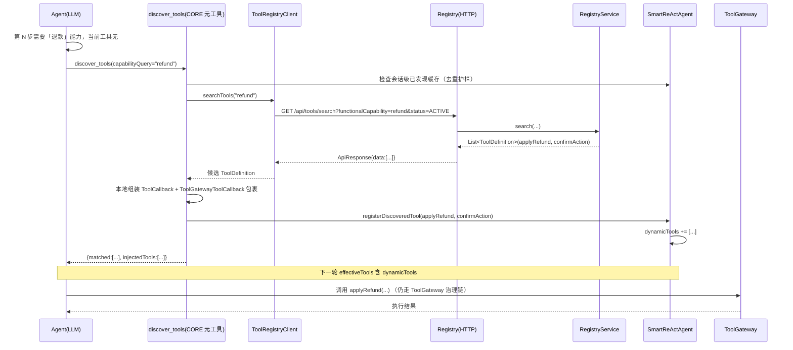

# tool-register 能力分类与 Agent 自主发现机制 设计文档（T1 + T2）

> 作者：高见远（software-architect）｜协作：齐活林（team-lead）
> 状态：设计稿（只读，不含业务代码实现）｜日期：2026-07
> 目标：在现有 tool-register 基础上，将工具按「功能性能力（capability）」分类，让各 Agent 在运行期**自主发现**所需工具，而非在初始化时一次性暴露全部工具。

---

## 0. 背景、现状与约束

### 0.1 已核实的现状（基于源码）

| 组件 | 位置 | 现状要点 |
|------|------|---------|
| `ToolDefinition` | `smart-assistant-common/.../gateway/tool/ToolDefinition.java` | 已有字段 `capabilities(String[])`、`tags(String[])`、`toolTier`、`riskLevel`、`status`（5 阶段）。`capabilities` 实际由**风险等级推导**（`capabilitiesForRiskLevel`：READ→`read-only`；LOW/MEDIUM→`mutate-state`；HIGH→`mutate-state`+`payment`），**属于"风险/访问"语义，非功能性语义**。 |
| `ToolCapability` | `.../gateway/tool/ToolCapability.java` | 枚举值 `READ_ONLY/MUTATE_STATE/NETWORK_CALL/PAYMENT/DATA_ACCESS/AI_INFERENCE/UNKNOWN`。`isValid()` 校验字符串。 |
| `ToolRegistryClient` | `.../tool/client/ToolRegistryClient.java` | `getToolDefinitions(tag)` → `GET /api/tools?tags={tag}&status=ACTIVE`（精确 tag 匹配）。本地 TTL 缓存 + **三级降级**（缓存→远程→空）。`getToolCallbacks(tag, beans...)` 用 `ToolGatewayToolCallback` 包裹，CORE 常驻 + SHARED/EXTENSION 走 allowlist。 |
| `SpringToolProvider` / `ToolProvider` | `.../tool/provider/*` | `getToolCallbacks(String tag)`：扫描 `@Tool` Bean → 组装 `ToolCallback` → 从 Registry 取该 tag 的已注册名集合 → merge（CORE 全留 + SHARED/EXTENSION 需 allowlist）→ `ToolGatewayToolCallback` 包裹。 |
| `ToolManifestValidator` | `smart-assistant-tool-registry/.../service/ToolManifestValidator.java` | `validateCapabilities`：空填默认 `["unknown"]`；非预定义值仅 WARN 不阻断。 |
| `RegistryController` / `RegistryService` | `smart-assistant-tool-registry/...` | `/api/tools` 查询**已支持** `capabilities`（OR 语义）过滤；`RegistryService.query(tags,status,namespace,capabilities)` 已实现 `hasAnyCapability`（OR）。`/api/tools/register` 注册端点。`/api/tools/call/record` 已有调用记录模式。 |
| Agent 配置 | `OrderAgentConfig` / `ProductAgentConfig` / `GeneralAgentConfig` | init 时 `toolProvider.getToolCallbacks(toolTag)`，`toolTag` 为静态单值（`ORDER`/`PRODUCT`/`GENERAL`）。逻辑：CORE 永远加载 + 该 tag 的 SHARED/EXTENSION 过滤后加载。定时 `refreshTools` 热刷新。 |
| `ToolGateway` / `ToolGatewayToolCallback` | `.../gateway/tool/*` | P0 统一治理链：status 拦截、审批钩子、scope/tag 鉴权、熔断、限流、超时、幂等、审计。所有经 Provider 返回的工具回调都经 `ToolGatewayToolCallback` 包裹接入。 |
| `SmartReActAgent` | `smart-assistant-common/.../agent/SmartReActAgent.java` | `presetTools` 为初始工具集；`execute()` 每轮基于 `effectiveTools` 注入模型（chatClient 路径每轮重读 `effectiveTools`）。可选 `ToolGroupManager` 已有 `enableGroup/disableGroup` **元工具**模式（可借鉴）。 |
| `ToolGroupManager` | `.../tool/ToolGroupManager.java` | 分组 + 按需激活 + 元工具（运行期自主切换组），是「LLM 运行期自主切换工具面」的先例。 |

### 0.2 设计目标与分层

主理人评估方向（采用）：方案等价于 **tool-RAG / 能力作用域动态加载**，约 70% 基础原语已存在。采用**混合 3 层**：

- **T0**：CORE 常驻（已有，不依赖 Registry）。
- **T1**：能力作用域**预载**——演进当前 tag 模型，给每个 Agent 配一组 capability scope，init 时按能力集取子集；零额外延迟、暴露面远小于「全部」。
- **T2**：按需**发现**——暴露元工具 `discover_tools(capabilityQuery)`，Agent 在预载集之外遇到需求时中途调用；需 Registry 增加「按能力搜索」端点 + Agent 提示 + 护栏 + 可观测。

### 0.3 硬性约束（本设计遵守）

1. 不改任何源码，仅产出设计文档（本文件）。
2. 复用现有原语（`ToolRegistryClient` 缓存/降级、`ToolGateway` 治理、`RegistryService.query` 能力过滤、`ToolManifestValidator`、元工具模式）。
3. **保留三级降级 + Registry 挂时降级 CORE-only**（T1 演进不能破坏，T2 步骤级模型也必须保留）。
4. **P0 治理接线不破**：被发现的工具调用仍走 `ToolGatewayToolCallback` → 审批/风险/限流/超时/审计全保留。

---

## 1. 功能性能力分类法（Functional Capability Taxonomy）

### 1.1 两个正交维度

现有 `capabilities` 字段是**风险/访问维度**（由 riskLevel 推导），用于治理与授权。我们要新增的是**功能性维度**（「能查订单 / 能退款」）。二者正交，必须解耦：

| 维度 | 字段 | 语义 | 主要用途 | 取值示例 |
|------|------|------|---------|---------|
| 风险/访问能力（已有） | `capabilities` | 工具"有多危险/碰什么资源" | 治理、授权、scope 鉴权 | `read-only`, `mutate-state`, `payment`, `network-call`, `data-access`, `ai-inference` |
| **功能性能力（新增）** | `functionalCapabilities` | 工具"能做什么业务动作" | 能力作用域预载、自主发现匹配 | `query-order`, `refund`, `cancel-order`, `search-product`, `notify-user`, `rag-retrieve` |

> 设计决策：**新增字段 `functionalCapabilities`（`String[]`），不复用 `capabilities`。**
> 理由：① 语义正交，复用会污染现有风险校验与 `capabilitiesForRiskLevel` 推导；② 迁移安全（`capabilities` 行为完全不变）；③ 与现有 `capabilities` OR 过滤原语平行，复用 `hasAnyCapability` 模式即可，改动最小。

### 1.2 与 `ToolCapability` 枚举的演进

- `ToolCapability`（现有）：定位为**风险能力枚举**，保留不变；文档上明确其"用于治理"。
- 新增 `ToolFunctionalCapability`（NEW 枚举，位置同 `ToolCapability`）：受控词表，字符串持久化，沿用 `ToolCapability` 的 `getValue()/isValid()` 模式。`ToolDefinition.functionalCapabilities` 以 `String[]` 存储（便于跨模块扩展与跨服务序列化），但**注册/校验时按此枚举做受控校验**（v1 宽松 WARN，迁移窗后收紧）。
- `capabilities`（风险）与 `functionalCapabilities`（功能）在 `ToolManifestValidator` 中做一致性互检（如 `functional=refund` 但 `risk=READ` → WARN，提示声明矛盾）。

### 1.3 `ToolDefinition` 扩展（数据模型）

字段新增（Builder 模式，带默认值，向后兼容）：

```java
/** 功能性能力标签（业务动作语义），如 ["query-order","refund"]；默认空数组（迁移期向后兼容） */
@Builder.Default
private String[] functionalCapabilities = new String[0];
```

静态工厂重载（向后兼容，不破坏现有调用）：

```java
// 现有签名保留；新增 functionalCapabilities 参数版
ToolDefinition.read(name, desc, tags, new String[]{"query-order"});
ToolDefinition.write(name, desc, riskLevel, tags, new String[]{"refund","cancel-order"});
ToolDefinition.highRisk(name, desc, needsApproval, tags, new String[]{"refund","payment-confirm"});
```

`ToolDefinition` 的 `equals/hashCode` 仅基于 `name`，新增字段不影响既有缓存 key。

### 1.4 `ToolManifestValidator` 校验规则（新增 `validateFunctionalCapabilities`）

| 场景 | 处理 | 阶段 |
|------|------|------|
| `functionalCapabilities` 为 null/空 | WARN + 填默认 `[]`（不阻断，迁移期允许存量工具暂未声明） | v1 全程 |
| 含非 `ToolFunctionalCapability` 受控词 | WARN（不阻断；允许用户自定义扩展词，但建议纳入词表） | v1 全程 |
| 与 `capabilities`（风险）语义冲突 | 如 `functional=refund`/`create-order` 但 `risk=READ` → WARN 提示 | v1 全程 |
| 迁移窗关闭后仍未声明 | （可选）升级为 ERROR，强制补全 | 迁移后 |

> 校验顺序：`validateCapabilities`（现有）→ `validateFunctionalCapabilities`（新增）→ `validateOutputSchema`。

### 1.5 存量工具迁移策略（3 阶段，零停机）

- **阶段 A（加字段、零风险）**：`functionalCapabilities` 默认 `[]`。查询/发现端点若 `functionalCapabilities` 为空，则**退化到 `tags`** 匹配（保证未迁移工具仍可被 tag 检索到）。校验仅 WARN。
- **阶段 B（补全声明）**：在各工具 `initTools()` / `@Tool` 注册处（`OrderTools`、`ProductTools`、`GeneralTools`、`WeatherTool`、`ImageTools`、`DataGifTool`、`KnowledgeQueryTool`、`CouponTools`、`*MemoryTool`、`OrderKnowledgeTool`、`OrderAnalyticsTool`、`TextToSqlTool` 等）通过 `ToolDefinition.read/write/highRisk(..., functionalCapabilities)` 补全。提供**启发式映射脚本**（按工具名/描述关键词推断，如 `*query*Order*`→`query-order`、`*refund*`→`refund`），产出「建议 functionalCapabilities」清单供人工复核，对高风险工具（payment/refund）强制人工确认。
- **阶段 C（校验收紧）**：迁移窗关闭后，`validateFunctionalCapabilities` 对关键工具升级为 ERROR；搜索端点停止 tag 退化（仅当工具确实无 functionalCapabilities 时回退，并打 metric）。

**存量工具 → functionalCapabilities 映射（示例，待人工复核）**

| 工具（类.方法） | functionalCapabilities | 典型 tier |
|----------------|----------------------|----------|
| `OrderTools.queryOrder` | `query-order` | CORE |
| `OrderTools.trackLogistics` | `track-logistics` | CORE |
| `OrderTools.createOrder` | `create-order` | CORE |
| `OrderTools.payOrder` | `pay`, `payment-confirm` | CORE |
| `OrderTools.cancelOrder` | `cancel-order` | CORE |
| `OrderTools.applyRefund` | `refund`, `payment-confirm` | CORE |
| `OrderTools.confirmAction` | `payment-confirm` | CORE |
| `OrderTools.shipOrder` / `confirmDelivery` | `ship-order` / `confirm-delivery` | CORE |
| `CouponTools.*` | `query-coupon`, `apply-coupon` | CORE |
| `OrderAnalyticsTool.*` | `order-analytics` | CORE |
| `OrderKnowledgeTool.*` | `rag-retrieve` | CORE |
| `OrderMemoryTool.*` | `memory-read`, `memory-write` | CORE |
| `ProductTools.search*` | `search-product` | CORE |
| `ProductTools.detail*` | `query-product` | CORE |
| `KnowledgeQueryTool.*` | `rag-retrieve` | CORE |
| `ProductMemoryTool.*` | `memory-read`, `memory-write` | CORE |
| `WeatherTool.*` | `query-weather` | SHARED |
| `ImageTools.*` | `image-generate`, `image-edit` | SHARED |
| `DataGifTool.*` | `chart-generate` | SHARED/EXTENSION |
| `GeneralTools.*` | `web-search`, `general-qa` | SHARED |
| `TextToSqlTool.*` | `data-query` | CORE（参数化，非裸 SQL） |

---

## 2. T1 设计：能力作用域预载（演进 tag 模型）

### 2.1 Agent 配置：由单一 `toolTag` → `capabilityScope`

- 配置项：`agent.capability-scope`（一组 `functionalCapabilities`，如 `query-order,create-order,pay,cancel-order,refund,track-logistics,confirm-action`）。
- 兼容层：保留 `agent.tool-tag`（如 `ORDER`），提供 **tag → capabilityScope 映射表**（见 2.3），`toolTag` 仅作为 capabilityScope 的便捷别名；最终统一走能力集查询。
- 每个 Agent 的能力 scope 来自其「角色」：Order 客服需要订单生命周期相关能力；Product 顾问需要商品/检索能力；General 需要通用/天气/图像等。

### 2.2 `SpringToolProvider` / `ToolRegistryClient` 按能力集查询

新增 API（向后兼容重载，不删旧 `getToolCallbacks(String tag)`）：

```java
// ToolProvider 接口新增重载
List<ToolCallback> getToolCallbacks(Set<String> functionalCapabilities);

// ToolRegistryClient 新增
List<ToolDefinition> getToolDefinitionsByCapability(Set<String> functionalCapabilities);
// 内部 fetchFromRegistry 支持 functionalCapabilities 查询参数（同 tags 模式 + TTL 缓存 + 降级）
List<ToolCallback> getToolCallbacks(Set<String> functionalCapabilities, Object... toolBeans);
```

**能力集多值语义（默认 OR）**：工具只要含 scope 中**任一** functionalCapability 即纳入该 Agent 的预载子集。理由：避免「能力交集为空导致该工具被错误剔除」的欠暴露风险；scope 由人工按角色配，OR 是「能力并集」，更安全。提供 `capabilityMatchMode=AND|OR` 开关（默认 OR），供个别 Agent 精确收缩。

**merge 逻辑（演进现有三层）**：
1. CORE 常驻（本地 `ToolRegistry` 命中或本地 `@Tool` 方法）→ 始终加载，不依赖 Registry。
2. SHARED/EXTENSION：取「Registry 已注册（allowlist）**且** `functionalCapabilities ∩ scope ≠ ∅`」的子集。
3. 全部经 `ToolGatewayToolCallback` 包裹接入治理链。

**保留三级降级 + Registry 挂 → CORE-only**：`resolveRegisteredNames` / `fetchFromRegistry` 失败即返回空集，仅 CORE 可用——与现有一致。

### 2.3 tag → capabilityScope 兼容映射（演进期）

| toolTag | capabilityScope（functionalCapabilities） |
|---------|------------------------------------------|
| `ORDER` | `query-order, track-logistics, create-order, pay, cancel-order, refund, payment-confirm, ship-order, confirm-delivery, query-coupon, order-analytics, rag-retrieve, memory-read, memory-write` |
| `PRODUCT` | `search-product, query-product, rag-retrieve, memory-read, memory-write, apply-coupon` |
| `GENERAL` | `query-weather, image-generate, image-edit, chart-generate, web-search, general-qa, notify-user, rag-retrieve` |

### 2.4 T1 时序图（init 加载）



---

## 3. T2 设计：按需发现（步骤级自主发现）

### 3.1 `discover_tools` 元工具契约

**定位**：所有 Agent 都有的 **CORE 元工具**（与 `ToolGroupManager.enableGroup` 同模式），始终在预载集中，不被治理禁用。

**输入**

| 参数 | 类型 | 说明 |
|------|------|------|
| `capabilityQuery` | String | 能力名（如 `refund`）或自然语言意图（v1 用关键词匹配，v2 可接 LLM/embedding 路由） |
| `keywords` | String[]（可选） | 辅助关键词，参与文本匹配（name/description） |
| `matchMode` | `OR`/`AND`（可选，默认 `OR`） | 多条件匹配语义 |
| `limit` | int（可选，默认 20） | 返回上限 |

**输出（返回给 LLM 的 JSON）**

```json
{
  "query": "refund",
  "matched": [
    {"name": "applyRefund", "description": "提交退款申请", "tier": "CORE",
     "riskLevel": "HIGH", "needsApproval": true, "functionalCapabilities": ["refund","payment-confirm"]}
  ],
  "injectedTools": ["applyRefund", "confirmAction"],
  "source": "registry",
  "latencyMs": 12
}
```

**发现结果的注入机制（供下一步使用）**：
`discover_tools` 内部拿到候选 `ToolDefinition` 后，从本地 `@Tool` Bean（`MethodToolCallbackProvider`）组装出对应 `ToolCallback`，经 `ToolGatewayToolCallback` 包裹，调用 **`SmartReActAgent.registerDiscoveredTool(ToolCallback...)`** 注入该 Agent 运行期的"动态工具集"（`dynamicTools`）。`SmartReActAgent` 每轮 `effectiveTools` 计算时**追加 `dynamicTools`**，chatClient 路径每轮 `spec.tools(effectiveTools...)` 重读，故下一步 LLM 即可直接调用真实工具。

> 关键：发现 = 扩大「LLM 知晓面」，被注入的工具仍走 `ToolGateway` 治理（审批/限流/超时/审计），**P0 接线不破**。

**`SmartReActAgent` 需新增（设计，不实现）**：
- 字段 `List<ToolCallback> dynamicTools`（会话级，可变）。
- `registerDiscoveredTool(ToolCallback... tcs)`：去重加入 `dynamicTools`（同名覆盖）。
- `effectiveTools` 计算改为 `base(=presetTools 或 ToolGroup active) + dynamicTools`；`injectToolsToModel`/`spec.tools` 使用合并后列表。
- 配套：`getDiscoveredCapabilityHistory()` 供护栏去重。

### 3.2 Registry 能力搜索端点

**新增**：`GET /api/tools/search`

| 参数 | 类型 | 说明 |
|------|------|------|
| `functionalCapability` | String[]（可选） | 按功能性能力精确匹配（OR） |
| `keyword` | String（可选） | 在 `name`/`description` 上做包含匹配（大小写不敏感） |
| `matchMode` | `OR`/`AND`（可选，默认 `OR`） | capability 与 keyword 之间语义 |
| `status` | ToolStatus（可选，默认 `ACTIVE`） | 仅返回启用工具 |
| `tier` | ToolTier（可选） | 可按层过滤（如只发现 SHARED/EXTENSION） |
| `limit` | int（可选，默认 20） | 上限 |

**后端**：`RegistryService.search(functionalCapabilities, keyword, matchMode, status, tier, limit)` —— 基于 `ToolDefinition.functionalCapabilities`（复用 `hasAnyCapability` 模式）+ 可选文本匹配。`RegistryController` 新增 `@GetMapping("/search")` 返回 `ApiResponse<List<ToolDefinition>>`。

### 3.3 Agent 提示词策略 + 护栏

**提示词（注入 system prompt 或 discover_tools 的 tool description）**：
> "你当前只拥有预载的工具。当某一步需要某种能力（如退款、查物流）但当前工具列表里没有对应工具时，**调用 `discover_tools(capabilityQuery=该能力)`** 去发现并加载它；**不要臆造不存在的工具名**。发现成功后下一步即可使用被加载的工具。"

**护栏（防循环 / 防滥用 / 防断链）**：

| 护栏 | 规则 |
|------|------|
| 每轮/每会话最大发现次数 | `maxDiscoveriesPerTurn`（如 1）、`maxDiscoveriesPerSession`（如 10），超限拒绝并提示「请基于已加载工具继续 / 升级人工」 |
| 动态工具上限 | `maxDynamicTools`（如 15），超出拒绝新发现 |
| 已发现能力去重 | 同一 `capabilityQuery` 已发现过则直接返回缓存结果，不再查 Registry（同时阻断无限循环） |
| 迭代预算联动 | `discover_tools` 自身也计入 Agent 的 `maxIterations` 预算；连续发现无进展触发既有无进展计数器 |
| 发现失败/Registry 挂 | 降级：返回「CORE-only 可用，无法发现 X」并建议升级人工；**不**阻断对话 |
| 能力映射不确定性 | v1 仅支持受控能力名 + 关键词，避免 LLM 自由发挥；错误映射由「返回空 + 提示换词」兜底 |

### 3.4 可观测：discovery 事件日志

`DiscoveryEvent` 记录：`agentId`、`conversationId`、`capabilityQuery`、`keywords`、`matchedNames`、`hitCount`、`source`(registry/cache/miss)、`latencyMs`、`discoverToolsInjected`、`timestamp`。

- 接入现有 `ObservationRegistry`（span `agent-tool-discovery`）、`StageTraceRecorder`（写入 `a2a:stage:trace:{requestId}` 同通道）。
- 可选：复用 `/api/tools/call/record` 模式新增 `POST /api/tools/discovery/record`，由客户端回调 Registry 聚合「各能力被发现频次 / 命中率」，反哺 capabilityScope 配置优化（哪些能力该进 T1 预载）。

### 3.5 T2 时序图（步骤级发现）



---

## 4. 横切关注点

### 4.1 与 `ToolGateway` 治理的关系（P0 接线不破）

- **发现 = 扩「知晓面」，不是「授权面」**：`discover_tools` 只会返回**已在 Registry 注册（allowlist）**的工具。`SHARED/EXTENSION` 必须经 Registry 注册才能被发现；`CORE` 本地常驻、总在预载集、不经发现。
- 被注入的动态工具回调统一经 `ToolGatewayToolCallback` 包裹，沿用既有 status 拦截 / 审批钩子 / scope·tag 鉴权 / 熔断 / 限流 / 超时 / 幂等 / 审计。**没有任何治理被绕过。**

### 4.2 `ToolTier` 语义

- 被发现者多为 **SHARED / EXTENSION**（跨 Agent 共享、中心治理），它们本就需注册，发现只是让 LLM「看见」并加载。
- **CORE 总是预载、不经发现**（避免无谓的实时查询与重复加载）。
- 发现到的 SHARED/EXTENSION 受中心 `status` 治理；**Registry 挂时不参与发现**（与现有一致：中心不可用 → 仅 CORE），`discover_tools` 此时返回空 + 升级人工建议。

### 4.3 缓存策略（复用现有 `CacheEntry` + TTL）

| 层级 | 缓存 | 说明 |
|------|------|------|
| 客户端能力查询 | `ToolRegistryClient.definitionCache` 增加 `functionalCapabilities` key 维度，沿用 TTL（如 60s） | T1 预载与 T2 搜索共用；命中即不查 Registry |
| 会话级已发现 | `SmartReActAgent` 维护 `discoveredCapabilityHistory` + 已加载 `ToolCallback` 缓存 | 同一能力不重复查、不重复注入（**阻断循环**） |
| 搜索结果 | 可选短 TTL（如 30s） | 高频相同意图复用 |

---

## 5. 结构化输出

### 5.1 能力分类表（capability → 示例工具 → tier）

| functionalCapability | 示例工具（方法） | 典型 tier |
|----------------------|-----------------|----------|
| `query-order` | `OrderTools.queryOrder` | CORE |
| `track-logistics` | `OrderTools.trackLogistics` | CORE |
| `create-order` | `OrderTools.createOrder` | CORE |
| `pay` / `payment-confirm` | `OrderTools.payOrder`, `confirmAction` | CORE |
| `cancel-order` | `OrderTools.cancelOrder` | CORE |
| `refund` | `OrderTools.applyRefund` | CORE |
| `ship-order` / `confirm-delivery` | `OrderTools.shipOrder`, `confirmDelivery` | CORE |
| `query-coupon` / `apply-coupon` | `CouponTools.*` | CORE |
| `order-analytics` | `OrderAnalyticsTool.*` | CORE |
| `rag-retrieve` | `OrderKnowledgeTool.*`, `KnowledgeQueryTool.*` | CORE/SHARED |
| `memory-read` / `memory-write` | `*MemoryTool.*` | CORE |
| `search-product` / `query-product` | `ProductTools.*` | CORE |
| `query-weather` | `WeatherTool.*` | SHARED |
| `image-generate` / `image-edit` | `ImageTools.*` | SHARED |
| `chart-generate` | `DataGifTool.*` | SHARED/EXTENSION |
| `web-search` / `general-qa` | `GeneralTools.*` | SHARED |
| `notify-user` | 通知类工具 | SHARED |
| `data-query` | `TextToSqlTool.*`（参数化） | CORE |

> tier 与 functionalCapability **正交**：同一能力在不同 Agent 可归不同 tier；tier 由工具声明决定，能力只描述"做什么"。

### 5.2 数据模型 / API 规格

**A. `ToolDefinition` 扩展 JSON Schema（增量）**

```json
{
  "$schema": "http://json-schema.org/draft-07/schema#",
  "title": "ToolDefinition (extended)",
  "type": "object",
  "properties": {
    "name": {"type": "string"},
    "description": {"type": "string"},
    "riskLevel": {"enum": ["READ","LOW","MEDIUM","HIGH"]},
    "toolTier": {"enum": ["CORE","SHARED","EXTENSION"]},
    "status": {"enum": ["ACTIVE","DEPRECATED","DISABLED","REMOVED","DRAFT"]},
    "tags": {"type": "array", "items": {"type": "string"}},
    "capabilities": {"type": "array", "items": {"type": "string"},
      "description": "风险/访问能力（由 riskLevel 推导，用于治理）"},
    "functionalCapabilities": {"type": "array", "items": {"type": "string"},
      "description": "功能性能力（业务动作语义，用于能力作用域预载与自主发现）"},
    "outputSchema": {"type": ["string","null"]},
    "scopes": {"type": "array", "items": {"type": "string"}},
    "needsApproval": {"type": "boolean"},
    "rateLimit": {"type": "integer"},
    "timeout": {"type": "string"}
  },
  "required": ["name"]
}
```

**B. `GET /api/tools/search` REST 规格**

```
GET /api/tools/search
Query:
  functionalCapability: String[]  (可选, OR)
  keyword:              String    (可选, 匹配 name/description)
  matchMode:            OR|AND    (可选, 默认 OR)
  status:               ToolStatus(可选, 默认 ACTIVE)
  tier:                 ToolTier  (可选)
  limit:                int       (可选, 默认 20)
Response 200:
  ApiResponse<List<ToolDefinition>>
  其中返回的 ToolDefinition 含 functionalCapabilities 字段
Error:
  400 参数非法 | 500 Registry 内部错误
```

**C. `discover_tools` 工具 I/O**

```
工具名: discover_tools  (CORE 元工具, 所有 Agent 常驻)
输入参数:
  capabilityQuery: String   (能力名或自然语言意图, 必填)
  keywords:       String[]  (可选, 辅助文本匹配)
  matchMode:      OR|AND    (可选, 默认 OR)
  limit:          int       (可选, 默认 20)
行为:
  1. 护栏: 会话级已发现去重 / 每轮·每会话上限 / 动态工具上限
  2. 调 RegistryClient.searchTools(capabilityQuery, keywords, matchMode, limit)
  3. 本地组装 ToolCallback + ToolGatewayToolCallback 包裹
  4. 调 SmartReActAgent.registerDiscoveredTool(...) 注入下一轮可用集
  5. 记 DiscoveryEvent (可观测)
返回 (给 LLM 的 JSON):
  { query, matched:[{name,description,tier,riskLevel,needsApproval,functionalCapabilities}],
    injectedTools:[...], source, latencyMs }
治理: 自身为 CORE, 调用经 ToolGateway; 注入的工具后续调用仍经 ToolGateway
```

### 5.3 时序图

见 §2.4（T1 init 加载）与 §3.5（T2 步骤级发现）两处 mermaid 图。

### 5.4 文件清单（设计层面需改动的文件 + 路径）

| 文件 | 改动类型 | 改动要点 |
|------|---------|---------|
| `smart-assistant-common/.../gateway/tool/ToolDefinition.java` | 改 | 新增 `functionalCapabilities` 字段 + Builder + 工厂重载 |
| `smart-assistant-common/.../gateway/tool/ToolFunctionalCapability.java` | **新** | 功能性能力受控枚举（getValue/isValid） |
| `smart-assistant-common/.../gateway/tool/ToolCapability.java` | 改(文档) | 明确为"风险能力"，注释更新 |
| `smart-assistant-common/.../tool/client/ToolRegistryClient.java` | 改 | 新增 `getToolDefinitionsByCapability` / `searchTools` / `getToolCallbacks(Set)` 重载；functionalCapabilities 缓存维度；保留三级降级 |
| `smart-assistant-common/.../tool/provider/ToolProvider.java` | 改 | 接口新增 `getToolCallbacks(Set<String>)` 重载 |
| `smart-assistant-common/.../tool/provider/SpringToolProvider.java` | 改 | capability 集查询路径；CORE 常驻 + SHARED/EXTENSION∩scope；tag 兼容映射 |
| `smart-assistant-common/.../agent/SmartReActAgent.java` | 改 | 新增 `dynamicTools` + `registerDiscoveredTool(...)`；`effectiveTools` 合并 dynamicTools |
| `smart-assistant-common/.../tool/meta/DiscoverToolsTool.java` | **新** | `discover_tools` 元工具实现（调 client.search + 注入 agent） |
| `smart-assistant-common/.../tool/meta/DiscoveryEvent.java` (+ 可选 `DiscoveryRecorder`) | **新** | 可观测事件结构 |
| `smart-assistant-tool-registry/.../service/RegistryService.java` | 改 | `query` 支持 `functionalCapabilities`；新增 `search(...)` |
| `smart-assistant-tool-registry/.../controller/RegistryController.java` | 改 | `/api/tools` 增加 `functionalCapabilities` 参数；新增 `GET /api/tools/search`（+ 可选 `POST /api/tools/discovery/record`） |
| `smart-assistant-tool-registry/.../service/ToolManifestValidator.java` | 改 | 新增 `validateFunctionalCapabilities` 及与风险能力互检 |
| `smart-assistant-order/src/.../config/OrderAgentConfig.java` | 改 | `toolTag` → `capabilityScope`（保留 tag 兼容映射）；init 用 capability 重载 |
| `smart-assistant-product/src/.../config/ProductAgentConfig.java` | 改 | 同上 |
| `smart-assistant-general/src/.../config/GeneralAgentConfig.java` | 改 | 同上 |
| `smart-assistant-{order,product,general}/src/main/resources/prompts/*-system-prompt.txt` | 改 | 增加 `discover_tools` 使用说明与护栏提示 |
| 各工具 `initTools()`（`OrderTools`/`ProductTools`/`GeneralTools`/`WeatherTool`/`ImageTools`/`DataGifTool`/`KnowledgeQueryTool`/`CouponTools`/`*MemoryTool`/`OrderKnowledgeTool`/`OrderAnalyticsTool`/`TextToSqlTool` 等） | 改 | 补全 `functionalCapabilities` 声明（阶段 B 迁移） |
| `ToolRegistryProperties`（common） | 改 | 新增 T1/T2 特性开关（`t1-capability-scope-enabled`、`t2-discovery-enabled`）、`maxDiscoveriesPerTurn/Session`、`maxDynamicTools` 等护栏阈值 |

### 5.5 有序任务列表（含依赖）

| ID | 任务 | 依赖 | 优先级 | 对应文件 |
|----|------|------|--------|---------|
| **T1** | 数据模型扩展：新增 `functionalCapabilities` 字段 + `ToolFunctionalCapability` 枚举 + `ToolDefinition` 工厂重载 | — | P0 | ToolDefinition, ToolFunctionalCapability, ToolCapability(注释) |
| **T2** | Registry 查询/搜索后端：Service `query` 支持 `functionalCapabilities` + 新增 `search()`；Controller `/api/tools` 增参 + 新增 `/api/tools/search` | T1 | P0 | RegistryService, RegistryController |
| **T3** | 客户端与 Provider 能力作用域：`ToolRegistryClient` capability 查询+缓存重载；`SpringToolProvider`/`ToolProvider` capability 重载；CORE 常驻+降级保留；tag 兼容映射 | T1, T2 | P0 | ToolRegistryClient, SpringToolProvider, ToolProvider |
| **T4** | T1 Agent 接入：3 个 AgentConfig 由 `toolTag`→`capabilityScope` + 提示词 + 上线开关（特性门控，可回退 tag） | T3 | P1 | Order/Product/GeneralAgentConfig, prompt files, Properties |
| **T5** | T2 发现机制：`DiscoverToolsTool` 元工具 + `SmartReActAgent.dynamicTools`/`registerDiscoveredTool` + 提示词护栏 + `DiscoveryEvent` 可观测 + 会话级缓存 | T2, T3 | P1 | DiscoverToolsTool, DiscoveryEvent, SmartReActAgent, prompt files, Properties |
| **T6** | 校验与迁移：`ToolManifestValidator.validateFunctionalCapabilities` + 存量工具 `functionalCapabilities` 补全（启发式脚本+人工复核）+ 联调与回归测试 | T1, T2 | P1 | ToolManifestValidator, 各工具 initTools, 迁移脚本/映射 |

> 依赖关系：`T1 → T2 → T3 → T4`；`T2 → T5`（T5 还需 T3 的 client 能力）；`T6` 与 T4/T5 可并行但建议 T1/T2 完成后启动；T4/T5 各自受特性开关保护，可独立灰度。

### 5.6 待明确事项 / 风险 / 推荐上线节奏

**待明确（建议主理人拍板）**
1. `functionalCapabilities` 校验严格度：v1 建议**宽松 WARN**（允许自定义扩展词），迁移窗后可选收紧为 ERROR。
2. capabilityScope 多值默认语义：**建议 OR**（能力并集，避免欠暴露）；个别 Agent 可用 `AND` 精确收缩。
3. `discover_tools` 是否支持纯自然语言意图：v1 仅「能力名 + 关键词」，v2 再接 LLM/embedding 路由。
4. 一个能力对应多个工具（如 `refund` → `applyRefund`+`confirmAction`）：发现返回整组，由 Agent 自行编排。

**风险与缓解**
| 风险 | 缓解 |
|------|------|
| 每步实时查的延迟 | 客户端 capability/TTL 缓存 + 会话级已发现缓存；仅「预载集之外」才触发发现 |
| 发现准确率（意图→能力映射错） | 受控词表 + 关键词兜底 + 返回空提示换词；v2 再上 LLM 路由 |
| 循环调用 / 无限发现 | 已发现能力去重 + 每轮/每会话上限 + 动态工具上限 + 迭代预算联动 |
| Registry 挂时热路径断 | 发现失败降级 CORE-only + 升级人工；保留现有一致降级 |
| 治理被绕过 | 发现只返回已注册(allowlist)工具；注入仍走 `ToolGateway`；P0 接线不破 |
| Schema/上下文膨胀 | `maxDynamicTools` 上限；dynamicTools 会话级生命周期 |

**推荐上线节奏**
- **T1 先上（快赢，低风险的演进）**：仅把"按 tag 过滤"演进为"按 capability 集预载"，零新增运行期发现、无循环/延迟新风险，复用 70% 原语；用特性开关灰度，可一键回退 tag 模式。
- **T2 二期（受控放量）**：先对**只读/低风险** functionalCapability（如 `query-weather`、`rag-retrieve`、`search-product`）开放发现，积累 discovery 命中率/延迟指标；再按指标逐步开放 `refund`/`pay` 等高风险能力；配套护栏与可观测全量上线。

---

## 6. 一句话摘要

在保留现有 `ToolGateway` 治理、三级降级与 CORE-only 容灾的前提下，新增与风险正交的 `functionalCapabilities` 字段与 `ToolFunctionalCapability` 枚举，T1 将 Agent 由单一 `toolTag` 演进为「按能力集预载子集」（零延迟、缩暴露面），T2 再暴露常驻的 `discover_tools` 元工具 + Registry `/api/tools/search` 端点，让 Agent 在预载集之外按需自主发现并注入工具，并以护栏与 discovery 事件日志防循环、保可观测。

---

## 7. 附录：T1 首批 `functionalCapabilities` 受控词表（2026-07-12 主理人细化）

基于全仓真实工具清单（38 中心注册工具 + 9 router 技能 + 2 MCP SQL 工具）推导的首批受控词表。命名约定：**kebab-case；域特定能力用 `domain-verb` 前缀，通用能力不加域前缀；token 描述用中文**。v1 校验策略为**宽松 WARN**（允许自定义扩展词，迁移窗后可选收紧为 ERROR）。T1 仅新增字段 + 枚举 + 工厂重载；本词表的逐工具回填在 **T6** 完成。

### 7.1 词表（能力令牌 → 映射工具）

| 能力令牌 | 功能描述 | 映射工具（中心注册） | 映射技能(router) | 典型风险 |
|---------|---------|-------------------|----------------|---------|
| `greeting` | 寒暄/闲聊 | — | `greeting` | read-only |
| `math-calculate` | 数学/脚本计算 | `calculate`, `executeScript` | `calculate` | read-only / unknown |
| `unit-convert` | 单位换算 | `convertTemperature`, `convertLength`, `convertWeight`, `convertCurrency` | — | read-only |
| `weather-query` | 天气查询 | `queryWeather` | `weather_query` | read-only |
| `image-analyze` | 图片内容分析 | `analyzeImage` | — | mutate-state |
| `image-generate` | 文生图 | `generateImage` | — | mutate-state |
| `gif-generate` | 趋势动画生成 | `generateTrendGif` | — | mutate-state |
| `web-search` | 联网检索 | `searchWeb` | — | mutate-state |
| `news-hot` | 热点资讯 | `getHotNews` | `hot_news` | mutate-state |
| `correction-query` | 历史纠错查询 | `queryCorrections` | — | read-only |
| `product-query` | 商品详情查询 | `queryProductInfo` | `product_query` | read-only |
| `product-stock` | 库存查询 | `checkStock` | `stock_check` | read-only |
| `product-price` | 价格/促销查询 | `getPrice` | — | read-only |
| `product-knowledge` | 商品知识库检索 | `queryKnowledge` | — | read-only |
| `order-query` | 订单查询 | `queryOrder`, `queryOrdersByStatus`, `queryUserRefunds` | `order_query` | read-only |
| `order-logistics` | 物流轨迹 | `trackLogistics` | — | read-only |
| `order-create` | 创建订单 | `createOrder` | — | mutate-state, payment |
| `order-pay` | 支付订单 | `payOrder` | — | mutate-state, payment |
| `order-cancel` | 取消订单 | `cancelOrder` | `order_cancel` | mutate-state, payment |
| `order-refund` | 退款申请 | `applyRefund` | `order_refund` | mutate-state, payment |
| `order-ship` | 商家发货 | `shipOrder` | — | mutate-state |
| `order-confirm` | 确认收货/确认支付 | `confirmDelivery`, `confirmAction` | — | mutate-state, payment |
| `order-coupon-query` | 优惠券查询 | `queryUserCoupons` | — | read-only |
| `order-coupon-optimize` | 最优券组合 | `findBestCoupon` | — | read-only |
| `order-analytics` | 订单统计/分析 | `countOrdersByStatus`, `queryTopRefunds`, `textToSql` | — | read-only |
| `order-knowledge` | 订单知识库检索 | `queryOrderKnowledge` | — | read-only |
| `product-preference-read` | 商品偏好读取 | `recallMemories`(product) | — | read-only |
| `product-preference-write` | 商品偏好保存 | `savePreference`(product) | — | mutate-state |
| `order-preference-read` | 订单偏好读取 | `recallMemories`(order) | — | read-only |
| `order-preference-write` | 订单偏好保存 | `savePreference`(order) | — | mutate-state |
| `knowledge-retrieve` | 通用知识库检索 | `queryKnowledge`, `queryOrderKnowledge` | — | read-only |
| `sql-query` | 自然语言/直连 SQL 查询 | `textToSql` | — | read-only（MCP `executeQuery`/`getTableSchema` 未入中心） |

> 共 **32** 个首批令牌。T2 二期建议先对低风险令牌开放发现：`weather-query` / `product-query` / `product-stock` / `product-price` / `product-knowledge` / `knowledge-retrieve` / `order-query` / `order-logistics`；`order-refund` / `order-pay` / `order-cancel` 等高风险令牌待指标稳定后逐步开放。

### 7.2 T6 回填前必须解决的 3 个数据质量雷点（不影响 T1）

1. **同名工具 upsert 冲突**：`recallMemories` / `savePreference` 同时被 `ProductMemoryTool` 与 `OrderMemoryTool` 注册（描述不同），中心注册表 `register` 为 upsert，后者覆盖前者 → 无法区分"商品偏好"与"订单偏好"。**已在能力层用域前缀 token 区分（`product-preference-*` vs `order-preference-*`），但工具名冲突仍会导致 Agent 调用歧义，建议 T6 前评估工具重命名或命名空间化。**
2. **`GeneralMemoryTool` 未注册**：`smart-assistant-tool-registry/.../general/GeneralMemoryTool.java` 仅有 `@Tool` 方法、无 `initTools()`，未进入中心注册表 → general 域偏好治理缺失。T6 需先补注册，再补 `general-preference-read` / `general-preference-write`。
3. **router 技能元数据缺失**：9 个技能用裸 `ToolDefinition.builder()` 注册（capabilities=["unknown"]），且与中心工具同名重复（`calculate`、`weather_query` vs `queryWeather`）。T6 迁移需给技能也补 `functionalCapabilities`，或中心/技能去重。
4. **MCP 工具不入中心**：consumer / order(Travel) 的 `executeQuery` / `getTableSchema` 仅经 MCP Server 暴露，无 `capabilities/tags/tier` 元数据，`sql-query` 能力当前仅 `textToSql` 在中心。纳入需额外工作（建议放 T2 或后续专项）。
