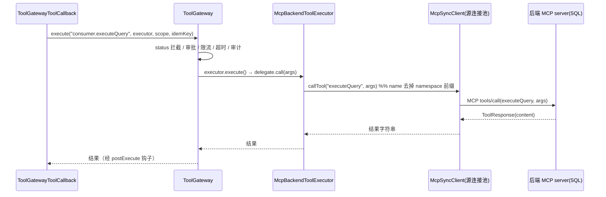
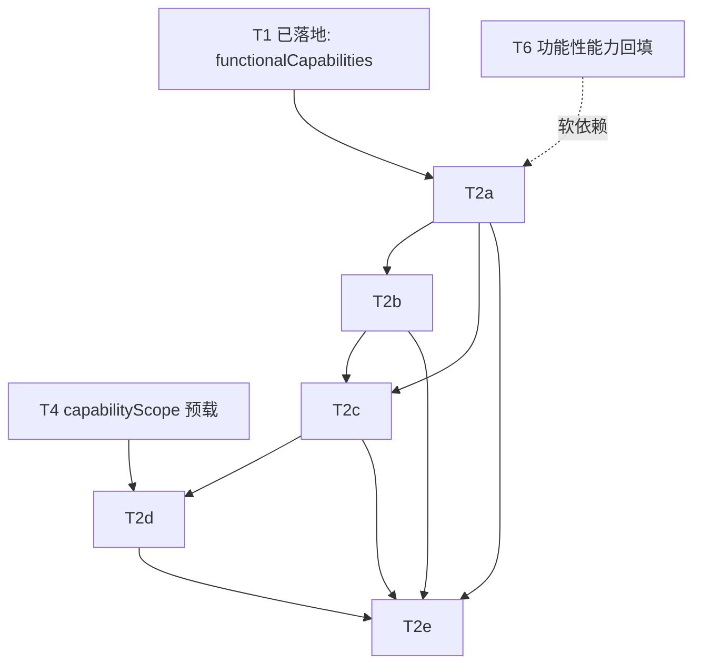

# T2' 设计：tool-registry 作为 MCP 兼容的聚合 / 网关（发现层）

> 作者：高见远（software-architect）｜协作：齐活林（team-lead）
> 状态：设计稿（只读，不含业务代码实现）｜日期：2026-07-12
> 前身：本文是 `docs/design-tool-capability-discovery.md`（下称「原文档」）中 **T2 步骤级发现** 的改写版。
> 原文档的 **T1（能力作用域预载）/ T2 数据模型 / §1 双维度分类 / §7 32 令牌词表** 已落地（commit `3d02558` / `c7a4bca` / `a104af7`），**本设计不改动 T1 任何已落地逻辑**，仅在其之上叠加 **MCP 兼容发现层**。

---

## 0. 范围、目标与硬约束

### 0.1 本设计要回答的 5 个问题（来自主理人拍板方向）

1. **MCP 绑定规格**：tool-registry 作为 MCP server 的传输方式（stdio / HTTP / SSE 选哪个）；`tools/list` 返回结构（`name/description/inputSchema/annotations` 如何由 `ToolDefinition` + `functionalCapabilities` + `capabilities` + `toolTier` 生成）；`tools/call` 入参/出参与现有执行路径的衔接点（**必须在哪个位置插 ToolGateway**）。
2. **Agent 侧发现机制**：`discover_tools` 元工具如何改为 MCP `tools/list` 薄封装；SmartReActAgent 的 `dynamicTools` 注入流程（仍经 `ToolGatewayToolCallback`，不变）；常驻 CORE 元工具契约是否变。
3. **MCP-backed 工具源接入**：外部 MCP server（如 SQL）如何注册进 tool-registry（连接配置、工具同步到中心目录、状态/能力元数据补全），以及这如何解决**数据分裂 #4**（裸 MCP SQL 工具未进中心注册表）。配置样例（YAML/JSON）。
4. **服务端能力过滤方案**：选「`tools/list` 过滤扩展」还是「`search_tools` tool」；给出 MCP 规格片段。
5. **修订文件清单 / 任务列表 / 风险更新 / 上线节奏**。

### 0.2 混合方案总览（一图概览）

```
                         ┌─────────────────────────────────────────────┐
                         │           tool-registry (MCP server)         │
   Agent ──MCP client──▶│  发现层：tools/list + search_tools         │
   (discover_tools)      │  仅暴露元数据，不实现"传递式" tools/call     │
                         │                                            │
                         │   中心目录 = HTTP 注册工具 ∪ MCP-backed 源   │
                         └───────┬───────────────────────┬──────────┘
                  MCP client │ (拉取/同步)          REST/HTTP │ (既有, 保底)
              ┌──────────▼─────────┐            ┌─────────▼──────────┐
              │ 后端 MCP server     │            │ 各 Agent 模块          │
              │ (SQL: executeQuery │            │ ToolGateway 治理链      │
              │  getTableSchema)  │            │ ToolGatewayToolCallback │
              └────────────────────┘            └──────────────────────┘
   关键边界：MCP 只承载「发现 + 传输」；所有 tools/call 都经 ToolGateway，
   无论目标是本地 @Tool 还是远端 MCP-backed 工具（由 McpBackendToolExecutor 转发）。
```

### 0.3 硬约束（本设计遵守）

1. **仅设计，不写实现代码、不修改任何源码、不 commit。**
2. **兼容 T1**：复用 `ToolDefinition.functionalCapabilities`（`List<String>`，绝不为 null、归一化去重）+ `ToolFunctionalCapability` 枚举（32 令牌，见原文档 §7.1），**不重新设计词表**。
3. **兼容 P0 治理链（不可破坏）**：`ToolGateway` 准入 + `ToolGatewayToolCallback` 包裹 + `SafeGuardAdvisor`/`GuardrailService`/`LoopGuardService`/`PhaseGate`/`PreALGate`/`CompressionHooks` + 三级降级（缓存→远程→空/CORE-only）+ 状态门禁（DISABLED 不可调用）。
4. **复用既有原语**：`ToolRegistryClient` 缓存+三级降级、`ToolGroupManager` 元工具模式、`RegistryService.query` 已支持的 capabilities OR 过滤、`ToolManifestValidator`。
5. **修复数据分裂 #4**：把现有裸 MCP SQL server（`executeQuery`/`getTableSchema`）登记为 tool-registry 的一个 **MCP-backed 工具源**，进入统一目录、经 ToolGateway 治理。

---

## 1. MCP 绑定规格

### 1.1 传输方式选择：HTTP / SSE（WebMvc），**否决 stdio**

| 传输 | 适用拓扑 | 结论 |
|------|---------|------|
| **stdio** | 把 MCP server 作为**子进程**随客户端拉起（本地、单客户端） | ❌ 否决。tool-registry 是**常驻中心服务**，被 order/product/general/consumer 多个 Agent 共享；stdio 要求每客户端各起一个进程，违背"中心目录"定位。 |
| **SSE（WebMvc）** | 中心服务 + 多客户端经 HTTP 连接，服务端主动推送 | ✅ **采用**。`spring-ai-starter-mcp-server-webmvc`（本仓 consumer/order/product 的 pom 已引入同类起步依赖），与既有技术栈一致。 |
| **Streamable HTTP**（WebFlux） | 同上，但用响应式栈 | ⚠️ 备选。若后续需要更高并发，可换 `spring-ai-starter-mcp-server-webflux`；本期先用 WebMvc 与现有依赖对齐、降低风险。 |

> **理由**：tool-registry 是共享中枢，必须独立生命周期、允许多 Agent 并发连接、可被网关/运维统一管控。stdio 只适合"本地随用随起"的工具进程，不适合中心注册表。故采用 **SSE/HTTP（WebMvc 起步依赖）**。

### 1.2 `tools/list` 返回结构：`ToolDefinition` → MCP `Tool` 映射表

MCP `Tool` 对象字段固定为 `name` / `description` / `inputSchema`(JSON Schema) / `annotations`(`ToolAnnotations`)。其中 `functionalCapabilities` / `toolTier` / `tags` **MCP 无原生槽位**，放入 `annotations` 的**扩展字段**（`_meta` 同时双写以兼容只看 `_meta` 的客户端）。

| MCP `Tool` 字段 | 来源（`ToolDefinition`） | 推导规则 |
|----------------|-------------------------------|---------|
| `name` | `name` | 原样（MCP-backed 源工具加 `namespace.` 前缀防冲突，见 §3） |
| `description` | `description` | 原样 |
| `inputSchema` | `inputSchema`（**新增字段，见 §5.3 单列**） / 中心 `@Tool` 方法反射得到 | 中心工具：Agent 侧本地 `@Tool` Bean 已有真实 schema，发现仅需元数据；后端 MCP 工具：同步时存后端 `inputSchema` |
| `annotations.title` | `description`（或 `name`） | 原样 |
| `annotations.readOnlyHint` | `isReadOnly()`（`riskLevel==READ`） | `READ`→`true`，否则 `false` |
| `annotations.destructiveHint` | `riskLevel` | `READ`→`false`；`HIGH`/`MUTATE`→`true` |
| `annotations.idempotentHint` | 启发式 | `READ` 或已知幂等动作→`true`，默认 `false` |
| `annotations.openWorldHint` | — | 默认 `false`（工具参数闭合） |
| `annotations.x-functional-capabilities` | `functionalCapabilities` | **扩展字段**，`List<String>`（如 `["sql-query"]`） |
| `annotations.x-tool-tier` | `toolTier` | `"CORE"\|"SHARED"\|"EXTENSION"` |
| `annotations.x-tags` | `tags` | `List<String>` |
| `annotations.x-risk-level` | `riskLevel` | `"READ"\|"LOW"\|"MEDIUM"\|"HIGH"` |
| `_meta.functionalCapabilities` | `functionalCapabilities` | **双写**：兼容只解析 `_meta` 的客户端 |

> **兼容性说明**：标准 MCP 客户端只认 `name/description/inputSchema/annotations` 前 4 个固定字段，扩展字段与 `_meta` 均被安全忽略，不影响 `tools/list` 标准解析（对应 §8 风险"annotation 自定义字段兼容性"）。

### 1.3 `tools/call` 边界（最关键的设计决策）

**tool-registry 的 MCP server 只暴露发现，不实现"传递式" `tools/call`。**

- `tools/list` ✅ 暴露（发现）
- `search_tools`（MCP tool）✅ 暴露（服务端能力过滤，见 §4）
- `tools/call` ❌ **不实现**（或实现为显式错误："请经 ToolGateway 适配层执行"）

**为什么**：若 Agent 直接对 registry 的 MCP `tools/call` 发起执行，会**绕过 P0 治理链**。正确路径是——Agent 侧的 `McpBackendToolExecutor` 把 `tools/call` **转发到后端 MCP server**（SQL 等），且这一次转发**被 `ToolGatewayToolCallback` 包裹在前**：

```
LLM ──call──▶ McpBackendToolExecutor(经 ToolGatewayToolCallback 包裹)
                        │  ToolGateway 治理链（status/审批/限流/超时/审计）
                        ▼
              McpSyncClient.callTool(name, args)  ──▶  后端 MCP server 的 tools/call
```

> 即：**MCP 只承载"发现 + 传输"，治理永远在 Agent 侧 ToolGateway 之前**。中心注册的工具（本地 `@Tool`）则沿用现网路径——本地 Bean 直接经 `ToolGatewayToolCallback` 执行，与 MCP 无关。

### 1.4 `tools/list` 响应片段（JSON 示例）

```json
{
  "tools": [
    {
      "name": "executeQuery",
      "description": "执行只读 SQL 查询（仅 SELECT，consumer 域）",
      "inputSchema": {
        "type": "object",
        "properties": { "sql": { "type": "string",
          "description": "SQL 查询语句（仅支持 SELECT）" } },
        "required": ["sql"]
      },
      "annotations": {
        "title": "执行只读 SQL 查询",
        "readOnlyHint": true,
        "destructiveHint": false,
        "idempotentHint": true,
        "openWorldHint": false,
        "x-functional-capabilities": ["sql-query"],
        "x-tool-tier": "SHARED",
        "x-tags": ["consumer", "mcp-source:sql"],
        "x-risk-level": "READ"
      },
      "_meta": { "functionalCapabilities": ["sql-query"], "toolTier": "SHARED" }
    }
  ]
}
```

---

## 2. Agent 侧发现机制（`discover_tools` 退化为 MCP 薄封装）

### 2.1 契约不变（常驻 CORE 元工具）

`discover_tools` 仍是所有 Agent 的 **CORE 常驻元工具**（与 `ToolGroupManager.enableGroup` 同模式），契约**完全不变**：

| 参数 | 类型 | 说明 |
|------|------|------|
| `capabilityQuery` | String | 能力名（如 `refund`/`sql-query`）或关键词 |
| `keywords` | String[]（可选） | 辅助文本匹配 |
| `matchMode` | `OR`/`AND`（可选，默认 `OR`） | 多条件语义 |
| `limit` | int（可选，默认 20） | 返回上限 |

**唯一变化**：内部实现从「调 REST `GET /api/tools/search`」改为「调 `McpRegistryDiscoveryClient`（MCP 客户端封装）→ registry MCP `tools/list` 或 `search_tools`」。下游契约（返回 JSON、注入 `dynamicTools`、护栏、`DiscoveryEvent`）**全部复用原 T2 设计**，无变化。

### 2.2 `discover_tools` 改为 MCP 薄封装（时序）

```mermaid
sequenceDiagram
    participant LLM as Agent(LLM)
    participant DT as discover_tools(CORE 元工具)
    participant MC as McpRegistryDiscoveryClient(MCP client)
    participant R as tool-registry(MCP server)
    participant A as SmartReActAgent
    participant G as ToolGateway
    participant B as McpBackendToolExecutor
    participant S as 后端 MCP server(SQL)

    LLM->>LLM: 第 N 步需要"sql-query"能力，当前工具无
    LLM->>DT: discover_tools(capabilityQuery="sql-query")
    DT->>A: 检查会话级已发现缓存（去重护栏）
    DT->>MC: listTools(filter: functionalCapabilities=["sql-query"])
    MC->>R: MCP tools/list 或 search_tools
    R-->>MC: List<Tool>(含 annotations.x-functional-capabilities)
    MC-->>DT: 候选 ToolDefinition(executeQuery...)
    DT->>DT: 用 McpToolCallbackFactory 组装 ToolCallback
    Note over DT: center 工具→本地 @Tool Bean;\nMCP-backed→McpBackendToolExecutor
    DT->>G: new ToolGatewayToolCallback(tc, gateway)
    DT->>A: registerDiscoveredTool(executeQuery)
    A->>A: dynamicTools += [...]
    DT-->>LLM: {matched:[...], injectedTools:[...]}
    Note over LLM,A: 下一轮 effectiveTools 含 dynamicTools
    LLM->>G: 调用 executeQuery(sql) （经 ToolGateway 治理）
    G->>B: executor.call(sql)
    B->>S: MCP tools/call(executeQuery, sql)
    S-->>B: 查询结果
    B-->>G: 结果
    G-->>LLM: 执行结果
```

### 2.3 SmartReActAgent 注入流程（不变）

原 T2 设计的 `SmartReActAgent` 改动**本设计不重做**，仅确认沿用：

- 字段 `List<ToolCallback> dynamicTools`（会话级）；
- `registerDiscoveredTool(ToolCallback... tcs)`：去重加入（同名覆盖）；
- `effectiveTools` 计算 = `presetTools（或 ToolGroup active）+ dynamicTools`；`spec.tools(...)` 每轮重读（现有 `injectToolsToModel` 已每轮注入，无需改）；
- 配套 `getDiscoveredCapabilityHistory()` 供护栏去重。

> **T2' 对 Agent 侧的唯一新增**是 `McpToolCallbackFactory`：根据 `ToolDefinition` 的 `endpoint` 是否指向 MCP 源，决定生成「本地 `@Tool` Bean 回调」还是「`McpBackendToolExecutor` 回调」，两者都经 `ToolGatewayToolCallback` 包裹。**治理接线点完全不变**。

---

## 3. MCP-backed 工具源接入（修复数据分裂 #4）

### 3.1 问题回顾（原文档 §7.2 #4）

> consumer / order(Travel) 的 `executeQuery`/`getTableSchema` 仅经 MCP server 暴露，**无 `capabilities/tags/tier` 元数据**，`sql-query` 能力当前仅 `textToSql` 在中心。

**修复**：把每个后端 MCP server 登记为 tool-registry 的 **MCP-backed 工具源**。registry 作为 MCP **client** 连后端、拉 `tools/list`、映射为 `ToolDefinition`、补全元数据、注册进中心目录。从此 SQL 工具：① 进统一目录（解决 #4）；② 经 `discover_tools` 被发现；③ 执行时 `McpBackendToolExecutor` 转发到后端 `tools/call`，**且经 ToolGateway 治理**（不破 P0）。

### 3.2 连接配置（YAML 样例）

```yaml
smart-assistant:
  tool-registry:
    mcp-sources:
      - sourceId: sql-consumer
        enabled: true
        transport: sse                 # 后端 MCP server 的传输
        endpoint: http://consumer:8081/mcp
        namespace: consumer
        # 该源工具的默认元数据（不覆盖后端 tool 自带的 name/description/inputSchema）
        defaultTier: SHARED             # SHARED（受中心治理）或 EXTENSION
        defaultRisk: READ              # SQL 工具为只读 SELECT（SqlSecurityValidator 已校验）
        seedFunctionalCapabilities:      # 由配置显式声明（T6 式回填，迁移期必须）
          - sql-query
        tags: [consumer, mcp-source:sql]
        sync:
          mode: periodic              # periodic | on-startup
          cron: "0 */5 * * * ?"   # 每 5 分钟增量同步
          timeoutMs: 5000
      - sourceId: sql-travel
        enabled: true
        transport: sse
        endpoint: http://travel:8082/mcp
        namespace: travel
        defaultTier: SHARED
        defaultRisk: READ
        seedFunctionalCapabilities: [sql-query]
        tags: [travel, mcp-source:sql]
```

### 3.3 同步与元数据补全（`McpToolSourceIngestor` 设计）

对每个启用源，Ingestor（`@PostConstruct` + 定时）执行：

1. 作为 `McpSyncClient` 连后端 `tools/list`；
2. 每个后端 tool → `ToolDefinition`（映射表）：

| ToolDefinition 字段 | 值来源 |
|----------------|------|
| `name` | 后端 tool name，加 `namespace.` 前缀（如 `consumer.executeQuery`）防冲突 |
| `description` | 后端 tool description |
| `inputSchema` | **后端 `inputSchema`**（持久化，供 `McpBackendToolExecutor` 转发） |
| `riskLevel` | `defaultRisk`（配置，READ）|
| `capabilities`（风险） | 由 `riskLevel` 推导（READ→`read-only`）|
| `functionalCapabilities` | `seedFunctionalCapabilities`（配置显式声明，迁移期必填）|
| `toolTier` | `defaultTier`（SHARED）|
| `tags` | `tags`（含 `mcp-source:<id>`）|
| `namespace` | 源 namespace |
| `status` | `ACTIVE` |
| `endpoint` | 后端 MCP `endpoint`（**执行转发目标**，复用既有 `ToolDefinition.endpoint` 字段）|
| `outputSchema` | 预留 null |

3. 调 `RegistryService.register(...)` 注册进中心目录（upsert，同名覆盖）；
4. 失败隔离：单源同步失败不影响其他源与中心既有工具。

> **数据分裂 #4 修复验证**：同步后 `GET /api/tools?functionalCapabilities=sql-query` 能返回 `consumer.executeQuery`/`consumer.getTableSchema`；`discover_tools("sql-query")` 能发现；执行经 `McpBackendToolExecutor → ToolGateway → 后端 tools/call`。

### 3.4 执行转发（`McpBackendToolExecutor`）



> 连接池化：每个源一个 `McpSyncClient` 长连接（懒加载 + 心跳 + 失败重连）；超时/熔断复用 `ToolGateway` 既有限流器与虚拟线程超时（`ToolGateway.doExecute` 步骤 5）。

---

## 4. 服务端能力过滤方案（推荐：`search_tools` MCP tool）

MCP 标准 `tools/list` **原生返回该 server 全部工具、无过滤参数**。两种可选手段：

| 方案 | 描述 | 评价 |
|------|------|------|
| A. 扩展 `tools/list` 加过滤参数 | 自定义 `tools/list` 变体（非标准） | ❌ 破坏 MCP 客户端兼容性（标准客户端不会传这些参数，且服务端语义偏离规范） |
| B. 新增 `search_tools` MCP tool | 把能力过滤实现为一个**普通 MCP tool**，入参即过滤条件，出参为 `ToolDefinition` 列表 | ✅ **推荐**：100% 符合 MCP 规范（只是多暴露一个 tool），等价于原 REST `/api/tools/search` |

**采用方案 B（并存）**：保留标准 `tools/list`（全量，供标准客户端）；新增 `search_tools`（服务端语义检索）。`discover_tools` 默认调 `search_tools`，降级再退回 `tools/list` + 客户端过滤。

### 4.1 `search_tools` MCP 规格片段

```json
{
  "name": "search_tools",
  "description": "按功能性能力 / 关键词 / 分层 / 状态在服务端检索工具（等价于原 /api/tools/search）",
  "inputSchema": {
    "type": "object",
    "properties": {
      "functionalCapabilities": {
        "type": "array", "items": { "type": "string" },
        "description": "功能性能力令牌（OR 语义），如 [\"sql-query\"]"
      },
      "keyword": { "type": "string", "description": "在 name/description 上包含匹配（可选）" },
      "matchMode": { "type": "string", "enum": ["OR","AND"], "default": "OR" },
      "tier": { "type": "string", "enum": ["CORE","SHARED","EXTENSION"] },
      "status": { "type": "string", "enum": ["ACTIVE","DEPRECATED","DISABLED","REMOVED","DRAFT"], "default": "ACTIVE" },
      "limit": { "type": "integer", "default": 20 }
    }
  },
  "annotations": { "readOnlyHint": true, "destructiveHint": false }
}
```

**后端实现**：`McpToolRegistryAdapter.searchTools(...)` → `RegistryService.search(functionalCapabilities, keyword, matchMode, tier, status, limit)`（复用 `hasAnyCapability` 模式 + 可选文本匹配，原 T2 §3.2 已设计，本设计直接复用）。

---

## 5. 文件清单（修订）

> 约定：`...` = 模块包前缀（如 `com/example/smartassistant/...`）。**不改动 T1 已落地的 3 个 common 文件**（`ToolDefinition` 功能逻辑、`ToolFunctionalCapability`、`ToolCapability`）——唯一例外见 §5.3 单列。

### 5.1 Registry 侧（smart-assistant-tool-registry）

| 文件 | 改动 | 要点 |
|------|------|------|
| `.../mcp/McpServerConfig.java` | **新** | 启用 MCP server（WebMvc/SSE）；注册 `McpToolRegistryAdapter` 产出的 tool specs + `search_tools`；添加 `spring-ai-starter-mcp-server-webmvc` 依赖 |
| `.../mcp/McpToolRegistryAdapter.java` | **新** | `ToolDefinition` → MCP `Tool` + `ToolAnnotations`（含扩展字段）；实现 `tools/list` 与 `search_tools`（**不实现**传递式 `tools/call`） |
| `.../mcp/McpToolSourceConfig.java` | **新** | 后端 MCP 源配置（YAML 绑定，§3.2） |
| `.../mcp/McpToolSourceIngestor.java` | **新** | 作为 MCP client 拉取后端 `tools/list`、映射为 `ToolDefinition`、补全元数据、注册进中心目录（§3.3） |
| `.../mcp/McpToolSourceRecord.java` | **新（可选）** | 源同步状态/元数据持久化（含 `inputSchema` 副本、lastSyncAt、error） |
| `.../service/RegistryService.java` | 改 | `query` 增 `functionalCapabilities` OR 过滤（复用 `hasAnyCapability`）；实现 `search(...)`（原 T2 后端任务，T2' 复用） |
| `.../controller/RegistryController.java` | 改（可选） | 保留；可新增 `GET /api/tools/mcp-sources` 管理端点 |
| `pom.xml` | 改 | 加 `spring-ai-starter-mcp-server-webmvc`（及按需 `mcp-client-webflux`） |

### 5.2 公共 MCP 适配层（smart-assistant-common）

| 文件 | 改动 | 要点 |
|------|------|------|
| `.../tool/mcp/McpRegistryDiscoveryClient.java` | **新** | MCP client 封装，连 registry MCP server，调 `tools/list` / `search_tools`，把 annotation 扩展字段解析回 `ToolDefinition`（`functionalCapabilities`/`toolTier`/`tags`） |
| `.../tool/mcp/McpBackendToolExecutor.java` | **新** | 给定工具名+参数，经 `ToolGateway` 包裹后转发到后端 MCP server `tools/call`（用源连接池） |
| `.../tool/mcp/McpToolCallbackFactory.java` | **新** | 由 `ToolDefinition` 生成 `ToolCallback`：center 工具→本地 `@Tool` Bean；MCP-backed→`McpBackendToolExecutor`；统一 `ToolGatewayToolCallback` 包裹 |
| `.../tool/client/ToolRegistryClient.java` | 改 | 增加 MCP 客户端降级衔接：MCP 不可用时回退现有 HTTP 查询（保留三级降级，MCP 作优先通道、REST 作 fallback） |
| `.../tool/provider/SpringToolProvider.java` | 改 | merge 阶段识别 MCP-backed 工具（`endpoint` 指向 mcp 源），改用 `McpToolCallbackFactory` 生成回调 |

### 5.3 仅对 T1 落地文件的必要改动（单列 + 必要性说明）

> **唯一必要改动**：`smart-assistant-common/.../gateway/tool/ToolDefinition.java` **仅新增一个字段**：
> ```java
> /** MCP-backed 工具源的工具入参 JSON Schema（同步自后端 MCP server）；中心 @Tool 工具为 null */
> private String inputSchema;   // 默认 null，向后兼容
> ```
> **必要性**：MCP-backed 工具（如 SQL `executeQuery`）的执行需由 `McpBackendToolExecutor` 把参数**原样转发**到后端 `tools/call`。后端 `inputSchema` 必须先持久化下来（同步时存），否则每次调用都要实时回查后端、后端挂则无法转发。**不改动** `functionalCapabilities` 相关任何逻辑（归一化/工厂重载全部保留），不触碰 `ToolFunctionalCapability`/`ToolCapability` 枚举。

### 5.4 Agent 侧（common + 各 Agent 模块，沿用原 T2/T4）

| 文件 | 改动 | 要点 |
|------|------|------|
| `.../tool/meta/DiscoverToolsTool.java` | **新（原 T2）** | `discover_tools` 改为调 `McpRegistryDiscoveryClient`（替代 REST search）；契约/护栏/`DiscoveryEvent` 不变 |
| `.../agent/SmartReActAgent.java` | 改（原 T2） | 新增 `dynamicTools` + `registerDiscoveredTool(...)`；`effectiveTools` 合并（**本设计不重做，沿用原 T2**） |
| `.../tool/meta/DiscoveryEvent.java`(+`DiscoveryRecorder`) | **新（原 T2）** | 可观测事件（沿用原 §3.4） |
| `.../config/*AgentConfig.java` | 改（原 T4） | capabilityScope 预载（T4 已派生自 T1）；`discover_tools` 作为 CORE 常驻注入 |
| `.../resources/prompts/*-system-prompt.txt` | 改（原 T2） | 增加 `discover_tools` 使用说明与护栏提示 |

---

## 6. 任务列表 T2'（有序、含依赖）

> 重写原 T2/T3/T5 相关任务，给出新有序 ID；与原 **T4**（AgentConfig capabilityScope 预载）、**T6**（工具 `functionalCapabilities` 回填）的依赖在表后说明。

| ID | 任务 | 依赖 | 优先级 | 对应文件（模块） |
|----|------|------|--------|----------------|
| **T2a** | **Registry MCP 暴露层（发现服务端）**：registry 启用 MCP server（WebMvc/SSE）+ `McpToolRegistryAdapter`（`ToolDefinition`→MCP `Tool`/`annotations` + 扩展字段）+ `search_tools` 实现 + `RegistryService.search` 与 `functionalCapabilities` OR 过滤 | T1（已落地）；软依赖 T6（中心工具需有 `functionalCapabilities` 才能被能力过滤，未回填时按 `tags` 退化，同原 T2 阶段 A） | P0 | McpServerConfig, McpToolRegistryAdapter, RegistryService, pom.xml |
| **T2b** | **MCP-backed 工具源接入（修复 #4）**：`McpToolSourceConfig` + `McpToolSourceIngestor`，把 SQL 等后端 MCP server 的 `executeQuery`/`getTableSchema` 同步进中心目录、补全元数据（`sql-query`/READ/SHARED/`endpoint`）+ `ToolDefinition.inputSchema` 新增（§5.3 单列） | T2a（需中心目录容器 + `ToolDefinition` 容器） | P0 | McpToolSourceConfig, McpToolSourceIngestor, McpToolSourceRecord(可选), ToolDefinition(单列 inputSchema) |
| **T2c** | **Common MCP 适配层（发现客户端 + 执行转发）**：`McpRegistryDiscoveryClient`（MCP 客户端封装，解析 annotation 扩展回 `ToolDefinition`）+ `McpBackendToolExecutor`（tools/call 经 ToolGateway 转发后端）+ `McpToolCallbackFactory` + `ToolRegistryClient`/`SpringToolProvider` 降级衔接 | T2a（MCP 契约）+ T2b（MCP-backed 工具存在） | P0 | McpRegistryDiscoveryClient, McpBackendToolExecutor, McpToolCallbackFactory, ToolRegistryClient, SpringToolProvider |
| **T2d** | **Agent 侧发现机制（`discover_tools` 改薄封装）**：`DiscoverToolsTool` 改为 MCP 薄封装 + `SmartReActAgent.dynamicTools` 注入 + prompt 护栏 + `DiscoveryEvent` | T2c（需 common MCP adapter）+ **T4**（AgentConfig capabilityScope 预载，使发现叠加在预载集之上） | P1 | DiscoverToolsTool, SmartReActAgent, DiscoveryEvent, *AgentConfig, prompts |
| **T2e** | **治理收口与上线（开关 + 降级 + 可观测）**：MCP 客户端/服务端降级（MCP 挂→CORE-only + 三级降级）、`McpBackendToolExecutor` 失败/超时/熔断衔接 ToolGateway、DiscoveryEvent 聚合、特性开关 `t2-mcp-discovery-enabled` 灰度 | T2a–T2d | P1 | McpRegistryDiscoveryClient, McpBackendToolExecutor, ToolRegistryProperties, DiscoveryRecorder |

**依赖关系图**



**与原 T4 / T6 的关系**
- **T4（AgentConfig capabilityScope 预载）**：是 T1 的派生任务，提供"预载子集"。T2' 的 `discover_tools` 是**叠加**在预载集之上的按需发现。T2d 需要 T4 完成才能体现"预载集之外按需扩展"的完整语义；但 T4 不阻塞 T2a/T2b/T2c（基础设施层）。
- **T6（工具 `functionalCapabilities` 回填）**：T2a 的服务端能力过滤（按 `functionalCapabilities` 搜）**依赖 T6 回填**才能精确。建议 **T6 与 T2a 并行启动**；若 T2a 上线时 T6 未全量，按原 T2 阶段 A 策略**退化到 `tags` 匹配**（保证未迁移工具仍可被检索）。

---

## 7. 风险与缓解更新（逐项更新原 §6）

### 7.1 新增 / 重点强调的 MCP 相关风险

| 风险 | 缓解 |
|------|------|
| **MCP 传输可靠性**（SSE/HTTP 连接中断、服务端重启） | 客户端连接池 + 自动重连 + 读超时；MCP 查询失败**降级到本地 HTTP REST / 缓存**（保留 `ToolRegistryClient` 三级降级，MCP 作优先通道、REST 作 fallback） |
| **MCP server（registry）挂 → 发现断** | `discover_tools` 返回"无法发现，仅预载可用" + 升级人工建议；保留原 CORE-only 三级降级，不阻断对话 |
| **外部 MCP 工具绕过治理** | 强制：MCP-backed 工具的 `tools/call` 必须经 `McpBackendToolExecutor → ToolGateway`；**registry MCP server 不实现传递式 `tools/call`**。新增契约测试断言"经 MCP 发现的工具调用 100% 经过 ToolGateway" |
| **多 MCP server 连接管理开销** | 源连接池化 + 心跳/懒加载 + 失败隔离（单源挂不影响其他源）；Ingestor **定时增量同步**而非实时，降低连接抖动影响 |
| **annotation 自定义字段客户端兼容性** | 双写 `annotations` 扩展字段与 `_meta`；对只认标准字段的客户端，`functionalCapabilities` 等降级不可见（不影响 `tools/list` 标准解析）；REST `/api/tools` 作为保底通道 |
| **MCP-backed 工具执行链路新增失败点**（后端 MCP server 挂） | 复用 `ToolGateway` 既有限流/超时/熔断；后端不可达 → `ToolGateway` 抛 `TOOL_EXECUTION_FAILED`，走现有错误恢复（`recoveryService`）与重试策略 |

### 7.2 沿用原 §6 的风险（确认仍成立）

| 风险 | 缓解（沿用） |
|------|--------------|
| 每步实时查的延迟 | 客户端 TTL 缓存 + 会话级已发现缓存；仅"预载集之外"才触发发现 |
| 发现准确率（意图→能力映射错） | 受控词表 + 关键词兜底 + 返回空提示换词；v2 再上 LLM 路由 |
| 循环调用 / 无限发现 | 已发现能力去重 + 每轮/每会话上限 + 动态工具上限 + 迭代预算联动 |
| 治理被绕过 | 发现只返回已注册(allowlist)工具；注入仍走 ToolGateway；P0 接线不破 |
| Schema/上下文膨胀 | `maxDynamicTools` 上限；dynamicTools 会话级生命周期 |

---

## 8. 上线节奏（维持"T1 已上、T2 二期只读先行"）

- **T1 已上**（commit `3d02558`/`c7a4bca`/`a104af7`）。
- **T2' 二期（受控放量）**：先对**低风险只读** functionalCapability 开放发现：
  - 先开放：`weather-query` / `product-query` / `product-stock` / `product-price` / `product-knowledge` / `knowledge-retrieve` / `order-query` / `order-logistics` / **`sql-query`**（即修复 #4 的 MCP SQL 工具，`READ` 风险，可早期纳入，顺带解决数据分裂）。
  - 后置：`order-refund` / `order-pay` / `order-cancel` 等高风险令牌，待低风险指标（命中率/延迟/治理拦截率）稳定后逐步开放。
- **基础设施先行**：T2a（MCP server 暴露）+ T2b（源接入，先接只读 SQL 源）属基础设施，先灰度；再放开发现面（T2d）。
- 所有 T2' 能力受特性开关 `t2-mcp-discovery-enabled` 保护，可一键回退到原 T2 REST 路径或 T1 纯预载。

---

## 9. 待主理人拍板事项

1. **传输细节**：本期定 **SSE/WebMvc**（`spring-ai-starter-mcp-server-webmvc`）是否认可？还是直接上 **Streamable HTTP（WebFlux）**？（建议 WebMvc 与现有依赖对齐、风险最低。）
2. **`ToolDefinition.inputSchema` 新增字段（§5.3）**：是否批准这唯一一处对 T1 落地文件的改动？如不批准，备选方案是把 `inputSchema` 仅存于 registry 侧的 `McpToolSourceRecord`（不碰 common），代价是 `McpBackendToolExecutor` 需从 registry 侧记录读取（多一次查表或缓存）。
3. **能力过滤采用方案 B（`search_tools` MCP tool）**：是否认可"标准 `tools/list` 全量 + `search_tools` 服务端过滤"并存？还是只要 `search_tools`？
4. **MCP-backed 源命名**：是否采用 `namespace.toolName` 前缀（如 `consumer.executeQuery`）防同名冲突？还是依赖 `tags`/`namespace` 字段区分（保留原工具名）？
5. **SQL 源的 `defaultRisk`**：固定 `READ`（依赖既有 `SqlSecurityValidator` 仅允许 SELECT）是否足够？是否需要对 `getTableSchema` 与 `executeQuery` 分别设更细的 `functionalCapabilities`（如 `sql-schema` vs `sql-query`）？
6. **T6 与 T2a 并行排期**：能否让 T6（`functionalCapabilities` 回填）与 T2a 同批启动，使能力过滤上线即可精确？（否则 T2a 先按 `tags` 退化上线。）

### 9.1 拍板结论（2026-07-12，主理人确认）
用户确认全部按推荐默认执行：
1. 传输：**SSE/WebMvc**（`spring-ai-starter-mcp-server-webmvc`），否决 WebFlux。
2. `ToolDefinition.inputSchema`：批准新增（唯一对 T1 落地 common 的改动，默认 null，不影响 functionalCapabilities）。
3. 能力过滤：**方案 B**（`tools/list` 全量 + `search_tools` MCP tool 并存）。
4. MCP-backed 源命名：**`namespace.toolName` 前缀**（如 `consumer.executeQuery`）防冲突。
5. SQL 源 `defaultRisk`：固定 **`READ`**，不拆更细 functionalCapabilities。
6. **T6 与 T2a 并行**排期，使能力过滤上线即精确。

---

## 10. 与原文档的衔接（交叉引用）

- 原文档 **§1 双维度分类 / §7.1 32 令牌词表**：本设计**直接复用**，不重新设计词表；`functionalCapabilities` 来源即原 §7.1。
- 原文档 **§2 T1 预载**：本设计在 T1 之上叠加 T2' 发现层；T4（capabilityScope）见本设计 §6 依赖说明。
- 原文档 **§3 T2 步骤级发现**：本设计 §2/§4 将其"REST `/api/tools/search`"改写为"MCP `tools/list` / `search_tools` 薄封装"，Agent 注入机制（§2.3）与护栏/`DiscoveryEvent` 完全沿用。
- 原文档 **§5.4 文件清单**：本设计 §5 给出修订版（registry 侧 / common 适配层 / agent 侧）。
- 原文档 **§5.5 / §5.6**：本设计 §6 / §7 给出 T2' 重写任务列表与更新后的风险。
- 原文档 **§6 一句话摘要 / §7.2 数据质量雷点 #4**：本设计 §3 专门修复 #4。
