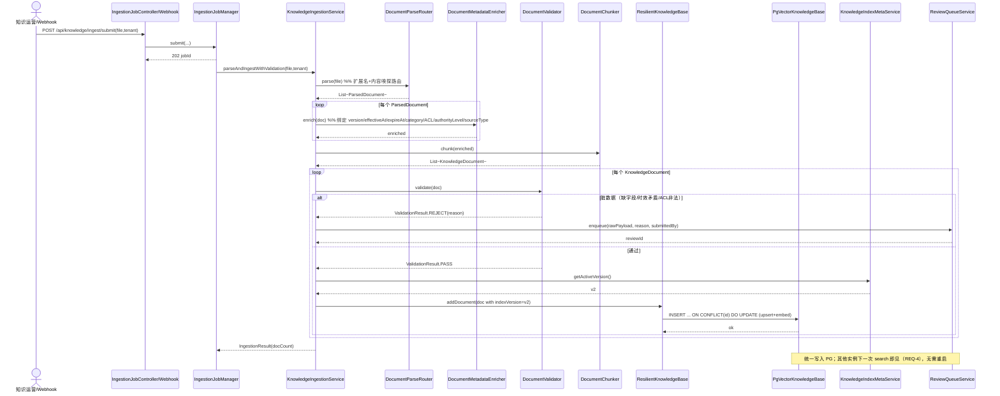
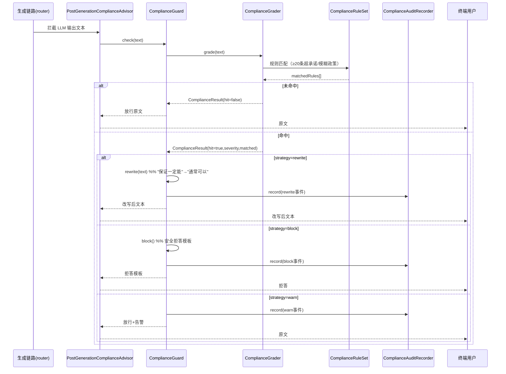
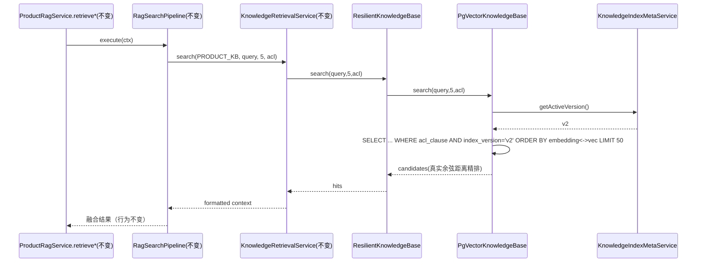

# SmartAssistant RAG 生产化改造 — 系统架构设计 + 任务分解

> 作者：高见远（架构师）
> 版本：v1.0（架构设计稿）
> 日期：2026-07-14
> 配套 PRD：`docs/rag-production/PRD.md`

---

## 0. 阅读结论：现有代码已具备大量脚手架（设计须对齐而非重写）

通读代码后，工程内已存在与本次改造高度相关的实现，架构设计**必须复用、扩展、对齐**，避免重复造轮子也避免破坏既有公开 API：

| 已有组件 | 路径 | 与本改造关系 | 需处理的问题 |
|---|---|---|---|
| `PgVectorKnowledgeBase` | `common/.../rag/PgVectorKnowledgeBase.java` | REQ-2 的 PG 持久化基底 | ① 向量维度**硬编码 384**，但运行时模型是 `bge-large-zh-v1.5`（1024 维）→ 建表会崩；② `search()` 把 `cosSim` 写死 `1.0`，丢弃 pgvector 真实余弦距离，精排失真；③ 缺 `index_version`/`parent_doc_id`/`source_type`/`raw_checksum`/`ingest_batch_id` 列；④ 建表用 `CREATE TABLE IF NOT EXISTS` 散在 Java，无迁移工具 |
| `KnowledgeIngestionService` | `common/.../rag/ingestion/KnowledgeIngestionService.java` | REQ-1 摄入编排基底 | ① 每次 `parseAndIngest` 末尾调用 `knowledgeBase.reindex()`（全量重算 embedding）→ 与 REQ-2 增量 upsert、REQ-4 多实例"免重启"冲突；② 无元数据提取绑定（parsers 全留空默认）；③ 无脏数据拦截→复核队列 |
| `DocumentParseRouter` + 4 解析器 | `common/.../rag/document/*` | REQ-1 路由解析 | 已注册 pdf/docx/html/htm/txt；**缺 Markdown**；无内容嗅探 |
| `IngestionJobController` 等 | `common/.../rag/ingestion/job/*` | REQ-1 触发机制 | 已有 `/api/knowledge/ingest/submit` 异步任务 + 重试；可复用作手动/Webhook 入口 |
| `KnowledgeBase`（接口） | `common/.../rag/KnowledgeBase.java` | 存储抽象 | 已定义 `addDocument/removeByBaseDocId/search/listIdsByBaseDocId/updateStatus/markSupersededByBaseId` 等，Pg/InMemory 共用 |
| `KnowledgeRetrievalService` | `common/.../rag/KnowledgeRetrievalService.java` | 检索入口 | `search(kbName, query, topK, acl)` → `kb.search(...)`，是 Pipeline 与存储的分界，**不动** |
| `IngestAuditEvent/Recorder` | `common/.../rag/ingestion/*` | 审计 | REQ-3 审计日志可复用其结构 |
| `IndexReconciliationService` | `common/.../rag/IndexReconciliationService.java` | indexVersion 对账 | 可承载 REQ-2 indexVersion 对账 |
| `KnowledgeSeedData` | `common/.../rag/KnowledgeSeedData.java` | 种子 | 首启动需把种子灌入 PG，保证基线不丢 |
| `advisor/PromptAuditAdvisor` 等 | `common/.../rag/advisor/*` | REQ-3 接入点参考 | 生成后合规可做成同类 Advisor |

**铁律（来自 PRD §七）**：`ProductRagService.retrieve` / `retrieveWithQualityResult`、`KnowledgeRetrievalService` 公开 API 行为不变；`KnowledgeDocument` 字段只增不删；GoldenSuite 基线不降。

---

## 1. 实现方案 + 框架选型

### 1.1 总体架构

```
                 ┌──────────────── 摄入侧（REQ-1/2/4 写路径）────────────────┐
 上传/Webhook/定时 ─▶ IngestionJobController/Webhook/Poller
                       └▶ KnowledgeIngestionService
                            ├▶ DocumentParseRouter（pdf/docx/html/md+嗅探）
                            ├▶ DocumentMetadataEnricher（版本/时效/分类/ACL/权威级/sourceType 绑定）
                            ├▶ DocumentValidator（脏数据拦截 → ReviewQueueService）
                            ├▶ DocumentChunker（分块，保留既有）
                            └▶ KnowledgeBase.addDocument()  ──┐
                                                              │
                       ResilientKnowledgeBase（装饰器）        │ upsert + embed
                         ├─ PgVectorKnowledgeBase ─────────────┘──▶ PostgreSQL(a2a_system) + pgvector
                         └─ InMemoryKnowledgeBase（降级/测试）        （统一写入，多实例实时读=REQ-4）

                 ┌──────────────── 检索侧（保留自研 Pipeline，REQ-2/4 读路径）────────────────┐
 用户 Query ─▶ ProductRagService.retrieve*（不变）
                └▶ RagSearchPipeline（MultiQuery→ExactMatch→Keyword→Bm25→Knowledge→Graph→RrfFusion，不变）
                      └▶ KnowledgeRetrievalService.search() ─▶ KnowledgeBase.search()
                            └─ PgVectorKnowledgeBase.search()：SQL WHERE 过滤 ACL + index_version，
                               用真实余弦距离精排，结果交 RRF 融合（行为不变）

                 ┌──────────────── 生成后（REQ-3，可并行）────────────────┐
 LLM 生成输出 ─▶ PostGenerationComplianceAdvisor（router）
                 └▶ ComplianceGuard.check() ─▶ ComplianceGrader（规则+可选LLM）
                      ├ 命中 warn  → 仅告警+写 compliance_audit_log
                      ├ 命中 rewrite→ 改写绝对化表述后放行
                      └ 命中 block  → 拒答安全模板
```

### 1.2 关键技术决策

| 维度 | 选型 | 理由 |
|---|---|---|
| **为何保留自研 Pipeline** | 不改 `RagSearchPipeline` 任何 Handler，仅把 `KnowledgeBase` 底层存储从 InMemory 换成 PG | PRD 红线要求 `retrieve`/`retrieveWithQualityResult` 行为不变；自研多路 + RRF 融合已是成熟链路，替换底层存储即可达成"持久化+共享"，风险最低 |
| **PG 表结构 + pgvector** | 复用 `a2a_system` 库；`knowledge_docs` 表加列；`CREATE EXTENSION IF NOT EXISTS vector;`；HNSW 索引 `USING hnsw (embedding vector_cosine_ops)` | 已有 PG 实例（5432/Docker5433，密码 postgres123），不新建库；向量维度**从 `BgeEmbeddingModel.dimensions()` 动态获取**（修复 384 硬编码 bug） |
| **增量 upsert + indexVersion 过滤** | `ON CONFLICT (id) DO UPDATE`（幂等）；新 chunk 打标 `active_index_version`；检索 `WHERE index_version = :active` | 单文档更新无需全量重建；旧版本检索不可见但保留可回滚；并发写靠 PK 唯一约束 + 幂等 upsert 安全 |
| **去除每次 reindex** | 摄入流程改为仅对新文档 embed（addDocument 内已完成），删除 `KnowledgeIngestionService` 末尾的 `knowledgeBase.reindex()` | 否则每摄入一次全量重算 embedding，既慢又会让多实例互相触发重算 |
| **内存降级** | `ResilientKnowledgeBase` 装饰器：PG 不可用时按请求降级到 InMemory 快照（只读） | 满足"PgVector 不可用时检索不中断"红线；启动期 `mode=auto` 失败则整体降级内存 |
| **迁移工具** | **Flyway**（`spring-boot-starter-flyway`），V1 起建扩展+建表 | 优于手写 DDL（已在 Java 散落）、优于 Liquibase（无需其复杂度） |
| **文档解析** | 既有 `DocumentParseRouter` + 新增 `MarkdownDocumentParser`；内容嗅探用 **Apache Tika** | REQ-1 要求 4 类 + 内容嗅探 |
| **元数据/脏数据** | 新增 `DocumentMetadataEnricher` + `DocumentValidator` + `ReviewQueueService` | 复用既有 `ParsedDocument` 元数据字段；拦截进 `knowledge_review_queue` |
| **合规校验** | `ComplianceGrader`（规则集 + 可选 LLM，复用 `EvaluationReportService` grader 思路）+ `ComplianceGuard` + `compliance_audit_log` | REQ-3 明确要求复用 EvaluationReportService grader 思路 |
| **嵌入来源** | 本地 `embedding-service:8090`（BGE），通过既有 `BgeEmbeddingModel` 调用（同进程 ONNX） | 与 PRD 约束一致，不调云 API（注：`PgVectorKnowledgeBase` 复用同进程 `BgeEmbeddingModel`，不经 REST，降低延迟） |

---

## 2. 文件列表（新建 + 修改，标注模块）

> 模块缩写：`C`=common，`P`=product，`R`=router

### 2.1 数据模型 / 配置 / 基础设施（C）

| 文件 | 操作 | 说明 |
|---|---|---|
| `smart-assistant-common/src/main/java/com/example/smartassistant/common/rag/KnowledgeDocument.java` | **修改** | 新增字段 `sourceType`、`rawChecksum`、`ingestBatchId`（只增不删）；补齐 `indexVersion`/`parentDocId` 持久化所需 getter |
| `smart-assistant-common/src/main/java/com/example/smartassistant/common/rag/properties/RagProductionProperties.java` | 新建 | 集中承载 `app.rag.*` 配置（见 §7） |
| `smart-assistant-common/src/main/java/com/example/smartassistant/common/rag/store/PgVectorKnowledgeBase.java` | **修改** | ① 维度动态化 ② 修正 `search()` 真实余弦距离 ③ `index_version`/`parent_doc_id`/`source_type`/`raw_checksum`/`ingest_batch_id` 列 ④ indexVersion 过滤 ⑤ 增量 upsert（保留）⑥ 去除强制全量 reindex |
| `smart-assistant-common/src/main/java/com/example/smartassistant/common/rag/store/ResilientKnowledgeBase.java` | 新建 | `KnowledgeBase` 装饰器：PG→内存降级 |
| `smart-assistant-common/src/main/java/com/example/smartassistant/common/rag/store/KnowledgeIndexMetaService.java` | 新建 | `knowledge_index_meta` 读写 active_index_version / bump |
| `smart-assistant-common/src/main/java/com/example/smartassistant/common/rag/store/MemoryRefreshCoordinator.java` | 新建 | 内存模式水印轮询刷新（REQ-4 一致性） |
| `smart-assistant-common/src/main/resources/db/migration/V1__rag_knowledge_schema.sql` | 新建 | Flyway：建扩展 + `knowledge_docs`（扩展列）+ `knowledge_index_meta` + `knowledge_review_queue` + `compliance_audit_log` |
| `smart-assistant-common/pom.xml` | **修改** | 加 Flyway、Tika、CommonMark 依赖 |

### 2.2 摄入管道（REQ-1）（C / P）

| 文件 | 操作 | 说明 |
|---|---|---|
| `smart-assistant-common/src/main/java/com/example/smartassistant/common/rag/document/MarkdownDocumentParser.java` | 新建 | Markdown 解析 + front-matter 元数据抽取 |
| `smart-assistant-common/src/main/java/com/example/smartassistant/common/rag/document/DocumentParseRouter.java` | **修改** | 注册 `.md/.markdown`；接入 Tika 内容嗅探 |
| `smart-assistant-common/src/main/java/com/example/smartassistant/common/rag/ingestion/DocumentMetadataEnricher.java` | 新建 | 版本/时效/分类/ACL/权威级/sourceType 绑定规则 |
| `smart-assistant-common/src/main/java/com/example/smartassistant/common/rag/ingestion/DocumentValidator.java` | 新建 | 脏数据判废规则 + 返回 `ValidationResult` |
| `smart-assistant-common/src/main/java/com/example/smartassistant/common/rag/ingestion/ReviewQueueService.java` | 新建 | 脏数据入 `knowledge_review_queue` + 审批 |
| `smart-assistant-common/src/main/java/com/example/smartassistant/common/rag/ingestion/KnowledgeIngestionService.java` | **修改** | 注入 enricher/validator；新增 `parseAndIngestWithValidation`；去除末尾全量 reindex；脏数据走复核分支 |
| `smart-assistant-common/src/main/java/com/example/smartassistant/common/rag/ingestion/job/IngestionWebhookController.java` | 新建 | 对象存储事件 → submit（REQ-1 触发） |
| `smart-assistant-common/src/main/java/com/example/smartassistant/common/rag/ingestion/job/ScheduledIngestionPoller.java` | 新建 | 定时扫描目录兜底 |
| `smart-assistant-common/src/main/java/com/example/smartassistant/common/rag/ingestion/job/ReviewQueueController.java` | 新建 | 复核审批 REST（approve→重投 / reject→丢弃通知） |
| `smart-assistant-common/src/main/java/com/example/smartassistant/common/rag/ingestion/job/IngestionJobAutoConfiguration.java` | **修改** | 装配 enricher/validator/webhook/poller/review controller；注入 `RagProductionProperties` |
| `smart-assistant-product/src/main/java/com/example/smartassistant/config/RagProductionAutoConfiguration.java` | 新建 | 绑定属性、按 `mode` 装配 `ResilientKnowledgeBase` |
| `smart-assistant-product/src/main/java/com/example/smartassistant/config/ProductKnowledgeConfig.java` | **修改** | `mode=pg/auto` 时装配 PG 知识库；首启动把 `KnowledgeSeedData` 灌入 PG |

### 2.3 合规校验（REQ-3，可并行）（C / R）

| 文件 | 操作 | 说明 |
|---|---|---|
| `smart-assistant-common/src/main/java/com/example/smartassistant/common/rag/compliance/ComplianceRule.java` | 新建 | 单条规则（pattern / severity / strategy） |
| `smart-assistant-common/src/main/java/com/example/smartassistant/common/rag/compliance/ComplianceRuleSet.java` | 新建 | ≥20 条超承诺/模糊政策规则集（JSON 可配） |
| `smart-assistant-common/src/main/java/com/example/smartassistant/common/rag/compliance/ComplianceGrader.java` | 新建 | 规则 grader + 可选 LLM grader（复用 `EvaluationReportService` 思路） |
| `smart-assistant-common/src/main/java/com/example/smartassistant/common/rag/compliance/ComplianceResult.java` | 新建 | 命中结果 + 改写建议 |
| `smart-assistant-common/src/main/java/com/example/smartassistant/common/rag/compliance/ComplianceGuard.java` | 新建 | 改写/拒答/告警分级 + 写 `compliance_audit_log` |
| `smart-assistant-common/src/main/java/com/example/smartassistant/common/rag/compliance/ComplianceAuditRecorder.java` | 新建 | 审计写入 |
| `smart-assistant-router/src/main/java/com/example/smartassistant/router/advisor/PostGenerationComplianceAdvisor.java` | 新建 | 接入生成末端（LLM 输出→用户前） |
| `smart-assistant-router/src/main/java/com/example/smartassistant/router/config/ComplianceAutoConfiguration.java` | 新建 | 装配 grader/guard/规则集 |

### 2.4 集成与验收（P，主链路收口）

| 文件 | 操作 | 说明 |
|---|---|---|
| `smart-assistant-product/src/main/java/com/example/smartassistant/config/ProductKnowledgeConfig.java` | **修改** | 默认 store 切 PG（auto 降级）；种子迁移 |
| `smart-assistant-product/src/main/java/com/example/smartassistant/config/RagProductionAutoConfiguration.java` | 新建 | 见 2.2 |
| `src/test/resources/eval-baseline.json`（GoldenSuite） | 复用 | 回归不退化校验 |

---

## 3. 数据结构和接口（类图，Mermaid）

```mermaid
classDiagram
    %% ===== 数据模型 =====
    class KnowledgeDocument {
        +String id
        +String title
        +String content
        +String category
        +String keywords
        +long effectiveAt
        +long expireAt
        +String tenantId
        +String version
        +String sourceUrl
        +int chunkIndex
        +String parentDocId
        +AuthorityLevel authorityLevel
        +DocumentStatus documentStatus
        +String indexVersion
        +Set~String~ authorizedRoles
        +Set~String~ authorizedUsers
        +int securityLevel
        +String sourceType
        +String rawChecksum
        +String ingestBatchId
        +getIndexVersion() String
        +getSourceType() String
        +getRawChecksum() String
        +getIngestBatchId() String
        +isRetrievable() boolean
    }

    %% ===== 存储抽象 =====
    class KnowledgeBase {
        <<interface>>
        +String getName()
        +void addDocument(KnowledgeDocument)
        +void addDocuments(List)
        +void removeDocument(String)
        +void removeByBaseDocId(String)
        +List~KnowledgeHit~ search(String, int, AclContext)
        +int size()
        +void reindex()
        +List~String~ listIdsByBaseDocId(String)
        +void updateStatus(String, DocumentStatus)
    }
    KnowledgeBase <|.. InMemoryKnowledgeBase
    KnowledgeBase <|.. PgVectorKnowledgeBase
    KnowledgeBase <|-- ResilientKnowledgeBase

    class InMemoryKnowledgeBase {
        -Map~String,KnowledgeDocument~ docs
        -Map~String,float[]~ vectors
        +search(String,int,AclContext) List~KnowledgeHit~
    }
    class PgVectorKnowledgeBase {
        -JdbcTemplate jdbcTemplate
        -int dimensions
        -String activeIndexVersion
        +search(String,int,AclContext) List~KnowledgeHit~
        -buildAclClause(AclContext) String
        -realCosineScore(double dist) double
    }
    class ResilientKnowledgeBase {
        -KnowledgeBase primary   %% PgVector
        -KnowledgeBase fallback  %% InMemory
        +search(...) List~KnowledgeHit~
    }
    ResilientKnowledgeBase o-- KnowledgeBase

    %% ===== 检索入口（不动） =====
    class KnowledgeRetrievalService {
        -Map~String,KnowledgeBase~ bases
        +search(kbName,query,topK,acl) String
        +register(KnowledgeBase) KnowledgeRetrievalService
    }
    KnowledgeRetrievalService o-- KnowledgeBase

    %% ===== 摄入（REQ-1） =====
    class KnowledgeIngestionService {
        -DocumentParseRouter router
        -DocumentChunker chunker
        -KnowledgeBase knowledgeBase
        -DocumentMetadataEnricher enricher
        -DocumentValidator validator
        +parseAndIngestWithValidation(path,tenant) IngestionResult
    }
    KnowledgeIngestionService --> KnowledgeBase : upsert
    KnowledgeIngestionService --> DocumentMetadataEnricher
    KnowledgeIngestionService --> DocumentValidator
    KnowledgeIngestionService --> ReviewQueueService

    class DocumentParseRouter {
        +parse(path) List~ParsedDocument~
        +registerParser(ext,parser)
    }
    class MarkdownDocumentParser
    DocumentParseRouter o-- MarkdownDocumentParser
    DocumentParseRouter ..> TikaDocumentSniffer : 内容嗅探

    class DocumentMetadataEnricher {
        +enrich(ParsedDocument) ParsedDocument
    }
    class DocumentValidator {
        +validate(KnowledgeDocument) ValidationResult
    }
    class ReviewQueueService {
        +enqueue(ReviewItem)
        +approve(id, overrides)
        +reject(id)
    }
    class IngestionJobController
    class IngestionWebhookController
    class ScheduledIngestionPoller
    class ReviewQueueController

    %% ===== indexVersion 元数据 =====
    class KnowledgeIndexMetaService {
        +getActiveVersion() String
        +bump(newVersion) void
        +stamp(doc) void
    }
    KnowledgeIngestionService --> KnowledgeIndexMetaService
    PgVectorKnowledgeBase --> KnowledgeIndexMetaService : 读 activeVersion 过滤

    %% ===== 合规（REQ-3） =====
    class ComplianceGuard {
        +check(text) ComplianceResult
        -rewrite(text) String
        -block() String
    }
    class ComplianceGrader {
        +grade(text) ComplianceResult
    }
    class ComplianceRuleSet {
        +rules : List~ComplianceRule~
    }
    class ComplianceResult {
        +boolean hit
        +List~ComplianceRule~ matched
        +Severity severity
        +String rewritten
    }
    class ComplianceAuditRecorder {
        +record(ComplianceAuditEvent)
    }
    class PostGenerationComplianceAdvisor
    ComplianceGuard --> ComplianceGrader
    ComplianceGrader --> ComplianceRuleSet
    ComplianceGuard --> ComplianceAuditRecorder
    PostGenerationComplianceAdvisor --> ComplianceGuard

    %% ===== 种子（基线不丢） =====
    class KnowledgeSeedData {
        +productDocuments() List~KnowledgeDocument~
        +orderDocuments() List~KnowledgeDocument~
    }
    ProductKnowledgeConfig ..> KnowledgeSeedData : 首启动灌 PG
```



---

## 4. 程序调用流程（时序图，Mermaid）

### 4.1 主链路 A：上传 → 路由解析 → 元数据绑定 → PG upsert（REQ-1 + REQ-2 + REQ-4 写）



### 4.2 主链路 B：生成后 → 合规校验 → 改写/拒答（REQ-3）



### 4.3 检索链路（保留自研 Pipeline，仅底层换 PG）



---

## 5. 关键决策（PRD 第五节 8 问逐条回应）

| # | 待确认问题 | 架构决策 | 状态 |
|---|---|---|---|
| 1 | 内存降级保留与切换策略 | **保留**。三态 `app.rag.store.mode = pg \| memory \| auto`（默认 `auto`）：启动尝试 PG，失败整体降级内存；运行时 `ResilientKnowledgeBase` 按请求降级（PG 查询抛错/健康检查连续失败 → 只读降级内存快照）。降级触发条件由 `PgVectorHealthIndicator`（连接 + 嵌入延迟阈值）判定。 | 已定 |
| 2 | PgVector schema 归属 + 迁移 | **复用 `a2a_system` 库**（同 PG 实例，不新建库）。表：`knowledge_docs`（扩展现有列）、`knowledge_index_meta`、`knowledge_review_queue`、`compliance_audit_log`。**迁移工具 = Flyway**（V1 首行 `CREATE EXTENSION IF NOT EXISTS vector;`），替代散落 Java 的 `CREATE TABLE IF NOT EXISTS`。表命名沿用 `knowledge_*` 无前缀（与现有一致）。 | 已定 |
| 3 | 摄入触发方式 | 默认 **手动上传后台（`/api/knowledge/ingest/submit`）+ Webhook（对象存储事件→submit）**，定时扫描目录兜底（`app.rag.ingest.scan-dir` + `@Scheduled`）。首版不引消息队列。 | 已定 |
| 4 | 合规校验兜底策略 | 分级 `warn / rewrite / block`，由 `app.compliance.default-strategy` 配置（默认 `rewrite`，高危自伤类已由 `GuardrailService` 覆盖为 block）。误杀兜底：运营后台人工复核 + per-tenant 规则白名单豁免；命中全部写 `compliance_audit_log`。 | 已定（默认值待主理人确认） |
| 5 | 与 ExperienceService 关系 | **不合并治理**。KnowledgeDocument = 经摄入校验+版本+ACL+合规的治理知识；Experience = 运行时 Agent 自沉淀经验（走 ExperienceService 既有流程，不强制治理）。检索时 Experience 作为独立 path 参与融合，但**不经过** ComplianceGuard 的改写/拒答（仅告警级），避免双治理。 | 已定 |
| 6 | indexVersion 生成与并发写 | `knowledge_index_meta` 单行存 `active_index_version`+`bumped_at`；摄入时按当前 active 版本打标，检索按 active 过滤；模型/切分变更时运维 bump。并发写靠 PK 唯一约束 + `ON CONFLICT DO UPDATE`（幂等 upsert，last-write-win 安全），**无需乐观锁**。 | 已定 |
| 7 | ACL 过滤下沉层级 | **下沉到 SQL WHERE**（PgVector 已实现 `buildAclClause`：租户+安全等级+角色+用户，服务端生成 filter）；内存模式走 in-memory filter（已实现）。理由：性能 + 一致性 + 安全默认拒绝。 | 已定（沿用现有实现） |
| 8 | 脏数据判废标准 + 复核 | 判废（任一即废）：① content 非空 ② category 非空 ③ 时效合法（expireAt==-1 或 expireAt>effectiveAt 且 effectiveAt≤now+上限）④ ACL 合法（securityLevel∈[0,MAX]、tenantId 格式、roles/users 引用合法）⑤ sourceType 已知。废→入 `knowledge_review_queue(reason,raw_payload,submitted_by,status=REVIEW)`；复核 REST：`approve` 带覆盖项重投 / `reject` 丢弃并通知上传人。**拦截率=100%**。 | 已定（复核 UI 不在代码范围，仅提供 API+表） |

---

## 6. 任务列表（有序、含依赖、按实现顺序）

> 约束：基础链 T01→T02→T05（含 REQ-1/2/4）；REQ-3 = T04 可并行；T03 依赖 T01。

| Task | 名称 | 涉及模块 | 依赖 | 优先级 | 验收点 |
|---|---|---|---|---|---|
| **T01** | 基础设施与数据模型底座 | C | — | P0 | ① `KnowledgeDocument` 新增 3 字段编译通过、存量调用兼容；② Flyway 迁移可建扩展+4 张表；③ `RagProductionProperties` 承载全部 `app.rag.*`/`app.compliance.*` 配置；④ pgvector 维动态取（`vector(1024)` 不写死） |
| **T02** | 持久化存储层 REQ-2 + 多实例读共享底座 REQ-4 | C | T01 | P0 | ① 单文档 upsert 增量生效、重启不丢；② `search()` 用真实余弦距离（修复 cosSim=1.0 bug），GoldenSuite 不降；③ `index_version` 过滤可用；④ `ResilientKnowledgeBase` 降级正确；⑤ 多实例同写 PG、实时读（REQ-4 基础） |
| **T03** | 路由摄入管道 REQ-1 | C / P | T01 | P0 | ① pdf/word/html/md 4 类路由解析 + 内容嗅探；② 元数据绑定率≥95%；③ 脏数据拦截 100% 入复核队列且可查；④ 摄入不再全量 reindex；⑤ Webhook/定时触发可用 |
| **T04** | 生成后合规校验 REQ-3（可并行） | C / R | T01 | P1 | ① ≥20 条规则可命中；② 按配置执行 rewrite/block/warn；③ 改写后无违例表述（回归校验）；④ 误杀率≤5%；⑤ 命中写 `compliance_audit_log` |
| **T05** | 集成、多实例联调与验收 | P | T02,T03,T04 | P0 | ① AC-0-1/0-2/0-3 全满足；② 默认 store=pg(auto 降级)；③ 首启动种子灌 PG 基线不丢；④ 单实例写入其他实例 ≤5s 可见（含内存模式刷新）；⑤ GoldenSuite 回归通过 |

---

## 7. 依赖包列表

| 包 | 坐标 / 版本范围 | 用途 | 加入模块 |
|---|---|---|---|
| Flyway Core + PG | `org.flywaydb:flyway-core` / `flyway-database-postgresql`（Spring Boot 3.5 托管版本） | 表迁移（V1 建扩展+建表） | product（+common test） |
| Apache Tika | `org.apache.tika:tika-core` + `tika-parsers-standard-package:2.9.x` | 内容嗅探（html/markdown 判别） | common |
| CommonMark | `org.commonmark:commonmark:0.21.x` + `commonmark-ext-front-matter` | Markdown 解析 + front-matter 元数据 | common |
| pgvector-java（可选） | `org.pgvector:pgvector:0.3.x` | 类型化向量读写（当前方案用 `?::vector` 原始 SQL 已可行，列为可选增强） | common |
| Apache POI | `poi-ooxml:5.3.0`（已存在） | Word 解析 | common（已有） |
| Apache PDFBox | `pdfbox:3.0.3`（已存在） | PDF 解析 | common（已有） |
| JSoup | `jsoup:1.18.3`（已存在） | HTML 解析 | common（已有） |
| Spring AI（DeepSeek） | `spring-ai 1.0.9`（已存在） | REQ-3 可选 LLM grader | common/router（已有） |
| **移除/停用** | `io.milvus:milvus-sdk-java`（已存在） | 本改造用 PG，**不启用** Milvus（保留为备选，不接管线） | — |

---

## 8. 共享知识（跨文件约定）

### 8.1 indexVersion 约定
- 全局 active 版本存于 `knowledge_index_meta.active_index_version`（单行）。
- 摄入时由 `KnowledgeIndexMetaService.getActiveVersion()` 取当前值，打在 chunk 的 `indexVersion` 字段；检索时 `WHERE index_version = :active` 过滤。
- 模型/切分策略/解析策略变更 → 运维 bump（actuator/`KnowledgeIndexMetaService.bump`）→ 旧版本检索不可见但保留，由 `IndexReconciliationService` 对账 + 延迟 GC。
- 默认种子首版：`v1`；bge-large 切换后首个生产版本建议 `v2`。

### 8.2 元数据提取规则（DocumentMetadataEnricher）
- **sourceType**：由路由结果映射（pdf→PDF / docx→WORD / html→HTML / md→MARKDOWN / txt→TXT / 图→IMAGE）。
- **version**：优先 front-matter/`version` 字段；否则 filename 正则 `v\d+`；否则默认 `v1`。
- **effectiveAt/expireAt**：文档头 `生效:YYYY-MM-DD`/`失效:YYYY-MM-DD` 或 front-matter；缺省 `-1`（永久）。
- **category**：front-matter `category` 或首段小标题推断；缺省空（→ 判废）。
- **ACL**：front-matter `tenantId`/`authorizedRoles`/`authorizedUsers`/`securityLevel`；缺省公开（`tenantId=""`, `securityLevel=0`）。
- **authorityLevel**：front-matter；缺省 `L2_INTERNAL`。
- **rawChecksum**：原始文件 SHA-256（`HashUtil` 已有）。
- **ingestBatchId**：一次摄入任务 UUID。

### 8.3 降级开关配置 key（`RagProductionProperties` 承载）
```
app.rag.store.mode=auto                 # pg | memory | auto
app.rag.pg.init-schema-on-startup=false  # 生产走 Flyway；开发可开
app.rag.degrade.auto-enabled=true        # 运行时按请求降级
app.rag.degrade.health-fail-threshold=3  # 连续失败次数触发降级
app.rag.ingest.reindex-on-ingest=false   # 关键：关闭每次全量 reindex
app.rag.ingest.trigger=manual,webhook    # manual|webhook|schedule|all
app.rag.ingest.scan-dir=                 # 定时扫描目录（兜底）
app.rag.memory.refresh-interval-ms=5000  # 内存模式水印刷新间隔（REQ-4）
app.rag.seed.migrate-to-pg-on-startup=true
app.compliance.enabled=true
app.compliance.default-strategy=rewrite  # warn | rewrite | block
app.compliance.llm-enabled=false
app.compliance.appeal.enabled=true
```

### 8.4 合规规则存储格式（`ComplianceRuleSet`，JSON 可配，`src/main/resources/rag/compliance-rules.json`）
```json
{
  "rules": [
    { "id":"C001", "pattern":"保证一定能", "severity":"HIGH",   "strategy":"rewrite",
      "rewrite":"通常可以", "category":"超承诺" },
    { "id":"C002", "pattern":"价格永久有效", "severity":"HIGH", "strategy":"rewrite",
      "rewrite":"价格以当前页面为准", "category":"模糊政策" },
    { "id":"C003", "pattern":"100%|绝对|肯定|随时都能|完全免费|无风险|绝不",
      "severity":"MEDIUM", "strategy":"rewrite", "rewrite":"", "category":"绝对化" }
  ]
}
```
- `severity`：`HIGH/MEDIUM/LOW`；`strategy` 可单条覆盖全局默认。
- 审计表 `compliance_audit_log(rule_id, severity, strategy_applied, original_snippet, rewritten_snippet, tenant_id, timestamp)`。

### 8.5 脏数据复核表 `knowledge_review_queue`
`id, raw_payload(jsonb), reason, source_type, submitted_by, status(REVIEW/APPROVED/REJECTED), reviewed_by, reviewed_at, created_at`。

---

## 9. 待明确事项（仅真正需主理人/用户拍板，附推荐默认）

| 项 | 问题 | 推荐默认 | 阻塞程度 |
|---|---|---|---|
| A | REQ-3 接入生成链路的**精确挂载点**（router 模块生成方法/Advisor 链） | 做成 `PostGenerationComplianceAdvisor` 包裹 `AiChatService.generate`（镜像现有 `advisor` 包）；需 router 负责人确认生成输出出口方法名 | **软阻塞**：需与 router 模块对齐 1 个方法签名，不影响 T01–T03 |
| B | 合规默认策略 `app.compliance.default-strategy` | `rewrite`（改写优先，体验最优） | 非阻塞，可先按默认实现 |
| C | 复核入口 UI 是否本迭代做 | 仅提供 API + 表，UI 后续；首版由运营直接调 REST | 非阻塞 |
| D | pgvector 维度 | **运行时动态取 `BgeEmbeddingModel.dimensions()`**（bge-large-zh-v1.5 = 1024），不写死 | 已解决，非阻塞 |

> 说明：PRD 第五节 8 问均已在 §5 给出技术决策；上表仅列"需要人拍板默认值/跨模块协调"的少数项。其中 **A 是唯一需要 router 团队配合确认生成出口** 的真实协调点，建议主理人指派 router 负责人与架构师对齐 `AiChatService` 生成出口签名。

---

## 10. 向后兼容红线确认

| 红线 | 保障措施 |
|---|---|
| `ProductRagService.retrieve` / `retrieveWithQualityResult` 不变 | 不改动这两个方法；Pipeline 与 `KnowledgeRetrievalService` 零改动；仅替换底层 `KnowledgeBase` 实现 |
| `KnowledgeRetrievalService` 公开 API 不变 | 接口方法签名不变；`ResilientKnowledgeBase` 实现同一接口 |
| `KnowledgeDocument` 字段只增不删 | 仅新增 `sourceType`/`rawChecksum`/`ingestBatchId`；既有构造器/字段全保留 |
| GoldenSuite 基线不降 | T02 验收强制跑 GoldenSuite；`search()` 真实余弦距离修复后需复测基线；REQ-8 规则进回归集（后续） |
| 降级可用 | `ResilientKnowledgeBase` + `mode=auto` 保证 PG 不可用时检索不中断 |
