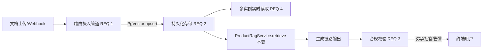

# SmartAssistant RAG 生产化改造 — 简单 PRD

> 文档类型：简单 PRD（默认，不含竞品分析）
> 作者：许清楚（产品经理）
> 版本：v0.1（初稿）
> 日期：2026-07-14

## 一、项目信息

| 项 | 内容 |
|---|---|
| Language | 中文 |
| Programming Language | Java 17 + Spring Boot（与现有代码库一致） |
| Project Name | `rag_production_hardening` |
| 关联模块 | `smart-assistant-common` / `smart-assistant-product` / `smart-assistant-router` |
| 基础设施 | PostgreSQL 5432（Docker 5433），库名 `a2a_system`，密码 postgres123；本地 `embedding-service:8090`（BGE） |
| 原始需求复述 | 现有 RAG 检索链路（多路混合检索 + Query 改写 + 评估门禁）已较成熟，但摄入层为硬编码种子、存储为 InMemory、缺生成后合规校验、多实例各自内存一份。需补齐 4 块短板使系统达到"生产级"：① 文档类型路由摄入管道；② 持久化 Vector Store（PG + PgVector）；③ 生成后合规校验；④ 多实例共享。 |

## 二、产品目标

将 SmartAssistant 的 RAG 从"Demo 级摄入 + 内存存储"升级为"生产级、可治理、可审计"的知识运营体系：在**不改动现有检索/评估公开 API 与 `KnowledgeDocument` 字段契约**的前提下，让已具备生产级元数据能力的 `KnowledgeDocument` 被真实内容驱动（路由摄入），将知识库从易失内存迁移到可持久化、可增量更新的 PgVector（持久化 + 多实例共享），并在生成链路补上"业务合规校验"闭环，最终消除"逐实例重启才更新"与"脏数据/超承诺"两类生产风险。

## 三、用户故事

| 角色 | 用户故事 |
|---|---|
| 知识运营 | 作为知识运营，我希望上传 PDF/Word/HTML/Markdown 文档后系统能自动按类型解析、抽取并绑定 version/effectiveAt/expireAt/category/ACL/authorityLevel 等元数据，且脏数据/无元数据文档被自动拦截，这样我无需手工维护种子数据即可保证知识库"元数据真实可信"。 |
| 后端开发 | 作为后端开发，我希望 `KnowledgeBase` 从 InMemory 平滑迁移到 PgVector、保留内存模式作为降级/测试，且 `ProductRagService.retrieve` / `retrieveWithQualityResult` 等公开 API 行为不变，这样我在不改动上游调用方的前提下完成存储生产化。 |
| 终端用户 | 作为终端用户，我希望规划结果不出现"保证一定能订到""价格永久有效"等超承诺或模糊政策表述，且知识更新后能立即在任意实例生效，这样我获得的是合规、及时、一致的服务。 |

## 四、需求池（优先级 + 顺序）

> 顺序：**1 → 2 → 4 为基础链**；**3 可并行开发**。优先级基于"是否阻断生产化闭环"划分。

### P0（Must have）

- **[REQ-1] 文档类型路由摄入管道**（对应改造①，顺序 1）
  - 支持 PDF / Word(.docx) / HTML / Markdown 按扩展名 + 内容嗅探路由到对应解析器。
  - 解析后自动抽取并绑定 `KnowledgeDocument` 元数据：version、effectiveAt、expireAt、category、tenantId + authorizedRoles/Users + securityLevel（ACL）、authorityLevel、documentStatus。
  - **无元数据 / 脏数据（字段缺失、时效矛盾、ACL 非法）禁止入库**，进入人工复核队列。
  - 现有 `KnowledgeDocument` 字段契约不变（只增不删）。

- **[REQ-2] 持久化 Vector Store**（对应改造②，顺序 2）
  - 将 `InMemoryKnowledgeBase` 迁移到 PG + PgVector；实现按 `indexVersion` 过滤的增量 upsert。
  - 保留内存模式（配置开关）作为降级 / 测试通道。
  - 现有 `retrieve` / `retrieveWithQualityResult` / `KnowledgeRetrievalService` 公开 API 行为不变。

- **[REQ-4] 多实例共享**（对应改造④，顺序 4）
  - 知识更新统一写入 PG + PgVector，各实例实时读取，消除"逐实例重启才更新"。
  - 与 REQ-2 共用存储层；明确实例侧缓存刷新 / 失效策略。

### P1（Should have）

- **[REQ-3] 生成后合规校验**（对应改造③，可并行）
  - 在生成链路后加一层"超承诺 / 模糊政策"检测（如"保证一定能订到""价格永久有效""绝对没问题"）。
  - 复用 `EvaluationReportService` 的 grader 思路（规则 + 可选模型判分）实现 `ComplianceGrader`。
  - 命中处理策略：改写 / 拒答 / 告警（分级 warn/block），并写入审计日志。

### P2（Nice to have）

- **[REQ-5]** 摄入可观测：摄入任务状态、成功率、元数据绑定率、脏数据拦截率看板（运营后台）。
- **[REQ-6]** 摄入失败重试 + 死信队列（DLQ），支持增量重跑。
- **[REQ-7]** 时效自动下线：定时任务扫描 effectiveAt/expireAt，到期文档自动置为 inactive。
- **[REQ-8]** 合规命中回归测试集接入 `GoldenSuiteEvalGate`，防止校验规则退化。

## 五、关键设计决策与待确认问题

> 以下为需架构师 / 主理人决策或澄清的开放项（≥5 条）。

1. **内存降级是否保留，及切换策略？** 默认保留内存模式（REQ-2 要求），需明确触发降级的条件（PgVector 不可用？延迟超阈？）与自动 / 手动切换机制。
2. **PgVector schema 归属与迁移方式？** 新建独立库还是复用现有 `a2a_system`？表命名（如 `rag_document`、`rag_embedding`）？用 Flyway/Liquibase 还是手写迁移脚本？
3. **摄入触发方式？** 定时扫描 / Webhook（对象存储事件）/ 手动上传后台，还是混合？首版建议"手动上传后台 + Webhook"为主、定时兜底。
4. **合规校验兜底策略？** 命中后默认改写 / 拒答 / 告警？是否需要分级（warn=告警并记录，block=阻断并改写/拒答）？误杀如何兜底（人工申诉）？
5. **与现有 ExperienceService 经验体系的关系？** 知识文档（KnowledgeDocument）与经验条目（Experience）如何区分 / 联动？是否共享 ACL 与版本机制？避免两套治理体系冲突。
6. **indexVersion 生成与并发写冲突。** 多实例并发 upsert 时 `indexVersion` 如何单调递增（DB 序列？）；冲突解决用 last-write-win 还是 version 乐观锁？
7. **ACL 过滤下沉层级。** tenantId/authorizedRoles/securityLevel 在检索时是否下沉到 SQL 层（WHERE 过滤）还是内存侧过滤？性能与一致性取舍。
8. **脏数据判废标准与人工复核流程。** 哪些字段缺失即判废？复核入口在哪（运营后台）？判废后是否通知上传人？

## 六、验收标准

### 整体验收（必须全部满足）
- **AC-0-1**：现有公开 API（`ProductRagService.retrieve`、`retrieveWithQualityResult`、`KnowledgeRetrievalService` 等）调用方零改动、行为一致。
- **AC-0-2**：`KnowledgeDocument` 字段契约不变（只增不删），存量 / 新增代码编译通过。
- **AC-0-3**：知识库可持久化（重启不丢）、可增量更新、多实例读取一致。

### 阶段验收

| 阶段 | 关键验收点 |
|---|---|
| 阶段1 摄入管道 [REQ-1] | ① 至少支持 PDF/Word/HTML/Markdown 4 类路由解析；② 元数据（version/effectiveAt/expireAt/category/ACL/authorityLevel）自动绑定率 ≥ 95%（抽样）；③ 无元数据/脏数据入库拦截率 = 100%；④ 拦截件进入复核队列且可查询。 |
| 阶段2 持久化 [REQ-2] | ① 启动不再全量内存载入；② 单文档 upsert 后增量生效（无需全量重建）；③ 按 `indexVersion` 过滤检索可用；④ 内存降级模式可手动/自动切换且行为正确；⑤ 检索结果与改造前基线一致（GoldenSuite 不回归）。 |
| 阶段4 多实例 [REQ-4] | ① 单实例写入后，其他实例在 TBD 秒（建议 ≤ 5s，含缓存刷新）内可见；② 无需重启即可生效；③ 多实例并发写不丢数据、不冲突。 |
| 阶段3 合规 [REQ-3，可并行] | ① 内置 ≥ 20 条超承诺/模糊政策规则样例可命中；② 命中后可按配置执行改写/拒答/告警；③ 改写后文本不再含违例表述（回归校验）；④ 误杀率（人工抽检）≤ 5%；⑤ 命中事件写入审计日志。 |

## 七、范围与约束（向后兼容红线）

- **API 红线**：`ProductRagService.retrieve` / `retrieveWithQualityResult`、`KnowledgeRetrievalService` 等公开方法签名与语义不变。
- **数据红线**：`KnowledgeDocument` 字段只增不删；新增字段（如 `sourceType`、`rawChecksum`、`ingestBatchId`）向后兼容存量记录。
- **评估不退化**：改造后 `GoldenSuiteEvalGate` 基线指标不得下降；阶段3 规则须进回归集（REQ-8）。
- **降级可用**：PgVector 不可用时，内存模式必须保证检索链路不中断。

## 八、依赖与顺序图（Mermaid，可选）

