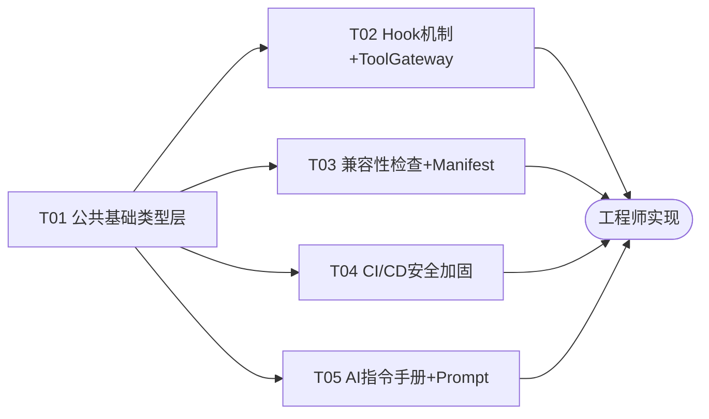

# SmartAssistant 增量需求系统设计 + 任务分解

> 架构师：高见远（Bob）
> 基于：产品经理许清楚的增量 PRD（REQ-01 ~ REQ-06）
> 技术栈：Java 21 + Spring Boot 3.4.8 + Spring AI 2.0.0 + Maven 多模块
> 设计原则：基于现有代码结构增量演进，最小侵入，不破坏既有 API

---

## 1. 设计决策（8 个待确认问题的最终决策）

| # | 问题 | 最终决策 | 理由 |
|---|------|----------|------|
| Q1 | ApprovalHook 审批交互模式 | **异步先拒绝（v1）**：`needsApproval=true` 的工具在 preExecute 阶段直接抛 `ToolExecutionException(APPROVAL_REJECTED)`，不阻塞线程等待人工审批 | v1 最简单安全，避免线程挂起；v2 再引入审批工单 + 回调恢复机制。现有 `AgentErrorCode.APPROVAL_REJECTED` 已存在，直接复用 |
| Q2 | DEPRECATED 超 sunsetDate 后自动转 DISABLED | **v1 不做自动化**，仅由 ToolStatusHook 在 preExecute 中 WARN 日志提醒（含 sunsetDate）；v2 加 `@Scheduled` 定时任务扫描 | 自动化下线有误伤风险，v1 先观察；定时任务需引入调度依赖，本期不涉及 |
| Q3 | HIGH 级漏洞（CVSS 7.0-8.9）是否阻断 | **仅 WARN 不阻断**，CRITICAL（CVSS ≥ 9.0）才阻断构建 | 平衡安全与交付效率；7-8.9 级漏洞数量多，全阻断会卡死迭代 |
| Q4 | @Deprecated 注解联动 ToolStatus.DEPRECATED | **独立维护，不联动** | `@Deprecated` 是编译期语义（API 标记），`ToolStatus` 是运行期生命周期状态，两者关注点不同；联动会引入反射扫描复杂度且语义不清 |
| Q5 | outputSchema 校验失败：WARN vs 阻断 | **WARN 不阻断（v1）**：注册时用 Jackson `readTree()` 校验 JSON 合法性，失败仅 WARN 日志，仍允许注册 | outputSchema 是描述性元数据，校验失败不应阻断工具注册；v2 可考虑强制 |
| Q6 | capabilities 标签是否支持自定义 | **v1 仅预定义 6 个 + `unknown` 兜底**，`ToolCapability` 枚举校验；v2 开放自定义 String | 预定义标签保证路由/过滤语义一致；自定义标签 v1 无消费方，开放无意义 |
| Q7 | ai-project-context.md 维护责任 | **随代码 PR 更新**，作为代码资产纳入 review | 文档漂移是最大风险，必须与代码同生命周期；不设专人维护 |
| Q8 | REQ-01 作为内联代码还是 ToolStatusHook | **作为 ToolStatusHook 实现**，与 REQ-02 合并交付 | Hook 机制正是为此类横切关注点设计；内联会让 ToolGateway 膨胀，且无法独立排序/启停；ToolStatusHook 作为 4 个 Hook 之一自然落地 |

---

## 2. 实现方案 + 框架选型

### 2.1 REQ-01 + REQ-02：ToolStatus 拦截 + Pre/PostToolUse Hook 机制

**核心技术挑战**：
- `ToolGateway.execute()` 现有 9 步执行链（步骤 0~9）是线性过程化代码，无扩展点
- `needsApproval` 字段存在但从未被检查（死字段）
- 需在不破坏现有 9 步语义的前提下，插入 Hook 扩展点

**方案**：
- 定义 `ToolExecutionHook` 接口（preExecute / postExecute / onError），通过 Spring `@Component` + `@Order` 自动收集为 `List<ToolExecutionHook>`
- `ToolGateway` 构造器注入 `List<ToolExecutionHook>`（Spring 按 @Order 排序）
- **插入点**（严格遵循 PRD）：
  - preExecute：步骤 0（获取 ToolDefinition）之后、步骤 1（幂等检查）之前
  - postExecute：步骤 6（审计日志）之后
  - onError：catch 块中（步骤 5 执行异常时）
- 4 个 Hook 实现：
  - `ToolStatusHook`（@Order(10)）：实现 REQ-01 —— DISABLED/REMOVED 抛异常拦截，DEPRECATED 打 WARN 放行
  - `ApprovalHook`（@Order(20)）：检查 `needsApproval` + 高风险，异步先拒绝（Q1 决策）
  - `SanitizeHook`（@Order(30)）：postExecute 脱敏 —— 手机号 `(\d{3})\d{4}(\d{4})` → `$1****$2`，身份证 18 位 → 前 6 后 4，银行卡 16-19 位 → 前 4 后 4
  - `AuditHook`（@Order(100)）：postExecute 结构化审计日志，onError 失败审计

**框架选型**：纯 Spring `@Component` + `@Order`，无新增依赖。`@Order` 值越小优先级越高（preExecute 正序执行，确保状态检查先于审批检查）。

### 2.2 REQ-03：CI/CD 安全加固

**方案**：
- 在 `.github/workflows/eval-gate.yml` 新增 `manifest-validate` Job（Maven 测试驱动，校验 capabilities/outputSchema）
- 新建 `.github/workflows/security-scan.yml` 独立工作流：
  - `dependency-scan` Job：`owasp-dependency-check-action`，CVSS ≥ 9.0 阻断（Q3 决策），SARIF 上传 GitHub Code Scanning
  - `secret-scan` Job：`gitleaks-action` 密钥扫描，SARIF 上传
  - `pr-title-scan` Job：PR 标题注入扫描（正则阻断危险字符）
- SARIF 统一通过 `github/codeql-action/upload-sarif@v3` 上传

**框架选型**：GitHub Actions Marketplace 现成 Action，无 Maven 依赖。

### 2.3 REQ-04：工具版本兼容性检查

**核心技术挑战**：
- `RegistryService.register()` 仅 `put` + 日志，无版本比对
- 需对比新旧 ToolDefinition 的「能力契约」差异，判定 BREAKING / COMPATIBLE

**方案**：
- 定义 `ToolCompatibilityChecker` 接口 + `CompatibilityResult` 枚举（BREAKING / COMPATIBLE）
- `ToolCompatibilityCheckerImpl` 实现比对逻辑：
  - **BREAKING**（需 major 版本升级）：风险等级降级（HIGH→MEDIUM）、超时缩短、scopes 收缩、needsApproval 由 false→true
  - **COMPATIBLE**：新增可选能力（timeout 增大、scopes 扩展、rateLimit 调整）
  - 注：v1 基于 ToolDefinition 元数据字段比对（参数 schema 比对需 v2 引入 inputSchema 字段）
- `RegistryService.register()` 在 `put` 前调用 checker：若 BREAKING 且 major 版本未升级 → 抛 `IncompatibleVersionException`
- 版本号解析：`SemanticVersion` 工具类（major.minor.patch）

**框架选型**：无新增依赖，纯 Java 实现。版本号解析自研（简单 split）。

### 2.4 REQ-05：完善 ToolDefinition Manifest

**方案**：
- `ToolDefinition` 新增 2 字段：
  - `capabilities`（String[]）：默认 `["unknown"]`（向后兼容）
  - `outputSchema`（String）：JSON Schema 字符串，默认 `null`
- 新增 `ToolCapability` 枚举：`READ_ONLY`, `MUTATE_STATE`, `NETWORK_CALL`, `PAYMENT`, `DATA_ACCESS`, `AI_INFERENCE`, `UNKNOWN`，提供 `isValid(String)` 校验
- `RegistryService.register()` 校验：capabilities 非空（空则填默认 `["unknown"]` + WARN）、outputSchema 合法 JSON（Jackson `readTree`，失败 WARN 不阻断，Q5 决策）
- `RegistryService.query()` 新增 `capabilities` 过滤参数（与现有 tags/status/namespace 并列）
- 静态工厂方法 `read()`/`write()`/`highRisk()` 默认 capabilities：
  - `read()` → `["read-only"]`
  - `write(LOW/MEDIUM)` → `["mutate-state"]`
  - `write(HIGH)` → `["mutate-state", "payment"]`
  - `highRisk()` → `["mutate-state", "payment"]`

**框架选型**：复用现有 `jackson-databind`（common 模块已有）做 JSON 校验，无新增依赖。

### 2.5 REQ-06：AI 项目指令手册

**方案**：
- 新建 `ai-project-context.md`（项目根目录），含：技术栈、微服务清单、编码规范、安全红线、测试规范
- `PromptBuilder` 新增 `withProjectContext()` 方法，注入顺序调整为：**base → project-context → service → sections → dynamic**
- Token 预算控制：上限 2000 tokens（≈ 8000 字符），超限时截断并追加 `...[project-context 已截断]`
- 降级处理：`ai-project-context.md` 不存在时 WARN 日志 + 跳过，不抛异常
- `PromptManager` 新增 `loadProjectContext()` 便捷方法（带缓存，复用现有 readResource 机制）

**框架选型**：无新增依赖。文件读取复用 `PromptBuilder` 现有 classpath 加载逻辑。

---

## 3. 文件列表及相对路径

| 文件路径 | 操作 | 所属需求 | 说明 |
|----------|------|----------|------|
| `smart-assistant-common/src/main/java/com/example/smartassistant/common/error/AgentErrorCode.java` | 修改 | REQ-01/02/04 | 新增 `TOOL_STATUS_DISABLED`、`TOOL_VERSION_INCOMPATIBLE` 错误码 |
| `smart-assistant-common/src/main/java/com/example/smartassistant/common/gateway/tool/ToolDefinition.java` | 修改 | REQ-05 | 新增 `capabilities`、`outputSchema` 字段 + 工厂方法默认值 |
| `smart-assistant-common/src/main/java/com/example/smartassistant/common/gateway/tool/ToolCapability.java` | 新增 | REQ-05 | 能力标签枚举（6 预定义 + UNKNOWN） |
| `smart-assistant-common/src/main/java/com/example/smartassistant/common/gateway/tool/hook/ToolExecutionHook.java` | 新增 | REQ-02 | Hook 接口（preExecute/postExecute/onError） |
| `smart-assistant-common/src/main/java/com/example/smartassistant/common/gateway/tool/hook/ToolHookContext.java` | 新增 | REQ-02 | Hook 上下文（toolName/def/scope/elapsed 等） |
| `smart-assistant-common/src/main/java/com/example/smartassistant/common/gateway/tool/compat/CompatibilityResult.java` | 新增 | REQ-04 | 兼容性结果枚举（BREAKING/COMPATIBLE） |
| `smart-assistant-common/src/main/java/com/example/smartassistant/common/gateway/tool/compat/ToolCompatibilityChecker.java` | 新增 | REQ-04 | 兼容性检查接口 |
| `smart-assistant-common/src/main/java/com/example/smartassistant/common/gateway/tool/compat/IncompatibleVersionException.java` | 新增 | REQ-04 | 版本不兼容异常 |
| `smart-assistant-common/src/main/java/com/example/smartassistant/common/gateway/tool/ToolGateway.java` | 修改 | REQ-01/02 | 注入 List<ToolExecutionHook>，插入 pre/post/onError 调用点 |
| `smart-assistant-common/src/main/java/com/example/smartassistant/common/gateway/tool/hook/ToolStatusHook.java` | 新增 | REQ-01/02 | 状态拦截 Hook（DISABLED/REMOVED 拦截，DEPRECATED WARN） |
| `smart-assistant-common/src/main/java/com/example/smartassistant/common/gateway/tool/hook/ApprovalHook.java` | 新增 | REQ-02 | 审批 Hook（needsApproval 异步先拒绝） |
| `smart-assistant-common/src/main/java/com/example/smartassistant/common/gateway/tool/hook/SanitizeHook.java` | 新增 | REQ-02 | 脱敏 Hook（手机/身份证/银行卡） |
| `smart-assistant-common/src/main/java/com/example/smartassistant/common/gateway/tool/hook/AuditHook.java` | 新增 | REQ-02 | 审计 Hook（结构化日志） |
| `smart-assistant-tool-registry/src/main/java/com/example/smartassistant/toolregistry/service/RegistryService.java` | 修改 | REQ-04/05 | register 增加兼容性检查 + manifest 校验；query 增加 capabilities 过滤 |
| `smart-assistant-tool-registry/src/main/java/com/example/smartassistant/toolregistry/controller/RegistryController.java` | 修改 | REQ-05 | query API 增加 capabilities 参数 |
| `smart-assistant-tool-registry/src/main/java/com/example/smartassistant/toolregistry/service/ToolCompatibilityCheckerImpl.java` | 新增 | REQ-04 | 兼容性检查实现 |
| `smart-assistant-tool-registry/src/main/java/com/example/smartassistant/toolregistry/service/ToolManifestValidator.java` | 新增 | REQ-05 | manifest 校验器（capabilities/outputSchema） |
| `.github/workflows/eval-gate.yml` | 修改 | REQ-03 | 新增 manifest-validate Job |
| `.github/workflows/security-scan.yml` | 新增 | REQ-03 | OWASP + Gitleaks + PR 标题扫描 + SARIF |
| `scripts/validate-tool-manifest.sh` | 新增 | REQ-03 | manifest 校验辅助脚本（CI 调用） |
| `ai-project-context.md` | 新增 | REQ-06 | AI 项目指令手册 |
| `smart-assistant-common/src/main/java/com/example/smartassistant/common/prompt/PromptBuilder.java` | 修改 | REQ-06 | 新增 withProjectContext() + Token 预算控制 |
| `smart-assistant-common/src/main/java/com/example/smartassistant/common/prompt/PromptManager.java` | 修改 | REQ-06 | 新增 loadProjectContext() 便捷方法 |

---

## 4. 数据结构和接口（类图）

> 完整类图见 `docs/class-diagram.mermaid`。以下为关键定义说明。

### 4.1 新增接口/类/枚举

```java
// ===== REQ-02: Hook 接口 =====
package com.example.smartassistant.common.gateway.tool.hook;

public interface ToolExecutionHook {
    /** 执行前钩子（步骤0后、步骤1前）。抛异常可阻断执行 */
    void preExecute(ToolHookContext context);
    /** 执行后钩子（步骤6后）。返回可能被修改的结果（如脱敏） */
    String postExecute(ToolHookContext context, String result);
    /** 异常钩子（catch 块中） */
    void onError(ToolHookContext context, Exception ex);
    /** Hook 名称（日志/排序标识） */
    String getName();
}

public class ToolHookContext {
    private final String toolName;
    private final ToolDefinition toolDefinition;
    private final String scope;
    private final String idempotencyKey;
    private final long startTimeMs;
    private long elapsedMs;  // postExecute/onError 时填充
    // getter + builder
}

// ===== REQ-05: 能力标签枚举 =====
package com.example.smartassistant.common.gateway.tool;
public enum ToolCapability {
    READ_ONLY("read-only"),
    MUTATE_STATE("mutate-state"),
    NETWORK_CALL("network-call"),
    PAYMENT("payment"),
    DATA_ACCESS("data-access"),
    AI_INFERENCE("ai-inference"),
    UNKNOWN("unknown");
    // isValid(String) 静态校验方法
}

// ===== REQ-04: 兼容性检查 =====
package com.example.smartassistant.common.gateway.tool.compat;
public enum CompatibilityResult { BREAKING, COMPATIBLE }

public interface ToolCompatibilityChecker {
    /** 对比新旧 ToolDefinition，返回兼容性结果 + 原因 */
    CompatibilityResult check(ToolDefinition oldDef, ToolDefinition newDef);
    String getReason();
}

public class IncompatibleVersionException extends RuntimeException {
    private final String toolName;
    private final String oldVersion;
    private final String newVersion;
    // 构造器 + getter
}
```

### 4.2 ToolDefinition 字段变更

```java
// 新增字段（REQ-05）
@Builder.Default
private String[] capabilities = new String[]{"unknown"};  // 默认 unknown，向后兼容

private String outputSchema;  // JSON Schema 字符串，默认 null
```

### 4.3 AgentErrorCode 新增

```java
// REQ-01: 状态拦截
TOOL_STATUS_DISABLED("TOOL_STATUS_DISABLED", false, "工具已停用或移除，暂不可用"),
// REQ-04: 版本不兼容
TOOL_VERSION_INCOMPATIBLE("TOOL_VERSION_INCOMPATIBLE", false, "工具版本不兼容，需升级主版本号"),
```

### 4.4 关键方法签名

```java
// ToolGateway（修改）
public ToolGateway(ToolRegistry toolRegistry, List<ToolExecutionHook> hooks)
// execute() 内部新增调用：
//   hooks.forEach(h -> h.preExecute(ctx));   // 步骤0后、步骤1前
//   result = hooks 链式 postExecute          // 步骤6后
//   catch: hooks.forEach(h -> h.onError(ctx, e));

// RegistryService（修改）
public void register(ToolDefinition definition)  // 内部调 checker + manifestValidator
public List<ToolDefinition> query(String[] tags, ToolStatus status,
                                   String namespace, String[] capabilities)  // 新增 capabilities 参数

// PromptBuilder（修改）
public PromptBuilder withProjectContext(String projectContext)  // 注入项目上下文层
// assemble() 顺序: base → projectContext → service → sections → dynamic
```

---

## 5. 程序调用流程（时序图）

> 完整时序图见 `docs/sequence-diagram.mermaid`。

### 5.1 ToolGateway Hook 执行流程

```
Caller → ToolGateway.execute(toolName, executor, scope, idempotencyKey)
  │
  ├─ 步骤0: toolRegistry.get(toolName) → ToolDefinition def
  │    (def == null → throw TOOL_INVALID_ARGUMENT)
  │
  ├─ 【NEW】构建 ToolHookContext(toolName, def, scope, idempotencyKey, start)
  ├─ 【NEW】preExecute 链（按 @Order 正序）:
  │    ├─ ToolStatusHook(10):  def.status
  │    │    DISABLED/REMOVED → throw TOOL_STATUS_DISABLED
  │    │    DEPRECATED → WARN(sunsetDate) + 放行
  │    ├─ ApprovalHook(20):   def.needsApproval && def.highRisk
  │    │    → throw APPROVAL_REJECTED (异步先拒绝)
  │    └─ SanitizeHook(30):   (preExecute 通常 no-op)
  │
  ├─ 步骤1: 幂等检查
  ├─ 步骤2: 鉴权检查 (scope + tags)
  ├─ 步骤3: 熔断检查
  ├─ 步骤4: 限流检查
  │
  ├─ 步骤5: 执行 (FutureTask + 虚拟线程 + 超时)
  │    catch (Exception):
  │      recordFailure(toolName)
  │      【NEW】onError 链: hooks.forEach(h -> h.onError(ctx, e))
  │      throw ToolExecutionException
  │
  ├─ 步骤6: 审计日志
  │
  ├─ 【NEW】postExecute 链（按 @Order 正序）:
  │    ├─ ToolStatusHook(10):  no-op
  │    ├─ ApprovalHook(20):   no-op
  │    ├─ SanitizeHook(30):   脱敏 result（手机/身份证/银行卡）→ 返回 maskedResult
  │    └─ AuditHook(100):     结构化审计日志（tool/elapsed/risk/resultLen）
  │
  ├─ 步骤7: 幂等缓存 (maskedResult)
  ├─ 步骤8: 熔断恢复
  ├─ 步骤9: 调用计数递增
  │
  └─ return maskedResult
```

### 5.2 RegistryService 兼容性检查流程

```
Client → RegistryController POST /api/tools/register (ToolDefinition newDef)
  │
  ├─ RegistryService.register(newDef)
  │    │
  │    ├─ ToolManifestValidator.validate(newDef)
  │    │    ├─ capabilities 为空 → 填默认 ["unknown"] + WARN
  │    │    ├─ capabilities 含非法值 → WARN（不阻断，Q6 v1 仅预定义）
  │    │    └─ outputSchema 非法 JSON → WARN（不阻断，Q5 决策）
  │    │
  │    ├─ existing = definitions.get(newDef.name)
  │    │
  │    ├─ if (existing != null):
  │    │    └─ ToolCompatibilityCheckerImpl.check(existing, newDef)
  │    │         ├─ 风险降级/超时缩短/scopes收缩/approval false→true
  │    │         │    → BREAKING
  │    │         ├─ major 版本未升级 (existing.major == newDef.major)
  │    │         │    → throw IncompatibleVersionException
  │    │         └─ 否则 COMPATIBLE → 继续
  │    │
  │    ├─ definitions.put(newDef.name, newDef)
  │    └─ 日志: 注册/更新 + version 变更
  │
  └─ return ApiResponse.ok(name, version)
```

---

## 6. 任务列表（有序、含依赖关系）

> 严格遵循硬性约束：≤5 任务，每任务 ≥3 文件，首任务为基础设施层。

| 任务ID | 任务名称 | 依赖 | 优先级 | 预估工作量 | 涉及文件 |
|--------|----------|------|--------|-----------|----------|
| **T01** | 公共基础类型层（接口/枚举/异常/ToolDefinition 字段） | 无 | P0 | 1 天 | AgentErrorCode.java(改)、ToolDefinition.java(改)、ToolCapability.java(新)、ToolExecutionHook.java(新)、ToolHookContext.java(新)、CompatibilityResult.java(新)、ToolCompatibilityChecker.java(新)、IncompatibleVersionException.java(新) |
| **T02** | Hook 机制实现 + ToolGateway 改造（REQ-01+02） | T01 | P0 | 2 天 | ToolGateway.java(改)、ToolStatusHook.java(新)、ApprovalHook.java(新)、SanitizeHook.java(新)、AuditHook.java(新) |
| **T03** | 注册中心兼容性检查 + Manifest 校验（REQ-04+05） | T01 | P1 | 2.5 天 | RegistryService.java(改)、RegistryController.java(改)、ToolCompatibilityCheckerImpl.java(新)、ToolManifestValidator.java(新) |
| **T04** | CI/CD 安全加固（REQ-03） | T01 | P1 | 2 天 | eval-gate.yml(改)、security-scan.yml(新)、validate-tool-manifest.sh(新) |
| **T05** | AI 项目指令手册 + Prompt 增强（REQ-06） | T01 | P2 | 1.5 天 | ai-project-context.md(新)、PromptBuilder.java(改)、PromptManager.java(改) |

**任务依赖关系图**：



**关键说明**：
- T01 是所有任务的基石（定义接口/枚举/字段），必须最先完成
- T02/T03/T04/T05 仅依赖 T01，彼此可并行开发
- T02（P0）与 T03（P1）有先后建议：T02 改造 ToolGateway 后，T03 的 manifest 校验可在注册链路集成，但代码无硬依赖

---

## 7. 依赖包列表（新增 Maven 依赖）

> **结论：本期无需新增任何 Maven 依赖。**

| 依赖 | 用途 | 是否新增 | 说明 |
|------|------|----------|------|
| `com.fasterxml.jackson.core:jackson-databind` | outputSchema JSON 校验 | ❌ 已有 | common 模块 pom.xml 已声明 |
| `org.springframework.boot:spring-boot-starter` | @Component/@Order 自动收集 Hook | ❌ 已有 | Spring Boot 内置 |
| OWASP Dependency-Check / Gitleaks | CI 安全扫描 | ❌ 非 Maven | GitHub Actions Marketplace，CI 层面 |
| `jq`（可选） | manifest 校验脚本 | ❌ 非 Maven | CI runner 预装或脚本内降级 |

**CI 层新增 GitHub Actions**：
- `dependency-check/dependency-check-action@v4`（OWASP）
- `gitleaks/gitleaks-action@v2`（密钥扫描）
- `github/codeql-action/upload-sarif@v3`（SARIF 上传）

---

## 8. 共享知识（跨文件约定）

### 8.1 命名规范
- Hook 类统一后缀 `Hook`，放 `common.gateway.tool.hook` 包
- 兼容性相关类放 `common.gateway.tool.compat` 包
- 异常类统一继承 `RuntimeException`，携带 `toolName` 字段
- 错误码枚举值全大写下划线：`TOOL_STATUS_DISABLED`、`TOOL_VERSION_INCOMPATIBLE`

### 8.2 异常处理约定
- **执行期拦截**（ToolGateway 内）：抛 `ToolExecutionException(toolName, AgentErrorCode, message)`，由现有 catch 包装
- **注册期拒绝**（RegistryService 内）：抛 `IncompatibleVersionException`，由 `RegistryController` 捕获返回 `ApiResponse.error`
- **校验降级**（manifest 校验）：不抛异常，仅 WARN 日志（Q5 决策）
- Hook 的 preExecute 抛异常会立即中断 execute()，异常类型必须是 RuntimeException

### 8.3 日志格式约定
- 所有日志前缀 `[ToolGateway]` / `[RegistryService]` / `[HookName]`
- 审计日志关键字段：`tool={}`, `elapsed={}ms`, `risk={}`, `status={}`, `version={}`
- WARN 日志需含上下文：`toolName`、`scope`、触发原因
- SanitizeHook 脱敏日志不记录原文，仅记录 `masked=true`

### 8.4 Hook 排序约定
| Hook | @Order | preExecute | postExecute | onError |
|------|--------|------------|-------------|---------|
| ToolStatusHook | 10 | ✅ 状态拦截 | — | — |
| ApprovalHook | 20 | ✅ 审批拒绝 | — | — |
| SanitizeHook | 30 | — | ✅ 脱敏结果 | — |
| AuditHook | 100 | — | ✅ 审计日志 | ✅ 失败审计 |

- `@Order` 值越小优先级越高，preExecute 正序执行（状态检查先于审批）
- postExecute 正序执行（脱敏先于审计，确保审计记录的是脱敏后结果）
- 新增 Hook 时 @Order 值避开 10/20/30/100，预留 40-90 区间

### 8.5 版本号约定
- 语义化版本 `MAJOR.MINOR.PATCH`（如 `1.2.0`）
- BREAKING 变更必须升级 MAJOR
- COMPATIBLE 变更升级 MINOR 或 PATCH
- 版本号非法（非数字/缺段）时 WARN + 视为 `0.0.0`

### 8.6 capabilities 约定
- 存储为 `String[]`，序列化为 JSON 数组
- 旧工具未声明 → 默认 `["unknown"]`，注册时自动填充
- 查询过滤为「任一匹配」（OR 语义），与现有 tags 过滤一致

---

## 9. 待明确事项

| # | 事项 | 当前假设 | 影响范围 | 建议后续动作 |
|---|------|----------|----------|-------------|
| 1 | REQ-04 参数级兼容性检查（参数删除/类型变更）需 `inputSchema` 字段，当前 ToolDefinition 无此字段 | v1 仅基于元数据字段（riskLevel/timeout/scopes/needsApproval）比对，不检查参数 schema | T03 兼容性检查粒度 | v2 引入 `inputSchema`（JSON Schema）字段后，ToolCompatibilityCheckerImpl 扩展参数级比对 |
| 2 | SanitizeHook 脱敏目前仅作用于 `postExecute` 的 result 字符串 | 假设工具返回值为 String（与 ToolGateway.execute 返回类型一致） | T02 SanitizeHook | 若未来 result 结构化（JSON），需扩展为按字段路径脱敏 |
| 3 | manifest-validate CI Job 的实现方式 | 假设通过 Maven 测试（`ToolManifestValidationTest`）驱动，校验运行时注册的工具 | T04 CI 脚本 | 若工具改为静态 JSON/YAML manifest 文件注册，脚本可改为纯 jq 校验 |
| 4 | ApprovalHook v2 审批工单机制未设计 | v1 异步先拒绝（直接抛异常），无审批状态流转 | T02 ApprovalHook | v2 需设计 `ApprovalTicket` 实体 + 状态机 + 回调恢复执行 |
| 5 | `ai-project-context.md` 的 Token 预算截断策略 | 超过 8000 字符时尾部截断 + 追加截断标记 | T05 PromptBuilder | 若需保留关键章节，可改为按章节优先级裁剪（安全红线 > 编码规范 > 其他） |
| 6 | ToolGateway 现有 `ToolRegistry`（common 模块）与 `RegistryService`（tool-registry 模块）是两套注册表 | 本期不合并，Hook 机制作用于 ToolGateway 使用的 `ToolRegistry`；兼容性检查作用于 `RegistryService` | T02/T03 跨模块 | 后续可统一为单一注册中心（RegistryService 作为权威源，ToolRegistry 作为本地缓存） |

---

*设计完成。所有接口/类定义基于现有代码结构（`common.gateway.tool` 包），最小侵入增量演进。*
